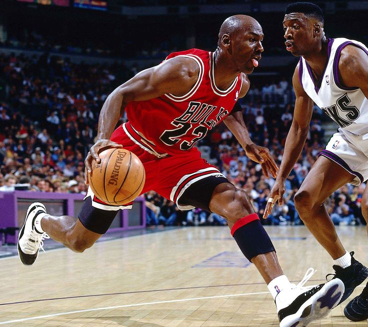

+++
date = '2025-07-24T18:10:25+02:00'
draft = false
title = 'DSA - Data Structures and Algorithms'
tags = ["go", "golang", "algorithms", "data-structures"]
categories = ["backend", "golang"]
summary = "A deep dive into Data Structures and Algorithms (DSA) using Go, covering essential concepts, implementations, and best practices."
comments = true
ShowToc = true
TocOpen = true
image = "banner.jpg"
weight = 6
+++



---

## 🧠 Mastering Data Structures and Algorithms (DSA) with Go

Whether you're preparing for technical interviews, optimizing backend systems, or simply sharpening your problem-solving chops, Data Structures and Algorithms (DSA) are foundational to your success as a developer.

In this article, I’ll walk you through core DSA concepts using Golang, a language praised for its simplicity, performance, and concurrency model. You'll see how Go makes understanding DSA both intuitive and powerful.

---

## 🚀 What is DSA?

Data Structures organize and store data efficiently, while Algorithms define step-by-step instructions to solve problems or manipulate data.

Together, DSA provides the backbone for high-performance applications.

---

## 📦 Essential Data Structures in Go

1. Arrays & Slices

    ```go
    arr := [5]int{1, 2, 3, 4, 5} // Fixed-size array
    slice := []int{1, 2, 3}      // Dynamic size
    
    slice = append(slice, 4)
    fmt.Println(slice) // [1 2 3 4]
    ```

    Slices are the idiomatic way to work with collections in Go. They offer flexibility while leveraging arrays under the hood.

1. Linked List

   Go doesn’t have a built-in linked list, but the container/list package provides one.

    ```go
    package main
    
    import (
    "container/list"
    "fmt"
    )
    
    func main() {
    l := list.New()
    l.PushBack("Go")
    l.PushBack("DSA")
    
        for e := l.Front(); e != nil; e = e.Next() {
            fmt.Println(e.Value)
        }
    }
    ```

1. Stack (`LIFO`)

    A stack can be easily implemented using slices.

    ```go
    type Stack []int
    
    func (s *Stack) Push(v int) {
        *s = append(*s, v)
    }
    
    func (s *Stack) Pop() int {
        n := len(*s)
        val := (*s)[n-1]
        *s = (*s)[:n-1]
        return val
    }
    ```

1. Queue (`FIFO`)

    Queues can also be implemented using slices.

    ```go
    type Queue []int
    
    func (q *Queue) Enqueue(v int) {
        *q = append(*q, v)
    }
    
    func (q *Queue) Dequeue() int {
        val := (*q)[0]
        *q = (*q)[1:]
        return val
    }
    ```

1. Hash Map (`Go's map`)

    ```go
    m := map[string]int{
        "apple":  5,
        "banana": 3,
    }
    fmt.Println(m["apple"]) // 5
    ```

    **Hint:**
   Go’s built-in map is a powerful hash table implementation for key-value pairs.

---

## 🧩 Must-Know Algorithms in Go

1. Binary Search

    Efficient O(log n) search on sorted arrays.

    ```go
    func binarySearch(arr []int, target int) int {
        low, high := 0, len(arr)-1
    
        for low <= high {
            mid := (low + high) / 2
            if arr[mid] == target {
                return mid
            } else if arr[mid] < target {
                low = mid + 1
            } else {
                high = mid - 1
            }
        }
        return -1
    }
    ```

1. Sorting (`Bubble Sort` Example)

    ```go
    func bubbleSort(arr []int) {
        n := len(arr)
        for i := 0; i < n-1; i++ {
            for j := 0; j < n-i-1; j++ {
                if arr[j] > arr[j+1] {
                    arr[j], arr[j+1] = arr[j+1], arr[j]
                }
            }
        }
    }
    ```

    For real projects, use Go’s built-in sorting:

    ```go
    sort.Ints(arr)
    ```

1. Recursion: Factorial

    ```go
    func factorial(n int) int {
        if n == 0 {
        return 1
        }
    
        return n * factorial(n-1)
    }
    ```

1. Graph and Trees

    For binary trees, you define custom structures.

    ```go
   type Node struct {
	Value int
	Left  *Node
	Right *Node
    }
    ```

    Depth-first traversal:

    ```go
    func dfs(n *Node) {
        if n == nil {
            return
        }
    
        fmt.Println(n.Value)
        dfs(n.Left)
        dfs(n.Right)
    }
    ```

---

## 🔃 Sort Algorithms

Sorting is a fundamental concept in computer science used in everything from searching to data normalization and ranking systems. Below are essential sorting algorithms every developer should know, implemented in Go.

1. Merge Sort (🧬 Divide and Conquer – O(n log n))

   Merge Sort recursively splits arrays into halves and merges them in a sorted manner.
   
   ```go
   func mergeSort(arr []int) []int {
       if len(arr) <= 1 {
           return arr
       }
   
       mid := len(arr) / 2
       left := mergeSort(arr[:mid])
       right := mergeSort(arr[mid:])
       return merge(left, right)
   }
   
   func merge(left, right []int) []int {
       result := []int{}
       i, j := 0, 0
   
       for i < len(left) && j < len(right) {
           if left[i] < right[j] {
               result = append(result, left[i])
               i++
           } else {
               result = append(result, right[j])
               j++
           }
       }
       return append(result, append(left[i:], right[j:]...)...)
   }
   ```

1. Quick Sort (⚡ Partition-based – Average: O(n log n), Worst: O(n²))

   Quick Sort selects a pivot and partitions the array into smaller and larger elements.
   
   ```go
   func quickSort(arr []int) {
       if len(arr) < 2 {
           return
       }
   
       left, right := 0, len(arr)-1
       pivot := rand.Int() % len(arr)
       arr[pivot], arr[right] = arr[right], arr[pivot]
   
       for i := range arr {
           if arr[i] < arr[right] {
               arr[i], arr[left] = arr[left], arr[i]
               left++
           }
       }
   
       arr[left], arr[right] = arr[right], arr[left]
       quickSort(arr[:left])
       quickSort(arr[left+1:])
   }
   ```

1. Bubble Sort (🫧 Simple but Inefficient – O(n²))

   Repeatedly swaps adjacent elements if they are in the wrong order.
   
   ```go
   func bubbleSort(arr []int) {
       n := len(arr)
       for i := 0; i < n-1; i++ {
           for j := 0; j < n-i-1; j++ {
               if arr[j] > arr[j+1] {
                   arr[j], arr[j+1] = arr[j+1], arr[j]
               }
           }
       }
   }
   ```

1. Insertion Sort (🧩 Efficient for Small Datasets – O(n²))

   Builds the sorted array one item at a time.
   
   ```go
   func insertionSort(arr []int) {
       for i := 1; i < len(arr); i++ {
           key := arr[i]
           j := i - 1
           for j >= 0 && arr[j] > key {
               arr[j+1] = arr[j]
               j--
           }
           arr[j+1] = key
       }
   }
   ```

1. Selection Sort (📌 Selects Minimum – O(n²))

   Repeatedly finds the minimum element and places it at the beginning.
   
   ```go
   func selectionSort(arr []int) {
       n := len(arr)
       for i := 0; i < n-1; i++ {
           minIdx := i
           for j := i + 1; j < n; j++ {
               if arr[j] < arr[minIdx] {
                   minIdx = j
               }
           }
           arr[i], arr[minIdx] = arr[minIdx], arr[i]
       }
   }
   ```

1. Heap Sort (🏗️ Priority Queue-based – O(n log n))

   Uses a binary heap structure to repeatedly extract the max element.
   
   ```go
   func heapSort(arr []int) {
       n := len(arr)
   
       // Build max heap
       for i := n/2 - 1; i >= 0; i-- {
           heapify(arr, n, i)
       }
   
       for i := n - 1; i > 0; i-- {
           arr[0], arr[i] = arr[i], arr[0]
           heapify(arr, i, 0)
       }
   }
   
   func heapify(arr []int, n, i int) {
       largest := i
       left := 2*i + 1
       right := 2*i + 2
   
       if left < n && arr[left] > arr[largest] {
           largest = left
       }
       if right < n && arr[right] > arr[largest] {
           largest = right
       }
   
       if largest != i {
           arr[i], arr[largest] = arr[largest], arr[i]
           heapify(arr, n, largest)
       }
   }
   ```

Each of these sorting algorithms serves different use cases. While Go’s sort package provides optimized versions, understanding how these work internally is critical for building performance-conscious software.

---

## 📑 Sorting Algorithms Cheat Sheet

| Algorithm       | Best Time    | Avg Time     | Worst Time   | Space     | Stable | In-Place | Notes                               |
|----------------|--------------|--------------|--------------|-----------|--------|----------|-------------------------------------|
| **Merge Sort**  | O(n log n)   | O(n log n)   | O(n log n)   | O(n)      | ✅ Yes | ❌ No     | Divide and conquer, great for linked lists |
| **Quick Sort**  | O(n log n)   | O(n log n)   | O(n²)        | O(log n)  | ❌ No  | ✅ Yes    | Very fast in practice, not stable   |
| **Bubble Sort** | O(n)         | O(n²)        | O(n²)        | O(1)      | ✅ Yes | ✅ Yes    | Educational use only, very slow     |
| **Insertion Sort** | O(n)     | O(n²)        | O(n²)        | O(1)      | ✅ Yes | ✅ Yes    | Efficient for small or nearly sorted data |
| **Selection Sort** | O(n²)    | O(n²)        | O(n²)        | O(1)      | ❌ No  | ✅ Yes    | Always O(n²), rarely used           |
| **Heap Sort**   | O(n log n)   | O(n log n)   | O(n log n)   | O(1)      | ❌ No  | ✅ Yes    | Good for priority queues            |

> ✅ **Stable**: Maintains the relative order of equal elements  
> ✅ **In-Place**: Uses constant extra space (excluding recursion stack)

---

## 🧠 Tips for Learning DSA with Go

- Practice problems: Use platforms like [LeetCode](https://leetcode.com/), [HackerRank](https://www.hackerrank.com/), or [Exercism](https://exercism.org/).
- Understand time complexity: Know Big-O analysis for every structure and algorithm.
- Build mini-projects: Implement your own `LRU Cache`, `Trie`, or `Priority Queue`.

---

## 🎯 Final Thoughts

Mastering DSA not only sharpens your coding skills but also prepares you for systems design, performance optimization, and real-world problem-solving.

With Go’s clean syntax and powerful standard library, you're equipped to tackle DSA challenges efficiently and idiomatically.

---

🚀 Follow me on [norbix.dev](https://norbix.dev) for more insights on Go, system design, and engineering wisdom.
