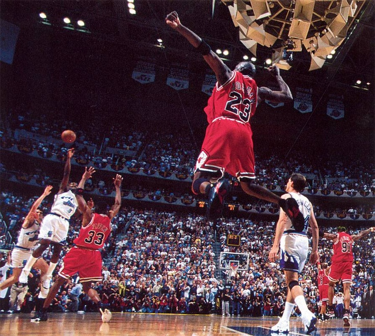

+++
date = '2025-09-25T09:00:00+02:00'
draft = false
title = "API-First Approach: Design Before You Code"
tags = ["api-first", "openapi", "swagger", "grpc", "asyncapi", "system-design"]
categories = ["software-engineering", "architecture"]
summary = "Explore the API-first approach: why defining contracts before implementation accelerates development, reduces integration bugs, and enables parallel workflows across teams."
comments = true
ShowToc = true
TocOpen = true
image = "api-first-banner.jpg"
weight = 26
+++



# 🔑 What is `API-First`?

The `API-first` approach means you design and define your APIs before writing any implementation code.

Instead of building a backend and then exposing endpoints, you:

- Start by defining the API contract (using `OpenAPI/Swagger`, `AsyncAPI`, `GraphQL` schema, etc.).

- Share this contract with teams (`frontend`, `backend`, `QA`, external partners).

- Generate mocks, SDKs, and stubs from the definition.

- Build services according to the agreed contract.

---

# ⚙️ How It Works (Steps)

1. Design the API

    - Define endpoints, request/response payloads, error models.

    - Use OpenAPI (REST), gRPC proto (RPC), or AsyncAPI (event-driven).

1. Review & Collaboration

    - Teams discuss and agree on the contract.

    - Changes go through versioning and review, just like code.

1. Mock & Test Early

    - Use API mock servers so frontend & QA can start testing before backend exists.

1. Code Generation

    - Generate client SDKs, server stubs, and documentation automatically.

1. Implement & Deploy

    - Backend devs implement the logic behind the API.

    - Frontend/devs already integrate against the agreed API.

---

# 📊 Diagram


---

# 🎯 Benefits

- 🔄 Parallel Development – frontend, backend, QA work at the same time.

- 📖 Single Source of Truth – the API spec is the contract.

- 🧪 Better Testing – mock servers & contract testing catch issues early.

- 🚀 Faster Delivery – code generators speed up SDK/server creation.

- 🔐 Consistency – shared design standards across services.

---

# ✅ Example (`OpenAPI` snippet)

```yaml
openapi: 3.0.0
info:
  title: Orders API
  version: 1.0.0
paths:
  /orders:
    get:
      summary: List orders
      responses:
        "200":
          description: List of orders
          content:
            application/json:
              schema:
                type: array
                items:
                  $ref: "#/components/schemas/Order"
components:
  schemas:
    Order:
      type: object
      properties:
        id:
          type: string
        status:
          type: string
```

From this spec, you can generate:

- API documentation

- Mock server

- Go/Python/TypeScript SDKs

- Server skeletons

---

# 🧰 Common Tools

- `OpenAPI` / `Swagger` – `REST` `APIs`

- `gRPC` + `Protocol Buffers` – `RPC` style

- `AsyncAPI` – Event-driven `APIs` (`Kafka`, `MQTT`, etc.)

- `Stoplight`, `Postman`, `SwaggerHub` – `API` design & mocking platforms

- `openapi-generator` / `Swagger` Codegen – generate `SDKs` & servers

👉 In short:
- API-first = contract first.

- The API spec becomes the blueprint that all teams build against, ensuring consistency, speed, and parallel work.

---

🚀 Follow me on [norbix.dev](https://norbix.dev) for more insights on Go, Python, AI, system design, and engineering wisdom.
