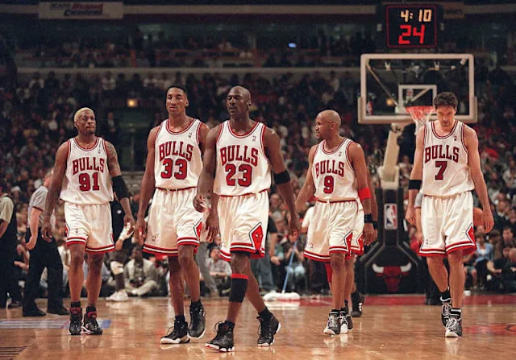
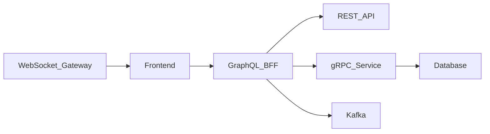

+++
date = '2026-05-26T10:00:00+02:00'
draft = false
title = "API Modeling in Distributed Systems: REST, WebSocket, gRPC, and GraphQL"
tags = ["rest", "grpc", "graphql", "websocket", "distributed-systems", "api-design", "system-design", "architecture", "backend"]
categories = ["software-engineering", "architecture"]
summary = "Learn how modern distributed systems use REST, gRPC, WebSocket, and GraphQL together. Explore architectural tradeoffs, communication patterns, scalability concerns, and real-world API modeling strategies."
comments = true
ShowToc = true
TocOpen = true
image = "api-modeling-banner.jpg"
weight = 35
+++



# 🌍 Why API Modeling Matters

Modern software systems are no longer monoliths exposing a single HTTP API.

Today’s architectures often consist of:

- Frontends (`Web`, `Mobile`, `Desktop`)
- `BFF` layers (`Backend For Frontend`)
- Internal microservices
- Event-driven systems
- Real-time communication channels
- AI/ML services
- Third-party integrations

As systems grow, choosing the correct communication model becomes one of the most important architectural decisions.

A poorly selected API protocol can lead to:

- Increased latency
- Tight coupling
- Difficult scaling
- Inefficient payloads
- Complex frontend integrations
- Operational overhead

A well-designed API model improves:

- Scalability
- Developer Experience (`DX`)
- System evolution
- Team collaboration
- Performance
- Observability

👉 The important part:
Modern distributed systems rarely use only one API style.

The best architectures combine multiple communication models together.

---

# 🔑 The 4 Major API Communication Models

The most common protocols and paradigms used today are:

| Protocol | Best For | Communication Style |
|---|---|---|
| `REST` | CRUD & public APIs | Request/Response |
| `gRPC` | Internal microservices | RPC |
| `WebSocket` | Real-time systems | Persistent bidirectional |
| `GraphQL` | Frontend aggregation & BFF | Query-based |

Each solves different problems.

---

# 🌐 REST APIs

`REST` (`Representational State Transfer`) became the dominant web API standard because of its simplicity and interoperability.

REST APIs model systems around:

- Resources
- HTTP semantics
- Stateless communication
- JSON payloads

Example:

```http
GET /orders/123
```

Response:

```json
{
  "id": "123",
  "status": "SHIPPED"
}
```

## Strengths of `REST`

- Human-readable
- Easy debugging
- Massive ecosystem support
- Excellent browser compatibility
- Works well for public APIs
- Simple caching through HTTP


REST is ideal for:

- CRUD systems
- External integrations
- Public APIs
- Administrative systems 

## Weaknesses of `REST`

As systems scale, REST introduces challenges:

- Over-fetching
- Under-fetching
- Multiple round-trips
- Weak streaming support
- Inconsistent contracts across services

Example:

Frontend needs:

- User
- Orders
- Notifications

But must call:

```text
GET /user
GET /orders
GET /notifications
```

This creates latency and orchestration complexity.

---

# ⚡ gRPC APIs

`gRPC` is a high-performance RPC framework developed by Google.

It uses:

- Protocol Buffers
- Strongly typed contracts
- HTTP/2
- Binary serialization

Instead of resource-oriented APIs, gRPC models systems as remote procedures.

Example:

```protobuf
service OrderService {
  rpc GetOrder(GetOrderRequest) returns (OrderResponse);
}
```

## 🚀 Why gRPC Is Powerful

gRPC excels in distributed systems because it provides:

- Extremely low latency
- Efficient binary payloads
- Strong contracts
- Bidirectional streaming
- Automatic code generation

This makes it perfect for:

- Internal microservices
- Platform engineering
- High-throughput systems
- Service meshes
- AI infrastructure
- Cloud-native platforms

---

# 📊 REST vs gRPC Payloads

JSON payloads are verbose:

```json
{
 "customerId": "123",
 "orderStatus": "PAID"
}
```

Protocol Buffers serialize into compact binary formats.

This reduces:

- Network usage
- CPU overhead
- Serialization cost

At scale, this becomes significant.

---

# ❌ gRPC Tradeoffs

Despite its strengths, gRPC has challenges:

- Harder debugging
- Browser limitations
- Learning curve
- More operational complexity
- Requires schema governance

gRPC is usually not ideal for:

- Public internet APIs
- Simple frontend integrations

---

# 🔄 WebSocket

WebSocket enables persistent bidirectional communication between client and server.

Unlike REST:

- The connection remains open
- Both sides can push data anytime

This enables real-time systems.

## ⚡ Where WebSocket Excels

Perfect use cases:

- Chat applications
- Trading platforms
- Multiplayer games
- IoT telemetry
- Monitoring dashboards
- Live collaboration systems

Example:

```json
{
 "event": "stock_price_updated",
 "symbol": "AAPL",
 "price": 205.44
}
```

## ⚠️ Challenges with WebSocket

Real-time systems introduce operational complexity:

- Connection management
- Reconnection handling
- Stateful infrastructure
- Scaling socket connections
- Distributed session handling
- Difficult observability

`WebSockets` are powerful - but operationally expensive.

---

# 🧠 GraphQL

GraphQL is a query language and API runtime originally developed by Facebook.

Instead of multiple endpoints, GraphQL exposes a single query interface.

Clients request exactly the data they need.

Example:

```graphql
query {
    order(id: "123") {
        id
        status
        customer {
            name
        }
    }
}
```

## 🎯 Why GraphQL Became Popular

GraphQL solves major frontend integration problems:

- Over-fetching
- Under-fetching
- Endpoint explosion
- Frontend orchestration complexity

It is especially powerful as a:

- `BFF` (Backend For Frontend)
- Aggregation layer
- API gateway abstraction

---

## 🏗️ Modern Architecture Pattern

One of the most common modern architectures looks like this:



This architecture combines:

- `GraphQL` for frontend aggregation
- `REST` for public APIs
- `gRPC` for internal services
- `WebSocket` for realtime communication

👉 This is where modern API modeling becomes architectural rather than theoretical.

---

## ⚠️ GraphQL Tradeoffs

GraphQL also introduces complexity:

- Resolver orchestration
- N+1 query problems
- Difficult caching
- Complex authorization
- Query cost management
- Schema governance

Without discipline, GraphQL APIs can become difficult to scale.

---

# 🧩 The Real Answer: Use Multiple Protocols

The biggest misconception in software engineering is:

**“Which API protocol is the best?”**

There is no universally best protocol.

Different communication models solve different problems.

Modern distributed systems usually combine multiple protocols together.

---

# 📊 Recommended Usage Strategy
| Layer	| Recommended Protocol |
| ---|---|
|Public APIs	| REST |
| Internal service-to-service	| gRPC |
| Frontend aggregation	| GraphQL |
| Real-time events	| WebSocket |
| Event streaming	| Kafka / AsyncAPI |

---

# 🧠 API Modeling Is About Tradeoffs

Good architects understand:

- Latency
- Coupling
- Payload size
- Streaming requirements
- Team ownership
- Operational complexity
- Browser compatibility
- Evolution strategy

API design is not only about code.

It is about communication boundaries between systems.

---

# 🔐 API Contracts Matter

As distributed systems grow, contracts become critical.

Good API modeling requires:

- Versioning
- Backward compatibility
- Schema governance
- Contract testing
- API documentation

Common tools:

| Tool	| Purpose |
|---|---|
| OpenAPI	| REST contracts |
| Protocol Buffers	| gRPC contracts |
| GraphQL SDL	| GraphQL schema |
| AsyncAPI	| Event-driven systems |

---

# ⚙️ Example Hybrid Stack

A modern polyglot architecture could look like:

- Frontend: React / Mobile
- GraphQL BFF: TypeScript
- Internal Services: Go (gRPC)
- Public APIs: REST
- Realtime Gateway: WebSocket
- Event Streaming: Kafka
- AI Services: Python

This is increasingly becoming the standard architecture for scalable platforms.

---

# 🚀 Final Thoughts

API modeling is one of the most important skills in modern software engineering.

The protocol you choose affects:

- Scalability
- Reliability
- Developer productivity
- Infrastructure cost
- System evolution

The best engineers understand that:

- REST is not obsolete
- gRPC is not always the answer
- GraphQL is not magic
- WebSocket is not free

Each protocol exists because it solves a specific communication problem.

👉 **Great distributed systems are built by combining the right communication models for the right architectural boundaries.**

---

# 📚 Key Takeaways

- REST is excellent for public CRUD APIs
- gRPC excels in internal high-performance communication
- WebSocket powers realtime systems
- GraphQL simplifies frontend aggregation
- Modern systems usually combine multiple API styles together
- API modeling is fundamentally about tradeoffs

---

🚀 Follow me on [norbix.dev](https://norbix.dev) for more insights on Go, Python, system design, and building real-world software.
