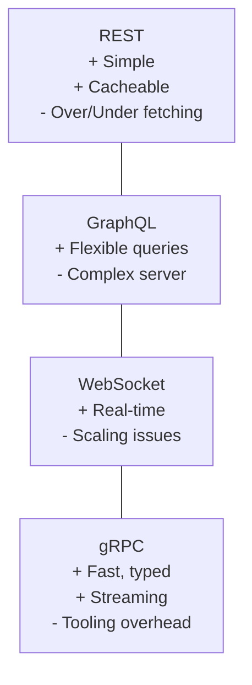
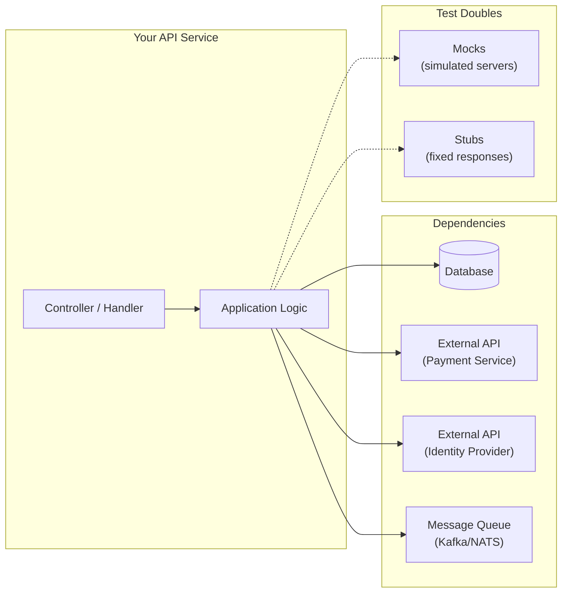
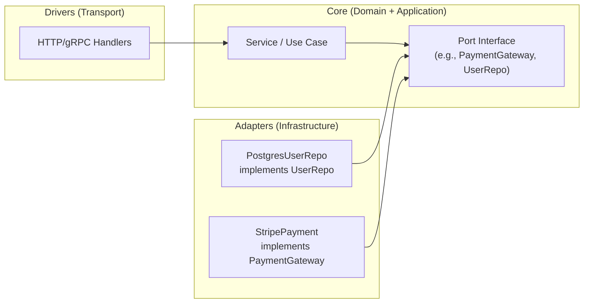

+++
date = '2025-09-07T12:00:00+02:00'
draft = false
title = 'REST vs GraphQL vs WebSocket vs gRPC: API Styles and Contracts in Go'
tags = ['api', 'rest', 'graphql', 'websocket', 'grpc', 'openapi', 'swagger', 'protobuf', 'go']
categories = ['Programming', 'Architecture']
summary = 'From REST to GraphQL, WebSocket, and gRPC — explore API communication patterns and how contracts like OpenAPI, Swagger, and Protobuf shape modern Go systems.'
comments = true
ShowToc = true
TocOpen = true
image = 'api-architecture-banner.jpg'
weight = 22
+++

<div style="display: flex; justify-content: center;">
  
</div>

---

## 📌 Introduction

APIs are the backbone of modern distributed systems. Over time, API design evolved from **ad-hoc HTTP endpoints** to **strongly typed contracts** with dedicated tooling.

Example (Go, the “raw” approach):

```go
http.HandleFunc("/hello", func(w http.ResponseWriter, r *http.Request) {
    fmt.Fprintln(w, "Hello World")
})
```

---

## 🏗️ API-First Approach

Before development even starts, the business and product teams should model the contract — not just developers.

This is called the API-First approach:

- Define your OpenAPI or Protobuf contract up front.

- Use it as the source of truth across teams (backend, frontend, QA).

- Generate server stubs, clients, and mocks directly from the contract.

👉 Why it matters:

- Aligns business expectations with implementation.

- Reduces misunderstandings and integration surprises.

- Enables parallel development (frontend builds against mocks while backend is still in progress).

---

## 📜 OpenAPI & Swagger

- OpenAPI (OAS): machine-readable spec for REST APIs.

- Swagger: ecosystem of tooling (UI, codegen, validators).

✅ Benefits:

- Contracts as a single source of truth.

- Auto-generate docs, clients, and server stubs.

Example OpenAPI snippet (YAML):

```yaml
paths:
  /users/{id}:
    get:
      summary: Get a user by ID
      parameters:
        - name: id
          in: path
          required: true
          schema:
            type: string
      responses:
        '200':
          description: OK
          content:
            application/json:
              schema:
                $ref: '#/components/schemas/User'
```

📍 Swagger UI: renders the spec into interactive docs.

👉 Try it online: [Swagger Editor](https://editor.swagger.io/) — design and validate REST APIs in OpenAPI format.

---

## 📦 Protobuf Contracts

- Protobuf defines schemas for gRPC services.

- Provides strong typing, binary serialization, and evolution with backward compatibility.

Example .proto:

```protobuf
syntax = "proto3";

service UserService {
  rpc GetUser (UserRequest) returns (UserResponse);
}

message UserRequest {
  string id = 1;
}

message UserResponse {
  string id = 1;
  string name = 2;
}
```

👉 Try it online: [Buf Schema Registry](https://buf.build/) — design, lint, and validate gRPC/Protobuf APIs in the browser.

---

## 🌐 REST

REST (Representational State Transfer) is the most widely used architectural style for building APIs. It relies on standard HTTP methods (GET, POST, PUT, DELETE) and typically exchanges data in JSON format, making it human-readable and easy to debug.

### ✅ Pros

- Simplicity → easy to implement and consume with any HTTP client.

- Widely supported → nearly every language, framework, and browser works with REST out of the box.

- Cacheable → HTTP caching mechanisms (ETag, Cache-Control) improve performance.

- Good for public APIs → intuitive and accessible for developers.

### ⚠️ Cons

- Over-fetching/under-fetching → clients may receive too much or too little data (can require multiple requests).

- No strong typing → JSON payloads are flexible but can lack strict schema enforcement.

- Less efficient → repeated HTTP requests, verbose JSON payloads, and HTTP/1.1 overhead.

- Limited real-time support → requires polling, long-polling, or add-ons like WebSocket for live updates.

### 📖 Example in Go (Gin)

```go
r.GET("/users/:id", func(c *gin.Context) {
    c.JSON(200, gin.H{
        "id":   c.Param("id"),
        "name": "Alice",
    })
})
```

➡️ This REST endpoint returns a user’s ID and name. It’s simple and readable, but compared to GraphQL or gRPC, it may require additional requests for related data (e.g., user’s posts).

---

## 🔍 GraphQL

GraphQL is a query language and runtime for APIs, designed to give clients exactly the data they need and nothing more. Unlike REST (which often returns fixed payloads), GraphQL lets the client define the shape of the response.

### ✅ Pros

- Client-driven queries → consumers choose the fields they want, reducing over-fetching and under-fetching.
   
- Single endpoint → no need for multiple REST endpoints; everything is served through one /graphql endpoint.
   
- Strong typing → schema defines all available queries, mutations, and types, which improves tooling and auto-documentation.
   
- Great for frontend teams → they can evolve independently by querying what they need without waiting for backend changes.

### ⚠️ Cons

- Complex server logic → resolvers can be tricky to implement and optimize.
   
- N+1 query problem → naive resolvers may hit the database excessively (can be mitigated with DataLoader or batching).
   
- Caching challenges → harder compared to REST where responses can be cached by URL; requires custom caching strategies.
   
- Security considerations → introspection and deeply nested queries can cause performance or exposure issues if not limited.

### Example query:

```graphql
query {
  user(id: "123") {
    id
    name
    posts { title }
  }
}
```

➡️ The above query retrieves a user with their id, name, and the title + creation date of their posts — all in a single round trip. In REST, this might require multiple endpoints (/users/123, /users/123/posts).

---

## 🔄 WebSocket

WebSocket is a communication protocol that provides full-duplex, bidirectional channels over a single TCP connection. Unlike HTTP, which is request/response-based, WebSockets keep the connection open, making them ideal for real-time applications like chat, gaming, IoT, and live dashboards.

### ✅ Pros

- Bidirectional → both client and server can send messages anytime.

- Low-latency → avoids overhead of repeated HTTP requests.

- Real-time capable → great for live updates, streaming, notifications, and collaborative apps.

- Lightweight messaging → efficient once the connection is established.

### ⚠️ Cons

- Harder to scale → requires sticky sessions or specialized infrastructure to manage persistent connections.

- Stateful connections → unlike stateless HTTP, connections consume server resources continuously.

- Less tooling/observability → harder to debug and monitor compared to REST/GraphQL.

- Security considerations → need proper authentication and throttling to prevent abuse.

### 📖 Example in Go

```go
import (
    "log"
    "github.com/gorilla/websocket"
)

func main() {
    conn, _, err := websocket.DefaultDialer.Dial("ws://localhost:8080/ws", nil)
    if err != nil {
        log.Fatal("dial error:", err)
    }
    defer conn.Close()

    conn.WriteMessage(websocket.TextMessage, []byte("hello"))
}
```

➡️ Here, a Go client establishes a WebSocket connection and sends a "hello" message. Unlike REST or gRPC, the connection stays alive and can be reused for sending/receiving multiple messages in real time.

---

## ⚡ gRPC

`gRPC` is a high-performance, open-source RPC (Remote Procedure Call) framework originally developed at Google. It uses Protocol Buffers (Protobuf) for data serialization and runs over HTTP/2, making it highly efficient for service-to-service communication in distributed systems.

### ✅ Pros

- High performance → compact Protobuf messages and HTTP/2 multiplexing reduce latency and bandwidth.

- Strongly typed contracts → Protobuf schemas act as a single source of truth, enabling auto-generated client/server code in multiple languages.

- Streaming support → supports unary (request/response), server-streaming, client-streaming, and bidirectional streaming.

- Great for microservices → ideal for internal communication between services in cloud-native environments.

### ⚠️ Cons

- Tooling overhead → requires schema compilation and generated code, which adds build complexity.

- Browser limitations → native support is limited; web clients need gRPC-Web or REST/gRPC gateways.

- Debugging → binary Protobuf payloads are harder to inspect compared to JSON in REST/GraphQL.


### 📖 Example Go Client

```go
resp, err := client.GetUser(ctx, &pb.UserRequest{Id: "123"})
if err != nil {
    log.Fatalf("could not fetch user: %v", err)
}
fmt.Println("User:", resp.Name)
```

➡️ This example calls a GetUser RPC defined in a Protobuf contract. The client sends a request with Id: "123" and receives a strongly typed response

---

## 📊 Visual Comparison



---

## 🧪 Testing Your APIs

- Robust APIs deserve robust tests. Here are practical workflows:

🧰 Toolbox

- Contracts: OpenAPI/Swagger (REST), Protobuf (gRPC)

- Manual: IntelliJ HTTP Client, IDEA gRPC Client

- CLI: curl, grpcurl

- GUI: Postman (supports REST, GraphQL, WebSocket, gRPC)

### Fail-Fast Pattern

When testing, adopt a fail-fast mindset:

- Detect invalid inputs and misconfigurations as early as possible.

- Fail the request with clear error messages (e.g., 422 Unprocessable Entity) instead of letting bad data flow deeper.

- In CI, stop the pipeline immediately when contract tests or smoke tests fail.

This pattern prevents small mistakes (like missing fields, wrong types, expired tokens) from becoming production outages.

## Mocking External Dependencies

Your service rarely lives in isolation. It depends on:

- Databases

- External APIs (e.g., payment gateways, identity providers)

- Message queues / event buses

For reliability, these dependencies should be:

- Mocked: fake servers responding to API requests (e.g., Prism for REST, fake gRPC server).

- Stubbed: minimal hardcoded responses (fast for unit tests).

- Real: integration environment with actual dependencies (used sparingly).

👉 Testing pyramid for APIs:

- Unit tests → use stubs.

- Integration tests → use mocks.

- E2E tests → hit real dependencies (but keep scope small).

## Dependency Graph


✅ Use dependency injection in Go (pass interfaces, not concrete clients) → swap between real, mock, and stub implementations easily.

Example (Go interface for payment gateway):

```go
type PaymentGateway interface {
    Charge(ctx context.Context, userID string, amount int) error
}
```

During tests:

```go
type StubPayment struct{}

func (s StubPayment) Charge(ctx context.Context, userID string, amount int) error {
    return nil // always succeed
}
```

---

## 🔁 Dependency Inversion Principle (DIP) in Practice

DIP:

High-level modules (use cases, services) must not depend on low-level modules (DB clients, HTTP SDKs).

Both should depend on abstractions (interfaces).

Abstractions shouldn’t depend on details; details depend on abstractions.

In Go, that means you define interfaces close to the domain/use case (core), and make adapters (DB, external APIs) implement them. Your wiring (composition root) injects the concrete implementations.

DIP Diagram (who depends on whom)



- Handlers depend on services (core).

- Services depend on ports (interfaces).

- Adapters implement ports and therefore depend on the interfaces (not the other way around).

### Minimal Go example (Ports in core, Adapters implement)

File `internal/core/payment/port.go` (❗ abstraction lives in the core)

```go
package payment

import "context"

type Gateway interface {
    Charge(ctx context.Context, userID string, amountCents int64, currency string) (string, error)
}
```

File: `internal/core/checkout/service.go` (high-level depends on abstraction)

```go
package checkout

import (
    "context"
    "fmt"

    "yourapp/internal/core/payment"
)

type Service struct {
    pay payment.Gateway
}

func NewService(pg payment.Gateway) *Service {
    return &Service{pay: pg}
}

func (s *Service) Purchase(ctx context.Context, userID string, cents int64) (string, error) {
    if cents <= 0 {
        return "", fmt.Errorf("invalid amount")
    }
    return s.pay.Charge(ctx, userID, cents, "USD")
}
```

File: `internal/adapters/stripe/gateway.go` (detail depends on abstraction)

```go
package stripe

import (
    "context"
    "yourapp/internal/core/payment"
)

type Client struct {
    apiKey string
}

func New(apiKey string) *Client { return &Client{apiKey: apiKey} }

// Ensure it implements the port
var _ payment.Gateway = (*Client)(nil)

func (c *Client) Charge(ctx context.Context, userID string, amountCents int64, currency string) (string, error) {
    // call Stripe SDK/HTTP here...
    return "ch_123", nil
}
```

File: `cmd/api/main.go` (composition root: wire details into core)

```go
package main

import (
    "log"

    "yourapp/internal/adapters/stripe"
    "yourapp/internal/core/checkout"
)

func main() {
    stripeGW := stripe.New("sk_test_...")          // detail
    svc      := checkout.NewService(stripeGW)      // inject into core

    // pass svc into HTTP handlers (not shown)
    log.Println("api up")
}
```

### Testing with mocks/stubs (DIP makes this trivial)

File: `internal/core/payment/stub.go`

```go
package payment

import "context"

type StubGateway struct {
    ChargeFn func(ctx context.Context, userID string, amountCents int64, currency string) (string, error)
}

func (s StubGateway) Charge(ctx context.Context, userID string, amountCents int64, currency string) (string, error) {
    if s.ChargeFn != nil { return s.ChargeFn(ctx, userID, amountCents, currency) }
    return "stub_tx", nil
}
```

File: `internal/core/checkout/service_test.go`

```go
svc := checkout.NewService(payment.StubGateway{
    ChargeFn: func(_ context.Context, _ string, amount int64, _ string) (string, error) {
        if amount > 100_00 { return "", fmt.Errorf("limit") }
        return "ok", nil
    },
})
```

### DIP Checklist

- Define ports (interfaces) in core (domain/application), not in infra.

- Adapters implement ports; they import core, not vice versa.

- Keep the composition root (wiring) at the edge (e.g., cmd/api/main.go).

- In tests, replace adapters with stubs/mocks by injecting port implementations.

- Enforce with var _ Port = (*Adapter)(nil) compile-time checks.

- Avoid handlers or services importing vendor SDKs—that’s a DIP smell.

This approach aligns perfectly with API-First and your mock/stub strategy: the contract (OpenAPI/Protobuf) defines shapes at the boundary, while DIP ensures your core stays independent from transport and vendor details.

---

## 🧪 When to Use Mock vs Stub

Use stubs for deterministic data, mocks for interaction/behavior verification.

| Test level     | Primary goal                          | Prefer Stub when…                                   | Prefer Mock when…                                   |
|----------------|---------------------------------------|----------------------------------------------------|----------------------------------------------------|
| Unit           | Pure logic correctness                | You just need canned data (happy/unhappy cases)    | You must assert a call happened (args, order, count) |
| Integration    | Adapter correctness (DB/API/Queue)    | You want fast, local tests without spinning dependencies | You need to simulate network errors, timeouts, retries |
| E2E / Contract | End-to-end flows & schema compatibility | —                                                  | Use mock servers from OpenAPI/Protobuf for contract fit |

Stub (deterministic data for unit tests):

```go
type StubPayment struct {
    ResultTx string
    Err      error
}

func (s StubPayment) Charge(ctx context.Context, userID string, amountCents int64, currency string) (string, error) {
    if s.Err != nil { return "", s.Err }
    return s.ResultTx, nil
}
```

Mock (verify interaction):

```go
type MockPayment struct {
    Calls []struct {
        UserID string
        Amount int64
        Curr   string
    }
    ReturnTx string
    ReturnErr error
}

func (m *MockPayment) Charge(ctx context.Context, userID string, amountCents int64, currency string) (string, error) {
    m.Calls = append(m.Calls, struct {
        UserID string; Amount int64; Curr string
    }{userID, amountCents, currency})
    return m.ReturnTx, m.ReturnErr
}

// test
mp := &MockPayment{ReturnTx: "tx_ok"}
svc := checkout.NewService(mp)
_, _ = svc.Purchase(ctx, "u1", 499)

require.Len(t, mp.Calls, 1)
require.Equal(t, int64(499), mp.Calls[0].Amount)
require.Equal(t, "USD", mp.Calls[0].Curr)
```

### Tips

- Start with stubs for 80% of unit tests (fast, simple).

- Use mocks where behavior matters (retry, circuit breaker, idempotency, audit).

- In integration tests, you can run a mock server (Prism for REST, test gRPC server) to simulate realistic failures: 429/503, timeouts, malformed payloads.

---

## 🧭 Code to an Interface, Not an Implementation

- Keep your core independent from frameworks and vendors. Depend on ports (interfaces) you own; inject adapters (details) at the edge.


Principles

- Define interfaces in the core (domain/application).

- Adapters implement those interfaces and import the core (not vice versa).

- Wire everything in a composition root (cmd/*/main.go).

- Prefer narrow, behavior-based interfaces (only what the use case needs).

- Enforce compile-time checks: var _ Port = (*Adapter)(nil).

Bad (leaky) – core depends on vendor:

```go
// core/checkout/service.go
type Service struct {
    stripe *stripe.Client // ❌ vendor in core
}
```

Good (DIP + interface) – core depends on abstraction:

```go
// core/payment/port.go
type Gateway interface {
    Charge(ctx context.Context, userID string, amountCents int64, currency string) (string, error)
}

// core/checkout/service.go
type Service struct{ pay payment.Gateway }

func NewService(gw payment.Gateway) *Service { return &Service{pay: gw} }
```

Adapter implements the port:

```go
// adapters/stripe/gateway.go
var _ payment.Gateway = (*Client)(nil)

type Client struct { apiKey string }

func (c *Client) Charge(ctx context.Context, userID string, amountCents int64, currency string) (string, error) {
    // call Stripe SDK / HTTP
    return "ch_123", nil
}
```

Composition root wires details:

```go
// cmd/api/main.go
stripeGW := stripe.New(os.Getenv("STRIPE_KEY"))
svc      := checkout.NewService(stripeGW)
router   := http.NewRouter(svc)
```

### Interface design checklist

- ✅ Define in core (where it’s used), not in infra (where it’s implemented).

- ✅ Keep it minimal (YAGNI): expose only methods your use case truly needs.

- ✅ Return domain errors or wrap vendor errors at the boundary.

- ✅ Make it mock/stub-friendly (simple method signatures, context first arg).

- ✅ Avoid leaking transport types (no *http.Request or *sql.DB in ports).

---

1. IntelliJ IDEA HTTP Client

    Create file `api_tests.http`:
    
    ```text
    ### Get user
    GET http://localhost:8080/v1/users/123
    Authorization: Bearer {{TOKEN}}
    
    ### Create user
    POST http://localhost:8080/v1/users
    Content-Type: application/json
    Authorization: Bearer {{TOKEN}}
    
    {
      "name": "Alice",
      "email": "alice@example.com"
    }
    ```
    
    GraphQL request:
    
    ```text
    POST http://localhost:8080/graphql
    Content-Type: application/json
    
    {
      "query": "query($id: ID!) { user(id: $id) { id name posts { title } } }",
      "variables": { "id": "123" }
    }
    ```
    
    WebSocket request:
    
    ```text
    WEBSOCKET ws://localhost:8080/ws
    Sec-WebSocket-Protocol: chat
    
    < { "type": "hello", "payload": "Hi" }
    < { "type": "subscribe", "channel": "notifications" }
    ```
    
    gRPC request:
    
    ```text
    GRPC localhost:50051 com.example.user.UserService/GetUser
    Content-Type: application/json
    
    {
      "id": "123"
    }
    ```

1. `curl` & `grpcurl` 

    REST:
    
    ```shell
    curl -sS -H "Authorization: Bearer $TOKEN" \
      http://localhost:8080/v1/users/123 | jq
    ```
    
    GraphQL:
    
    ```shell
    curl -sS -H "Content-Type: application/json" \
      -d '{"query":"{ user(id:\"123\"){ id name } }"}' \
      http://localhost:8080/graphql | jq
    ```
    
    gRPC:
    
    ```shell
    grpcurl -plaintext -d '{"id":"123"}' \
      localhost:50051 com.example.user.UserService.GetUser
    ```

1. `Postman`

   - Import OpenAPI → REST collections.

   - Import .proto → gRPC methods.

   - Use GraphQL tab for queries.

   - Use WebSocket request for real-time testing.

1. Contract-First Workflows

   - OpenAPI (REST): generate Go stubs with oapi-codegen.

   - Protobuf (gRPC): generate Go code with protoc.

   - Use mock servers (Prism, grpcurl) to test against the contract.

   - Add contract tests in CI to catch drift early.

1. Testing Patterns

   - Environments: manage tokens/URLs in IDEA http-client.env.json or Postman environments.

   - Negative tests: invalid payloads, auth errors, rate limiting.

   - Automation: run .http files or Postman collections in CI pipelines.

1. Quick Decision Matrix

    | Style     | Manual Tool        | CLI     | Contract        | Best For                                      |
    |-----------|--------------------|---------|-----------------|-----------------------------------------------|
    | REST      | IDEA HTTP, Postman | curl    | OpenAPI/Swagger | ✅ CRUD, ✅ public APIs, ✅ caching            |
    | GraphQL   | IDEA HTTP, Postman | curl    | SDL (schema)    | ✅ Complex clients, ✅ flexible reads, ⚠️ caching harder |
    | WebSocket | IDEA HTTP, Postman | websocat| (none)          | ✅ Real-time, ✅ chat, ✅ dashboards, ⚠️ scaling challenges |
    | gRPC      | IDEA gRPC, Postman | grpcurl | Protobuf        | ✅ Service-to-service, ✅ high perf, ✅ streaming, ⚠️ tooling overhead |

---

## 🎯 When to Use Which?

- REST → CRUD, public APIs, cache-friendly.

- GraphQL → client-driven queries, mobile apps.

- WebSocket → chat, dashboards, real-time collab.

- gRPC → service-to-service, high-performance internal APIs.

---

## Conclusion

- First APIs were manual and error-prone.

- OpenAPI/Swagger made REST self-documented.

- Protobuf powers gRPC with strong contracts.

- No silver bullet — choose API style based on domain, scale, and performance needs.

---

🚀 Follow me on [norbix.dev](https://norbix.dev) for more insights on Go, Python, AI, system design, and engineering wisdom.
