+++
title = "Demystifying Artificial Intelligence: AI, Machine Learning, and Deep Learning"
date = "2025-09-04T18:00:00+02:00"
draft = false
tags = ["artificial-intelligence", "machine-learning", "deep-learning", "ai-vs-ml"]
categories = ["software-engineering", "ai"]
summary = "Understand the difference between Artificial Intelligence, Machine Learning, and Deep Learning. Learn how these concepts fit together and power modern software systems."
comments = true
ShowToc = true
TocOpen = true
image = "ai-banner.jpg"
weight = 20
+++


**"Artificial Intelligence isn’t about replacing humans. It’s about amplifying human potential."**

Artificial Intelligence (AI) is one of the most transformative forces in technology today. From recommendation engines on Netflix to self-driving cars and generative models like ChatGPT, AI is shaping how we work, live, and create.

But **AI is often misunderstood**. Is it the same as machine learning? Where does deep learning fit? Let’s break it down.

---

## 📜 A Brief History of AI

- **1950s** – Alan Turing proposes the Turing Test. Early symbolic `AI` emerges.
- **1980s–1990s** – Expert systems and rule-based knowledge engines dominate.
- **2000s** – Rise of statistical machine learning thanks to bigger datasets.
- **2010s** – Deep learning revolution with `neural networks` and `GPUs`.
- **2020s** – Generative `AI` (`ChatGPT`, `Claude`, `Gemini`) makes `AI` mainstream.

🔹 **Tip:** AI has decades of research behind it — what feels “new” is the scale and accessibility today.

---

## 🧠 Artificial Intelligence: The Big Picture

**Artificial Intelligence (AI)** is the broad field focused on creating systems that mimic human intelligence.

Examples include:

- Rule-based systems (e.g., chess engines from the 1980s)
- Natural language processing (chatbots, translators)
- Computer vision (face recognition, object detection)
- Robotics and autonomous systems

AI doesn’t always require learning. A simple rule-based expert system is AI, even if it doesn’t adapt over time.

🔹 **Tip:** Think of AI as the *goal* — making machines “smart.”

---

### 🤔 How ChatGPT Works Behind the Scenes

One of today’s most visible applications of AI is **ChatGPT**, a large language model built using deep learning. Here’s how it works at a high level:

1. **Training on huge datasets** – Learns statistical patterns from books, code, and the web.
2. **Neural network architecture** – Uses *Transformers* to capture relationships between words.
3. **Token prediction** – Predicts the most likely next word (token) in a sequence.
4. **Fine-tuning & RLHF** – Reinforcement learning from human feedback aligns responses.
5. **Inference** – At runtime, your input is converted into tokens, processed through billions of neural weights, and output as natural language.

🔹 **Tip:** ChatGPT doesn’t “understand” like a human. It’s a probabilistic pattern-matching engine.

---

### 🔄 Other AI Models Competing with ChatGPT

The market is full of competitors, each with different strengths:

- **Claude (Anthropic):** Long context, reasoning, ethical design.
- **Google Gemini:** Multimodal (text, image, audio, video).
- **xAI Grok:** Multimodal with real-time search, integrated in X/Tesla.
- **Perplexity:** AI + live web search with citations.
- **Microsoft Copilot:** Embedded in Office/Teams with GPT-4 Turbo.
- **Meta AI (LLaMA):** Social/media apps, open research focus.
- **DeepSeek (China):** Efficiency-driven, strong benchmarks.
- **Mistral AI (EU):** Open-source, long context, developer-friendly.
- **Moonshot AI (China):** Large trillion-parameter “Kimi” models.
- **YandexGPT:** Russian-focused business integrations.

| Model         | Strengths                         | Best For                           |
|---------------|-----------------------------------|------------------------------------|
| Claude        | Long context, reasoning           | Research & enterprise workflows    |
| Gemini        | Multimodal, Google ecosystem      | Cross-media AI                     |
| Grok          | Real-time retrieval, reasoning    | Social/voice-first apps            |
| Perplexity    | Citations, fact-checking          | Research and knowledge tasks       |
| Copilot       | Deep MS integration               | Productivity workflows             |
| Meta AI       | Social media ecosystem            | Chat & consumer interaction        |
| DeepSeek      | Energy-efficient reasoning        | Scale-sensitive applications       |
| Mistral       | Open-source, flexible             | Developer tooling & customization  |
| Moonshot AI   | Massive models, multimodal        | Cutting-edge innovation            |
| YandexGPT     | Localized enterprise AI           | Russian-language businesses        |

🔹 **Tip:** Pick your AI model based on **ecosystem fit** (Google, Microsoft, Meta), **task type** (research vs creative), and **control** (open vs closed source).

---

## 📊 Machine Learning: Learning from Data

**Machine Learning (ML)** is a subset of AI. Instead of hard-coding rules, ML algorithms learn from data and improve with exposure.

Applications: spam filters, predictive maintenance, fraud detection, recommendations.

Methods: regression, decision trees, clustering, reinforcement learning.

🔹 **Tip:** ML is the *toolbox* that powers modern AI.

---

## What is a Model in Machine Learning?

A model in machine learning is basically a mathematical function that:

- Takes inputs (features, e.g. hours_studied).

- Produces an output (prediction, e.g. expected score).

- Learns the relationship between inputs and outputs by looking at examples in data.

- The logic or formula type the machine learning system is trying to learn.

### Parameters 

- The specific values in that logic that the training process discovers.

- Imagine you want to guess a student’s exam score based on how many hours they studied.

  - You collect data:

    create table
    
    | hours_studied | score |
    |---------------|-------|
    | 1             | 50    |
    | 2             | 60    |
    | 3             | 70    |
    
    A model could be as simple as the rule:
    
    ```matlab
    score = 10 * hours_studied + 40
    ```
    
    - Model = "linear relationship between hours and score" 
    - Parameters = slope = 10 and intercept = 40

### Analogy

- Model = the shape of the recipe (e.g., “bake a cake”).
  - That’s just a formula — and that’s what a model is.

- Parameters = the exact ingredient amounts (200g flour, 2 eggs, 100g sugar).

- Training = adjusting ingredient amounts until the cake tastes right.

- A model is the logic found.

- Parameters are the variables (numbers) that make that logic concrete

### How it works?

- You don’t hand-code the rules (like if hours > 5 then good score).

- Instead, you give the model examples (inputs + correct outputs).

- The training process adjusts internal parameters until the model finds rules that best fit the data.

So yes — in a way, the model is “creating its own logic”.

You don't write:

```python
def predict(hours):
    return 10 * hours + 40
```

The model discovers that rule by itself, because that line best fits the data.

### Types of models

1. Linear Regression → learns straight-line formulas.

  - Linear Regression → predicts continuous values with straight-line formulas.

  - Logistic Regression → predicts probabilities/classes with a linear boundary.

  - Linear SVM → finds a straight hyperplane to separate classes.

  - 👉 Good for: simple, linearly separable problems.
  - 👉 Limitation: can’t capture curves, waves, or complex shapes → risk of underfitting.

1. Decision Trees → learns rules like “if amount > 1000 then fraud.”

  - Decision Trees → split data with simple rules (if amount > 1000 → fraud).

  - Random Forests → many trees combined → better accuracy, less overfitting.

  - Gradient Boosted Trees (XGBoost, LightGBM, CatBoost) → trees built in sequence to fix each other’s mistakes.

  - 👉 Good for: tabular data (transactions, customer info).
  - 👉 Strength: handles non-linear patterns, interactions.

1. Neural Networks → complex layered functions that can learn images, text, etc.

  - Simple feed-forward networks (MLPs) → capture non-linear patterns.

  - CNNs (Convolutional Neural Networks) → great for images.

  - RNNs / LSTMs / Transformers → great for sequences, text, time series.

  - 👉 Good for: complex patterns (vision, NLP, speech).
  - 👉 Strength: very flexible, can approximate almost any function.
  - 👉 Limitation: need lots of data + compute.

👉 In short: A model is a trained function that tries to map inputs → outputs based on patterns it finds in the data.

1. Probabilistic Models

  - Naïve Bayes → simple, based on probability rules.

  - Hidden Markov Models → sequential, time-series modeling.

  - 👉 Good for: small datasets, text classification, spam detection.

1. Clustering / Unsupervised Models

  - K-Means → groups similar points.

  - Hierarchical Clustering → builds a tree of clusters.

  - DBSCAN → finds clusters of arbitrary shapes.

  - 👉 Good for: when you don’t have labels (unsupervised learning).

#### ⚡ How to choose?

- If the pattern is simple & linear → linear regression / logistic regression.

- If the data has rules & thresholds → tree-based models.

- If the problem is very complex (images, text, audio, high-dimensional data) → neural networks.

- If you have no labels → clustering methods.

---

## ⚠️ Common ML Challenges: Imbalanced Data & Generalization

### 1. Imbalanced Classes

#### 🚨 Problem

- Happens when one class dominates the dataset.

- Example: Fraud detection → 99% “legit” vs 1% “fraud”.

- If you train a classifier, it might always predict the majority class and still get 99% accuracy.

#### Example Dataset

```json
{
  "dataset": [
    { "transaction_id": "tx001", "amount": 120.50, "location": "NY", "label": "legit" },
    { "transaction_id": "tx002", "amount": 80.00,  "location": "CA", "label": "legit" },
    { "transaction_id": "tx003", "amount": 75.00,  "location": "TX", "label": "legit" },
    { "transaction_id": "tx004", "amount": 200.00, "location": "NY", "label": "legit" },
    { "transaction_id": "tx005", "amount": 950.00, "location": "FL", "label": "legit" },
    { "transaction_id": "tx006", "amount": 20.00,  "location": "WA", "label": "legit" },
    { "transaction_id": "tx007", "amount": 500.00, "location": "IL", "label": "legit" },
    { "transaction_id": "tx008", "amount": 50.00,  "location": "NV", "label": "legit" },
    { "transaction_id": "tx009", "amount": 100.00, "location": "NY", "label": "legit" },
    { "transaction_id": "tx010", "amount": 5000.00,"location": "CA", "label": "fraud" }
  ]
}
```

#### 🛠️ Solutions

1. Resampling the dataset

    - Oversampling minority class (e.g., SMOTE – Synthetic Minority Oversampling Technique).

    - Undersampling majority class to balance the distribution.

1. Adjusting class weights

    - Penalize mistakes on the minority class more heavily (supported in many ML frameworks).

1. Choosing the right metrics

    - Accuracy is misleading. Better: Precision, Recall, F1-score, ROC-AUC, PR-AUC.

    - For fraud, often maximize recall (catch as many frauds as possible) at the expense of some false positives.

👉 Key interview takeaway: “With imbalanced data, I focus on resampling, adjusting class weights, and using metrics beyond accuracy, like precision, recall, and ROC-AUC.”

### 2. Overfitting

#### 🚨 Problem

- Model learns too much from training data (including noise and quirks).

- Great on training set, bad on unseen/test data.

#### 🛠️ Symptoms

- High training accuracy, low validation/test accuracy.

- Loss continues dropping on training, but rises on validation (classic overfitting curve).

#### Example Dataset

```json
{
  "training_set": [
    { "student_id": "s001", "hours_studied": 1, "score": 50 },
    { "student_id": "s002", "hours_studied": 2, "score": 60 },
    { "student_id": "s003", "hours_studied": 3, "score": 70 },
    { "student_id": "s004", "hours_studied": 4, "score": 65 }, 
    { "student_id": "s005", "hours_studied": 5, "score": 80 }
  ],
  "test_set": [
    { "student_id": "s101", "hours_studied": 6, "score": 85 },
    { "student_id": "s102", "hours_studied": 7, "score": 90 },
    { "student_id": "s103", "hours_studied": 8, "score": 95 }
  ]
}
```

What’s happening here?

- In the training data, look at "hours_studied": 4.

    - Instead of following the trend (50 → 60 → 70 → 80…), the score drops to 65.

    - This is noise.

- A complex model might “memorize” that drop and think:

    - “Studying 4 hours actually lowers your score.”

- On the test set, where the true trend continues upward (6 → 85, 7 → 90, 8 → 95), the model makes wrong predictions because it learned the noise.

That’s overfitting:

- ✅ Training accuracy = high (because it memorized everything).

- ❌ Test accuracy = low (because it didn’t generalize the real rule).

#### 🛠️ Solutions

- Regularization: L1 (sparsity), L2 (weight decay).

- Dropout (turning off random neurons during training).

- Early stopping (halt training when validation loss worsens).

- Simpler model (reduce number of parameters).

- More data / data augmentation (especially in image tasks).

👉 Key interview takeaway: “Overfitting is when the model memorizes instead of generalizing. I fight it with regularization, dropout, early stopping, and more data.”

### 3. Underfitting

#### 🚨 Problem

- Model is too simple to capture the underlying patterns.

- Poor performance on both training and test sets.

#### 🛠️ Symptoms

- Both training and validation accuracy are low.

- Loss is high and doesn’t improve.

### Example

```json
{
  "dataset": [
    { "x": 1, "y": 1 },
    { "x": 2, "y": 4 },
    { "x": 3, "y": 9 },
    { "x": 4, "y": 16 },
    { "x": 5, "y": 25 },
    { "x": 6, "y": 36 },
    { "x": 7, "y": 49 },
    { "x": 8, "y": 64 },
    { "x": 9, "y": 81 },
    { "x": 10, "y": 100 }
  ]
}
```

- Underfitting = the model is too simple, so it fails to learn even the obvious pattern.

- Example: the real relationship is non-linear (curved), but the model tries to force a straight line.

#### Why this shows underfitting

The true pattern is quadratic:

```matlab
y=x2
```

- If you force a linear model (straight line, e.g. y = ax + b), it won’t fit well:

    - At small x, it predicts too high.

    - At large x, it predicts too low.

- Result:

    - ❌ Training accuracy = low.

    - ❌ Test accuracy = low.

That’s underfitting — the model is too simple for the data’s complexity.


#### ⚡ Rule of thumb

- If you know the pattern is quadratic → Polynomial Regression is the cleanest choice.

- If you suspect it could be more complex → go with trees or a small neural net.

#### 🛠️ Solutions

- Use a more complex model (more layers, deeper tree, etc.).

- Train longer (more epochs, better learning rate).

- Feature engineering (add informative features).

- Reduce regularization (too strong regularization may cause underfitting).

👉 Key interview takeaway:“Underfitting is when the model is too simple. To fix it, I increase model complexity, add better features, or train longer.”

### 🧠 Connecting the Dots

- Imbalanced classes: The data distribution is skewed → accuracy is misleading.

- Overfitting: The model is too complex → memorizes instead of generalizing.

- Underfitting: The model is too simple → fails to learn meaningful patterns.

---

## 🤖 Deep Learning: The Neural Revolution

### 🤖 Deep Learning: The Neural Revolution

Deep Learning (DL) is a subset of ML that relies on artificial neural networks (ANNs) with many layers. These layers allow the model to learn increasingly complex representations of data — from edges in an image to entire concepts like “cat” or “car.”

#### 🧩 What Are Neural Networks?

Please watch this  6minute video for a great visual intro: [Neural Networks Explained](https://www.youtube.com/watch?v=bfmFfD2RIcg) 

- Inspired by biology – loosely modeled after neurons in the human brain.

- Structure – input layer (data), hidden layers (transformations), output layer (prediction).

- Connections – each neuron has weights and biases, adjusted during training.

- Activation functions – nonlinear transformations (ReLU, sigmoid, tanh, softmax) that let networks learn complex relationships.

👉 Without activation functions, a neural network would just be a fancy linear regression.

#### 🔄 How Neural Networks Learn

The training process follows a loop:

1. Forward pass – input flows through layers, producing an output.

1. Loss function – measures how far the prediction is from the correct answer.

1. Backward pass (backpropagation) – calculates gradients of the loss with respect to weights.

1. Optimization (gradient descent) – updates weights to reduce error.

This cycle repeats thousands or millions of times until the network converges on good parameters.

#### 🏗️ Types of Neural Networks

- Feedforward Networks (MLP) – simplest form, fully connected layers.

- Convolutional Neural Networks (CNNs) – specialized for images and spatial data (e.g., object detection, face recognition).

- Recurrent Neural Networks (RNNs) – designed for sequences (e.g., speech, text, time-series).

- Transformers – modern architecture for language, vision, and multimodal tasks (powering GPT, Gemini, Claude).

#### ⚡ Why Deep Learning Works So Well

- Learns hierarchical features automatically (no manual feature engineering).

- Scales with big data and powerful hardware (GPUs/TPUs).

- Excels at unstructured data: images, audio, text.

#### 🌍 Real-World Applications

- Image recognition – self-driving cars, medical imaging.

- Speech recognition – voice assistants, transcription.

- Natural language processing – chatbots, translation, sentiment analysis.

- Generative AI – LLMs (ChatGPT, Claude), diffusion models (Stable Diffusion, MidJourney).

🔹 Tip: Deep learning is what made AI feel magical — moving from “machines that calculate” to “machines that see, listen, and talk.”

#### Simple diagram of a feedforward neural network with one hidden layer

- **Input layer**: features (e.g., pixels, words, measurements).
- **Hidden layer**: neurons transform inputs using weights + activation functions.
- **Output layer**: final prediction (classification, regression, etc.).

```mermaid
graph LR
    subgraph Input["Input Layer"]
        I1["x₁"]
        I2["x₂"]
        I3["x₃"]
    end

    subgraph Hidden["Hidden Layer (Neurons)"]
        H1["h₁"]
        H2["h₂"]
        H3["h₃"]
    end

    subgraph Output["Output Layer"]
        O1["ŷ (prediction)"]
    end

    I1 --> H1
    I1 --> H2
    I1 --> H3
    I2 --> H1
    I2 --> H2
    I2 --> H3
    I3 --> H1
    I3 --> H2
    I3 --> H3

    H1 --> O1
    H2 --> O1
    H3 --> O1
```



---

## 🛠️ Key AI Techniques Beyond ML

AI also includes:
- **Search algorithms** (A*, minimax in games)
- **Planning systems** (robotics, logistics scheduling)
- **Knowledge graphs & reasoning** (semantic web, ontologies)
- **Rule-based expert systems** (if-else driven logic engines)

👉 Not all AI is ML — classic approaches still power many systems.

---

## ⚖️ AI vs. ML vs. DL: A Mental Model

One of the biggest sources of confusion in tech discussions is the relationship between Artificial Intelligence (AI), Machine Learning (ML), and Deep Learning (DL). The simplest way to think about it is as nested circles:

- AI (Artificial Intelligence) – the broadest concept.

    - The goal: make machines simulate human intelligence.

    - Includes both learning systems and rule-based systems.

    - Examples: expert systems, knowledge graphs, search algorithms, game-playing bots, natural language processing, robotics.

    - 👉 AI is the what — the ambition of making machines act smart.

- ML (Machine Learning) – a subset of AI.

    - The method: algorithms that learn patterns from data instead of relying on hard-coded rules.

    - Uses statistical techniques to improve with experience.

    - Examples: spam filters, recommendation engines, credit scoring, fraud detection.

    - 👉 ML is the how — the toolbox for teaching machines.

- DL (Deep Learning) – a subset of ML.

    - The breakthrough: neural networks with many layers that can automatically learn complex representations from raw data.

    - Requires large datasets + high computational power (GPUs/TPUs).

    - Examples: image recognition (CNNs), speech recognition (RNNs, Transformers), large language models (GPT, Gemini).

    - 👉 DL is the engine — the technology that powers today’s most advanced AI.

### 🧠 Visualization

Think of it as nested circles:

- **AI** = broadest goal (machines that act smart)
- **ML** = subset (machines learn from data)
- **DL** = subset of ML (deep neural networks)

```mermaid
graph TD
    AI["🤖 Artificial Intelligence (AI)<br/>Broadest goal – machines that act smart"]
    ML["📊 Machine Learning (ML)<br/>Subset – machines learn from data"]
    DL["🧠 Deep Learning (DL)<br/>Subset of ML – neural networks"]
    
    AI --> ML
    ML --> DL
```



### 🔍 Why It Matters

- Not all AI is ML (e.g., a rule-based chess engine is AI but not ML).

- Not all ML is DL (e.g., logistic regression is ML but not DL).

- Most of today’s headline-grabbing AI breakthroughs (like ChatGPT or Stable Diffusion) are powered by Deep Learning.

👉 Understanding the distinction helps cut through hype and clarifies where different techniques fit in the AI landscape.

---

## 🛠️ AI in Software Engineering

Practical uses for developers:

- **Code completion & generation** (Copilot, Tabnine)
- **Test automation** (unit tests, fuzzing)
- **Bug detection** (static analysis + AI)
- **DevOps** (incident prediction, scaling automation)

👉 AI is a **developer productivity accelerator**.

---

## ⚖️ Ethics, Bias & Responsible AI

- **Bias in data** → unfair outputs.
- **Hallucinations** → wrong but confident answers.
- **Privacy risks** → sensitive data exposure.
- **Accountability** → unclear ownership of AI decisions.

👉 Engineers must think beyond *can we build this* to *should we build this*.

---

## 💰 Business & Market Applications

AI drives billions in revenue across industries:

- **Healthcare** – diagnostics, drug discovery
- **Finance** – fraud detection, trading models
- **Transportation** – autonomous driving, route optimization
- **Media & entertainment** – content creation, personalization

---

## 🚀 How to Get Started with AI

1. Learn Python (NumPy, Pandas).
2. Explore ML libraries (scikit-learn, TensorFlow, PyTorch).
3. Use cloud APIs (OpenAI, Anthropic, HuggingFace, Vertex AI).
4. Build a toy project (chatbot, sentiment analysis, image classifier).

👉 Start small, learn by building.

---

## 🎯 Future Trends

- **Multimodal AI** – unified text, image, audio, video.
- **AI Agents** – autonomous orchestration of tasks.
- **Edge AI** – models running on devices, not just cloud.
- **Domain-specific AI** – healthcare, law, finance.

---

## 🤖 AI Agents: From Tools to Teammates

Traditional AI models (like ChatGPT or Copilot) generate outputs when prompted.  
But **AI agents** go further: they *perceive, decide, and act* in pursuit of goals.

### What Makes an AI Agent?
- **Autonomy** – operates without step-by-step human instructions.
- **Goal-oriented** – works toward objectives (e.g., “book me a trip to Berlin”).
- **Adaptive** – learns from the environment or feedback loops.
- **Interactive** – can collaborate with humans or other agents.

### Examples in Action
- **Self-driving cars** – sense the road, plan routes, and control the vehicle.
- **AI trading bots** – analyze markets and execute trades in real time.
- **Customer support bots** – combine LLMs with APIs to resolve tickets.
- **Multi-agent systems** – groups of agents cooperating in logistics or simulations.

💡 **Case Study:** [ClickHouse ran an experiment](https://clickhouse.com/blog/llm-observability-challenge) to see if large language models could act as on-call SREs, performing root cause analysis (RCA) during incidents. The results showed that while LLMs are *helpful assistants* in summarizing logs and suggesting hypotheses, they still fall short of replacing human SREs. This highlights a key theme: today’s AI agents **augment human expertise rather than replace it** in high-stakes domains.

### LLM-Powered Agents
Modern frameworks (AutoGPT, LangChain agents, Microsoft Autogen) turn LLMs into **agents with tools**:
- Search the web for live data.
- Write and execute code.
- Call APIs and databases.
- Plan multi-step workflows.
- Collaborate with other agents.

👉 This transforms AI from a **chat assistant** into a **digital coworker** capable of handling end-to-end tasks.

### Why It Matters
AI agents represent the next leap in AI evolution:
- **AI** – the vision of intelligence in machines.
- **ML/DL** – the methods that make learning possible.
- **AI Agents** – the embodiment of intelligence in *action*.

We’re entering an era where AI won’t just answer — it will **decide, act, and coordinate**.  
That shift will redefine software, business processes, and even how humans collaborate with machines.

---

## 🔧 MLOps: Making Machine Learning Production-Ready

Building a machine learning model in a notebook is one thing. Running it safely, reliably, and at scale in the real world is another. That’s where MLOps (Machine Learning Operations) comes in.

MLOps applies DevOps practices (automation, CI/CD, monitoring) to the machine learning lifecycle:

1. Data management – version datasets, track quality.

1. Experimentation – manage models, hyperparameters, metrics.

1. Continuous training (CT) – retrain as data changes.

1. Deployment – push models into production APIs or batch pipelines.

1. Monitoring – detect drift, bias, and performance degradation.

1. Governance – ensure compliance, reproducibility, and audit trails.

Tools in the ecosystem:

- Pipelines: `Kubeflow`, `Airflow`, `Metaflow`

- Experiment tracking: `MLflow`, Weights & Biases

- Deployment: `Docker`, `Kubernetes`, `Seldon`

- Monitoring: `EvidentlyAI`, `Prometheus`, `Grafana`

👉 If `ML` is about building models, `MLOps` is about keeping them alive and useful in production.

---

## 📱 Case Study: Mobile Teaching AI Assistant (Simplified)

To connect theory with practice, let’s look at a simplified architecture for a Mobile Teaching AI Assistant — a system designed to answer student questions, retrieve information, and provide context-aware explanations.

[](mobile_banking_ai_assistant.png){ data-lightbox="ai-post" }

### 🔄 Interaction Flow

1. User Question – A student asks a question via the mobile app.

1. App Backend – The question is sent through a REST API to the AI backend.

1. Assistant Engine – The engine processes the request and decides whether to answer directly or call an external API.

1. External AI Services – Integration with providers like OpenAI, MS Azure, or translation APIs.

1. Response Delivery – The final answer is sent back through the pipeline and displayed to the student in the mobile app.

1. Feedback Loop – Students can provide feedback (e.g., was the answer helpful?), improving the system over time.

### 🏗️ Architecture Layer

[](mobile_banking_ai_assistant_arch.png){ data-lightbox="ai-post" }

Behind the scenes, the assistant relies on a retrieval-augmented generation (RAG) pipeline:

- Sources – PDFs, lecture notes, articles, and other documents.

- Channels – Ingestion pipelines that preprocess and clean the data.

- Embeddings – Text is transformed into vector embeddings using an embedding model.

- Vector Store – Stores embeddings for efficient semantic search.

- Retriever + LLM – A student’s question is embedded, compared against the vector store, and the top-ranked results are passed into an LLM (like GPT).

- Ranked Results – The LLM generates an answer that combines retrieved knowledge with generative reasoning.

👉 This setup ensures answers are relevant, context-aware, and explainable rather than “hallucinated.”

### 🌟 Why It Matters

This Mobile AI Assistant illustrates how the concepts from earlier sections (AI, ML, DL, and MLOps) come together:

- `AI` provides the goal (a “smart” assistant).

- `ML/DL` powers embeddings and `LLM` reasoning.

- `MLOps` ensures the system is reliable, monitored, and retrainable.

- Design, Develop, Deploy lifecycle is visible: from model design → backend development → mobile deployment.

📌 This kind of system shows how abstract AI concepts translate into tangible software solutions that can impact education, healthcare, finance, and beyond.

---

## 🔄 Wrapping Up

- **AI** = vision (smart systems)
- **ML** = method (learn from data)
- **DL** = breakthrough (neural nets at scale)

Understanding these layers — plus the risks, history, and market — gives you the tools to cut through hype and apply AI effectively.

---

🚀 Follow me on [norbix.dev](https://norbix.dev) for more insights on Go, Python, AI, system design, and engineering wisdom.
