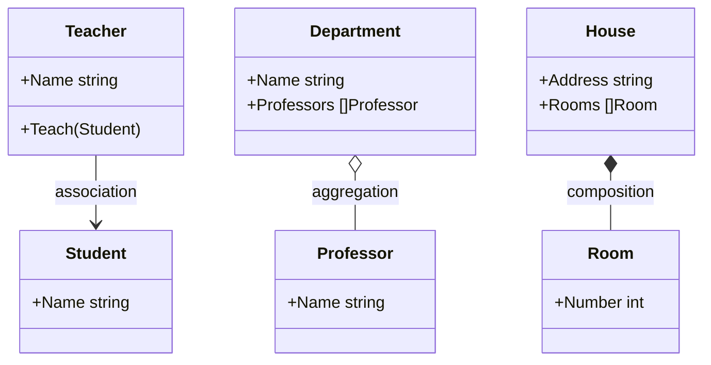

+++
date = '2025-04-08T19:10:10+02:00'
draft = false
title = "Best Practices for Software Development in Go"
tags = ["go", "golang", "best-practices", "software-engineering"]
categories = ["backend", "golang"]
summary = "A collection of real-world Go best practices from years of building backend systems, APIs, and cloud-native services."
comments = true
ShowToc = true
TocOpen = true
image = "banner.jpg"
weight = 1
+++

> Writing Go code that works is easy. Writing Go code that lasts? That takes practice.

After working on production systems in Go for several years — across SaaS platforms, cloud-native backends, and developer tooling — I’ve collected a set of battle-tested best practices that have helped me write maintainable, clean, and scalable Go code.


---

## 🧭 0. Agree on Code Style Before You Write a Line

Before starting any development, align on a shared code style with your team.

This prevents unnecessary friction during code reviews, ensures consistency, and reduces the mental overhead of switching between files written by different developers.

A great starting point is the **[Google Go Style Guide](https://google.github.io/styleguide/go/)** — it's clear, opinionated, and battle-tested at scale. You can automate style enforcement with:

- `gofmt` / `goimports` for formatting
- `golangci-lint` to enforce idiomatic Go practices

Establishing your code style early also makes onboarding faster and simplifies collaboration — especially in cross-functional teams or open source projects.

---

## ✅ 1. Keep it Simple

Go is intentionally minimal — embrace it.

- Avoid over-engineering.
- Prefer composition over inheritance.
- Use plain interfaces and simple data structures.
- Don’t abstract too early — write the concrete code first.

### 🔑 1.1 Keys in a Map

Go maps are incredibly powerful, but not all types can be used as keys.

Allowed as keys ✅:

- `string`, `int`, `bool`, `float64` (comparable primitives)

- Structs and arrays (if all their fields/elements are comparable)

Not allowed ❌:

- `slices`, `maps`, `functions` (they’re not comparable)

Example:

```go
m := map[string]int{
    "alice": 1,
    "bob":   2,
}

fmt.Println(m["alice"]) // 1
```

If you try to use a slice as a key:

```go
bad := map[[]int]string{} // ❌ compile error
```

Another important property: map iteration order is random.

Never rely on a fixed order when looping:

```go
for k, v := range m {
    fmt.Println(k, v) // order is not guaranteed
}
```

#### ✅ Best practices:

- Use maps for lookups, not ordered data.

- If you need order, collect keys into a slice and sort

    ```go
    keys := make([]string, 0, len(m))
    for k := range m {
        keys = append(keys, k)
    }
    sort.Strings(keys)
    
    for _, k := range keys {
        fmt.Println(k, m[k])
    }
    ```

### 🔍 1.2 Understanding nil in Go

In Go, nil is the zero value for reference types. It means “no value” or “points to nothing,” similar to null in other languages — but more strictly typed.

✅ Types that can be nil:

  - Pointers

  - Slices

  - Maps

  - Channels

  - Functions

  - Interfaces

❌ Value types like int, float64, bool, and struct cannot be nil. Their zero values are 0, 0.0, `false`, or an empty struct.

Example:

```go
// nil slice
var s []int
fmt.Println(s == nil) // true
fmt.Println(len(s))   // 0

// nil map
var m map[string]int
fmt.Println(m == nil) // true
// m["key"] = 1 // panic: assignment to entry in nil map

// nil interface
var i interface{}
fmt.Println(i == nil) // true
```

⚠️ Gotcha:

An interface holding a `nil` pointer is not itself `nil`:

```go
var p *int = nil
var x interface{} = p
fmt.Println(x == nil) // false (x holds a *int that is nil)
```

✅ Best practices:

- Check for nil before using maps, channels, or pointers.

- Initialize maps with make before assigning keys.

- Differentiate `nil` vs empty slices (nil slice is len=0 cap=0, empty slice is not nil).

- Be careful with nil interfaces — they can lead to subtle bugs.

---

## 🧱 2. Project Structure Matters

Use a predictable layout:

```text
/cmd - entry points 
/internal - private packages 
/pkg - public, reusable packages 
/api - OpenAPI/proto definitions 
/config - config loading 
/scripts - helper scripts
```


Stick to convention. Tools like [`golang-standards/project-layout`](https://github.com/golang-standards/project-layout) are a great starting point — but adapt it to your team’s needs.

---

## 🧩 2.1 Composition vs Aggregation vs Association in Go

When structuring relationships between objects, Go favors **composition** over inheritance. But it’s also useful to understand the difference between **association**, **aggregation**, and **composition**, especially if you’re coming from UML or other OOP-heavy backgrounds.

- **Association** → A loose link: one object *knows about* or *uses* another, but neither depends on the other’s lifecycle.
- **Aggregation** → Whole–part, but the part can live independently.
- **Composition** → Whole–part, but the part’s lifecycle depends on the whole.



### Example: Association

```go
type Student struct {
    Name string
}

type Teacher struct {
    Name string
}

// association: Teacher *uses* Student, but doesn’t own it
func (t Teacher) Teach(s Student) {
    fmt.Printf("%s teaches %s\n", t.Name, s.Name)
}
```

### Example: Aggregation

```go
type Professor struct {
    Name string
}

type Department struct {
    Name       string
    Professors []Professor // aggregation: professors exist independently
}
```

Here, Professor can exist outside of any Department. Destroying the department doesn’t destroy professors.

### Example: Composition

```go
type Room struct {
    Number int
}

type House struct {
    Address string
    Rooms   []Room // composition: rooms belong only to this house
}

func NewHouse(addr string, n int) House {
    rooms := make([]Room, n)
    for i := range rooms {
        rooms[i] = Room{Number: i + 1}
    }
    return House{Address: addr, Rooms: rooms}
}
```

Here, Rooms only make sense inside a House. If the house is destroyed, the rooms vanish too.

✅ Rule of Thumb in Go:

- Use association when objects only need to call or reference each other (e.g., Teacher teaching a Student).

- Use aggregation when objects have independent meaning (e.g., a User belonging to a Team).

- Use composition when parts are tightly bound to the whole (e.g., Order with its OrderLines).

Go’s emphasis on composition over inheritance makes this distinction practical — you model real-world relationships explicitly instead of relying on class hierarchies.

---

## 🧪 3. Tests Are Not Optional

- Use table-driven tests
- Use [`testing`](https://pkg.go.dev/testing), and only bring in libraries like `testify` if you really need them
- Keep unit tests fast and independent
- Use `go test -cover` to check coverage

---

## ✨ 4. Errors Are First-Class Citizens

- Always check errors — no exceptions.
- Wrap errors with context using `fmt.Errorf("failed to read config: %w", err)`
- For complex systems, consider using `errors.Join` or `errors.Is/As` for proper error handling.

---

## 📦 5. Use Interfaces at the Boundaries

Keep interfaces small, and only expose them where needed:

```go
type Storer interface {
    Save(ctx context.Context, data Item) error
}
```

Don’t write interfaces for everything — only where mocking or substitution matters (e.g. storage, HTTP clients, etc.).

### 🔗 5.1 Interface Embedding (Composing Behaviors)

In Go, it’s common to see interfaces inside other interfaces — this is called interface embedding.

Example from the standard library:

```go
type Reader interface {
    Read(p []byte) (n int, err error)
}

type Writer interface {
    Write(p []byte) (n int, err error)
}

type ReadWriter interface {
    Reader
    Writer
}
```

Instead of repeating method signatures, Go lets you compose small interfaces into bigger ones.

Why it matters:

- Encourages small, focused interfaces (e.g. io.Reader, io.Writer)

- Avoids “fat interfaces” that are harder to mock/test

- Makes code more reusable and flexible

Example in practice (net.Conn):

```go
type Conn interface {
    Reader
    Writer
    Closer
}
```

Any type that implements Read, Write, and Close automatically satisfies Conn.

**✅ This pattern keeps Go code clean, DRY, and testable.**

### 🔍 5.2 Type Assertions

When working with interfaces, you often need to access the concrete type stored inside.

Type assertion syntax:

```go
value, ok := i.(T)
```

- `i` → the interface value

- `T` → the type you expect

- `ok` → boolean (true if successful, false if not)

Example:

```go
var x interface{} = "hello"

s, ok := x.(string)
if ok {
    fmt.Println("string value:", s)
}
```

**⚠️ Without ok, a failed assertion will panic:**

```go
i := interface{}(42)
s := i.(string) // panic: interface {} is int, not string
```

✅ Common Use Case: Generic Maps

```go
data := map[string]interface{}{
    "id":   123,
    "name": "Alice",
}

id := data["id"].(int)
name := data["name"].(string)
```

🔄 Type Switch

```go
switch v := i.(type) {
case string:
    fmt.Println("string:", v)
case int:
    fmt.Println("int:", v)
default:
    fmt.Println("unknown type")
}
```

#### Best Practices:

- Prefer narrow interfaces (avoid interface{} unless really needed).

- Always use the ok idiom unless you are 100% sure of the type.

- Use type switches for clean multi-branch logic.

---

## 🧰 6. Tooling Makes You Better

- Use go vet, staticcheck, and golangci-lint
- Automate formatting: gofmt, goimports
- Use go mod tidy to keep your dependencies clean
- Pin tool versions with a `tools.go` file
- 📊 Use **SonarQube** for static code analysis at scale

SonarQube helps enforce code quality and security standards across large codebases. It can detect bugs, vulnerabilities, code smells, and even provide actionable remediation guidance. Integrate it into your CI pipeline to ensure every PR gets automatically analyzed.

You can use [`sonar-scanner`](https://docs.sonarsource.com/sonarqube/latest/analyzing-source-code/scanners/sonarscanner/) or a Docker-based runner like:

```text
```bash
docker run --rm \
  -e SONAR_HOST_URL="https://your-sonarqube-url" \
  -e SONAR_LOGIN="your_token" \
  -v "$(pwd):/usr/src" \
  sonarsource/sonar-scanner-cli
```

SonarQube works great alongside golangci-lint, giving you both quick feedback locally and deep insights via the web dashboard.

---

## 🔐 7. Secure By Default

- Always set timeouts on HTTP clients and servers
- Avoid leaking secrets in logs
- Validate all inputs — especially on the API boundary
- Use context.Context consistently and propagate it properly

---

## 🌐 8. Embrace the Go Ecosystem

- Use standard library wherever possible — it's well-tested and fast
- Prefer established, well-maintained packages
- Read source code — Go makes it easy to learn from the best

---

## 🚀 9. Performance Matters (but correctness first)

- Profile with `pprof`
- Avoid allocations in tight loops
- Use channels, but don’t abuse goroutines
- Benchmark with go test -bench

### 9.1 Cache vs Memoization

These two terms are often confused, but they solve slightly different problems:

| Concept       | Definition                                                                 | Example in Go                                         | Best For                                |
|---------------|-----------------------------------------------------------------------------|-------------------------------------------------------|-----------------------------------------|
| **Cache**     | General-purpose store that saves results for reuse, often across requests   | `map[string][]byte` holding responses from an API     | Web servers, database queries, heavy I/O |
| **Memoization** | Caching applied to a function call — same inputs, same output            | Store Fibonacci results in a local map inside a func  | Pure functions, recursive computations   |

Example: Memoizing Fibonacci

```go
var memo = map[int]int{}

func fib(n int) int {
    if n <= 1 {
        return n
    }
    if v, ok := memo[n]; ok {
        return v
    }
    res := fib(n-1) + fib(n-2)
    memo[n] = res
    return res
}
```

#### Key differences:

- Cache can be global, cross-service, even distributed (e.g., Redis).

- Memoization is function-scoped, purely about optimization of repeated calls with identical input.

#### ⚖️ Comparison

| Feature   | Cache                                   | Memoization                          |
|-----------|-----------------------------------------|---------------------------------------|
| **Scope** | System-wide (data, responses, etc)      | Function-local (results of calls)     |
| **Key**   | Anything (URLs, queries, objects)       | Function arguments                    |
| **Policy**| TTL, eviction (LRU, LFU, etc.)          | None (grows with unique inputs)       |
| **Use Cases** | DB queries, API responses, assets   | Fibonacci, factorial, DP problems     |


#### 👉 Rule of thumb:

- Use memoization when optimizing pure functions.

- Use a cache when optimizing data retrieval/storage across systems or layers.


#### ✅ Best Practice: 

- Use memoization for pure CPU-bound functions,

- Use cache for I/O-heavy or cross-request data.

---

### 9.2 Profiling Applications in Go

Before you optimize, measure. Profiling is the process of analyzing how your program uses CPU, memory, I/O, and goroutines at runtime.

- CPU profiling → see which functions consume the most CPU.

- Memory profiling → track allocations, leaks, GC pressure.

- Block/goroutine profiling → detect contention and deadlocks.

- I/O profiling → understand bottlenecks in file and network operations.


🛠️ Tools:

- pprof → built into Go (import _ "net/http/pprof" or go test -cpuprofile).

- go tool trace → visualize goroutines, scheduler, and syscalls.

- Flamegraphs → for intuitive hotspot analysis.


Example (benchmark with profiling):

```shell
go test -bench . -benchmem -cpuprofile=cpu.prof
go tool pprof cpu.prof
```

### 9.3 Writing Performant Go Applications

Performance in Go is about simplicity, memory discipline, and concurrency done right. Here are the key principles, expanded with practical guidance:

#### 🧭 Keep It Simple

Go’s runtime is optimized for clarity and straightforward patterns. Complex abstractions can hurt performance more than help.

Avoid deep inheritance-like structures or overuse of interfaces.

Inline small helper functions if they are critical hot paths.

Write concrete implementations first, introduce abstractions only if necessary.

#### 📊 Choose Data Structures Wisely

Selecting the right structure saves time and memory.

Maps → great for fast lookups (O(1) average).

Slices → ideal for sequential or indexed data. Preallocate with make([]T, 0, n) when size is known.

Arrays → better when the size is fixed and performance is critical.

Avoid sync.Map unless you have high contention with many goroutines.

Example:

```go
// Preallocate slice for performance
items := make([]string, 0, 1000)
```

#### 🧩 Reduce Allocations

Every allocation puts pressure on the garbage collector.

Pre-size slices and maps.

Reuse buffers with sync.Pool for short-lived objects.

Avoid creating temporary strings with repeated concatenations (strings.Builder is better).

```go
var bufPool = sync.Pool{New: func() any { return new(bytes.Buffer) }}
```

#### ⚡ Concurrency Done Right

Goroutines are cheap but not free. Overspawning leads to memory pressure and scheduler overhead.

Use worker pools to control concurrency.

For counters, prefer sync/atomic over mutex when safe.

Don’t use channels as queues unless you need synchronization.

```go
var counter int64
atomic.AddInt64(&counter, 1)
```

#### 📡 Efficient I/O

I/O is often the real bottleneck.

Use bufio.Reader / Writer for file and network operations.

Stream large files instead of loading them all at once.

Batch database or API operations where possible.

```go
scanner := bufio.NewScanner(file)
for scanner.Scan() {
    process(scanner.Text())
}
```

#### 🔍 Escape Analysis

Go decides whether a variable lives on the stack or heap. Heap allocations are slower and trigger GC.

- Inspect with:

```shell
go build -gcflags="-m"
```

- Avoid unnecessary heap escapes by keeping variables local and avoiding interface conversions.

#### 📏 Measure > Guess

Never assume where the bottleneck is. Use Go’s profiling tools:

- pprof → CPU, memory, goroutine profiling.

- go test -bench → benchmarking.

- go tool trace → concurrency visualization.

```shell
go test -bench . -benchmem -cpuprofile=cpu.prof
go tool pprof cpu.prof
```

✅ Rule of Thumb:

- Correctness first → Profile → Optimize the real hot paths → Measure again.

This cycle ensures you spend time on data-driven optimizations, not micro-optimizing code that doesn’t matter.

---

## 🧠 10. Readability > Cleverness

Your code will be read 10x more than it’s written.

    "Write code for humans, not machines."

Stick to idiomatic Go — use golangci-lint to enforce consistency, and always code with your teammates in mind.

---

## 🙌 Conclusion

Go is an incredible tool for building fast, reliable software — but like any tool, it shines brightest in the hands of developers who respect its philosophy: clarity, simplicity, and composability.

What are your favorite Go best practices? Let me know on [Twitter](https://x.com/norbixjakubczak) or GitHub [@norbix](https://github.com/norbix)!

---

🚀 Follow me on [norbix.dev](https://norbix.dev) for more insights on Go, Python, AI, system design, and engineering wisdom.
