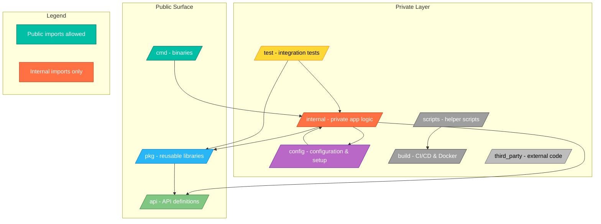

+++
date = '2025-04-08T19:10:10+02:00'
draft = false
title = "Best Practices for Software Development in Go"
tags = ["go", "golang", "best-practices", "software-engineering"]
categories = ["backend", "golang"]
summary = "A collection of real-world Go best practices from years of building backend systems, APIs, and cloud-native services."
comments = true
ShowToc = true
TocOpen = true
image = "banner.jpg"
weight = 1
+++

> Writing Go code that works is easy. Writing Go code that lasts? That takes practice.

After working on production systems in Go for several years — across SaaS platforms, cloud-native backends, and developer tooling — I’ve collected a set of battle-tested best practices that have helped me write maintainable, clean, and scalable Go code.


---

## 🧭 0. Agree on Code Style Before You Write a Line

Before starting any development, align on a shared code style with your team.

This prevents unnecessary friction during code reviews, ensures consistency, and reduces the mental overhead of switching between files written by different developers.

A great starting point is the **[Google Go Style Guide](https://google.github.io/styleguide/go/)** — it's clear, opinionated, and battle-tested at scale. You can automate style enforcement with:

- `gofmt` / `goimports` for formatting
- `golangci-lint` to enforce idiomatic Go practices

Establishing your code style early also makes onboarding faster and simplifies collaboration — especially in cross-functional teams or open source projects.

---

## ✅ 1. Keep it Simple

Go is intentionally minimal — embrace it.

- Avoid over-engineering.
- Prefer composition over inheritance.
- Use plain interfaces and simple data structures.
- Don’t abstract too early — write the concrete code first.

### 🔑 1.1 Keys in a Map

Go maps are incredibly powerful, but not all types can be used as keys.

Allowed as keys ✅:

- `string`, `int`, `bool`, `float64` (comparable primitives)

- Structs and arrays (if all their fields/elements are comparable)

Not allowed ❌:

- `slices`, `maps`, `functions` (they’re not comparable)

Example:

```go
m := map[string]int{
    "alice": 1,
    "bob":   2,
}

fmt.Println(m["alice"]) // 1
```

If you try to use a slice as a key:

```go
bad := map[[]int]string{} // ❌ compile error
```

Another important property: map iteration order is random.

Never rely on a fixed order when looping:

```go
for k, v := range m {
    fmt.Println(k, v) // order is not guaranteed
}
```

#### ✅ Best practices:

- Use maps for lookups, not ordered data.

- If you need order, collect keys into a slice and sort

    ```go
    keys := make([]string, 0, len(m))
    for k := range m {
        keys = append(keys, k)
    }
    sort.Strings(keys)
    
    for _, k := range keys {
        fmt.Println(k, m[k])
    }
    ```

### 🔍 1.2 Understanding nil in Go

In Go, nil is the zero value for reference types. It means “no value” or “points to nothing,” similar to null in other languages — but more strictly typed.

✅ Types that can be nil:

  - Pointers

  - Slices

  - Maps

  - Channels

  - Functions

  - Interfaces

❌ Value types like int, float64, bool, and struct cannot be nil. Their zero values are 0, 0.0, `false`, or an empty struct.

Example:

```go
// nil slice
var s []int
fmt.Println(s == nil) // true
fmt.Println(len(s))   // 0

// nil map
var m map[string]int
fmt.Println(m == nil) // true
// m["key"] = 1 // panic: assignment to entry in nil map

// nil interface
var i interface{}
fmt.Println(i == nil) // true
```

⚠️ Gotcha:

An interface holding a `nil` pointer is not itself `nil`:

```go
var p *int = nil
var x interface{} = p
fmt.Println(x == nil) // false (x holds a *int that is nil)
```

✅ Best practices:

- Check for nil before using maps, channels, or pointers.

- Initialize maps with make before assigning keys.

- Differentiate `nil` vs empty slices (nil slice is len=0 cap=0, empty slice is not nil).

- Be careful with nil interfaces — they can lead to subtle bugs.

---

### 🧬 1.3 Shallow vs Deep Copy in Go

Go passes **values by copy**, not by reference — but that copy is usually **shallow**, not deep.

#### 🪞 Shallow Copy

A shallow copy duplicates only the **top-level value**, not the data it refers to.  
For structs, slices, or maps containing references (like pointers or other slices),  
the inner data is still shared.

Example:

```go
type Student struct {
    Name string
    Scores []int
}

func main() {
    a := Student{Name: "Alice", Scores: []int{90, 95}}
    b := a // shallow copy

    b.Name = "Bob"
    b.Scores[0] = 50

    fmt.Println(a.Name)    // Alice (independent copy)
    fmt.Println(a.Scores)  // [50 95] shared underlying slice
}
```

- `b` has its own copy of the `Name` string (strings are immutable).

- But both `a` and `b` share the same slice `Scores` backing array — so a mutation inside it affects both.

#### 🧠 Deep Copy

A deep copy recursively duplicates all nested data — ensuring no shared memory.

Example (manual deep copy):

```go
func DeepCopyStudent(s Student) Student {
    newScores := make([]int, len(s.Scores))
    copy(newScores, s.Scores)
    return Student{
        Name: s.Name,
        Scores: newScores,
    }
}
```

Now, changes to Scores in the copy won’t affect the original.

#### 📦 Structs vs Pointers

When you pass a struct by value, you get a shallow copy of the struct.

When you pass a pointer, you share the same memory.

```go
func TeachByValue(s Student) {
    s.Name = "Changed in TeachByValue"
}

func TeachByPointer(s *Student) {
    s.Name = "Changed in TeachByPointer"
}

func main() {
    st := Student{Name: "Alice"}
    TeachByValue(st)
    fmt.Println(st.Name) // Alice not changed

    TeachByPointer(&st)
    fmt.Println(st.Name) // Changed in TeachByPointer
}
```

✅ Rule of thumb:

- Use values when you want immutability (safe copies).

- Use pointers when you want shared, mutable state or to avoid large value copies.

- Always be explicit about ownership — who is allowed to mutate what.

🧱 Memory Layout Visualization

```text
By Value:
st  ──▶ { Name: "Alice" }
s   ──▶ { Name: "Changed in TeachByValue" }  // a separate copy

By Pointer:
st  ─┐
     ▼
   { Name: "Changed in TeachByPointer" }  // shared memory
s ─┘
```

Pointers don’t create new data — they just give another view of the same memory location.

This means:

- Fast access (no full struct copy)

- Shared ownership (can cause data races in concurrent code)

- Memory-efficient, but you must handle mutability carefully.


⚙️ When Go Decides to Copy vs Share

| Type        | Default Behavior                       | Shared Data? |
| ----------- | -------------------------------------- | ------------ |
| **Struct**  | Copied (shallow)                       | No           |
| **Array**   | Copied (deep)                          | No           |
| **Slice**   | Copied header only (pointer, len, cap) | Yes          |
| **Map**     | Copied reference                       | Yes          |
| **Pointer** | Copied address                         | Yes          |
| **Channel** | Copied reference                       | Yes          |
| **String**  | Copied (immutable)                     | No (safe)    |

#### 🧭 Best Practices

| Use Case | Recommended Copy | Why |
|----------|------------------|-----|
| Passing configuration, DTOs, small structs | By value	| Prevents unintended mutation |
| Shared caches, DB connections, loggers | By pointer | Intended shared state |
| Complex structs with nested slices or maps | Deep copy if immutability needed | Prevents shared backing data |

**💡 Think of shallow copy as “two structs sharing one heart” — fast but risky.**

**Deep copy gives each one its own heartbeat.**

---

## 🧱 2. Project Structure Matters

Use a predictable layout:

```text
/cmd      - entry points (main packages)
/internal - private packages (not importable from outside the module)
/pkg      - public, reusable packages
/api      - OpenAPI/proto definitions or gRPC schemas
/config   - config loading and environment setup
/scripts  - helper scripts (build, test, deploy)
/test     - integration and end-to-end tests
/build    - Dockerfiles, CI/CD, or packaging assets
/third_party - vendored or generated external code
```
Stick to convention. Tools like [`golang-standards/project-layout`](https://github.com/golang-standards/project-layout) are a great starting point — but adapt it to your team’s needs.

### 🔒 2.1. About the `internal/` Package

Go enforces a visibility rule for the internal/ directory:

- Code inside `internal/` can import any other package (including `/pkg`, `/api`, or `/config`).

- Code outside `internal/` cannot import packages from `internal/`.

This design ensures a clean encapsulation boundary — internal packages remain private to your module, preventing accidental dependencies by external consumers or other modules.

```text
project/
├── cmd/
│   └── server/main.go
├── internal/
│   └── service/user.go
├── pkg/
│   └── logger/logger.go
```

✅ Allowed:
internal/service/user.go → import "project/pkg/logger"

❌ Forbidden:
pkg/logger/logger.go → import "project/internal/service"

This structure encourages modularity and intentional visibility — only expose what truly needs to be reused.

### ⚙️ 2.2. Other Common Directories

#### `cmd/` — Entry Points

Each subdirectory under /cmd builds a separate binary.

Example:

```text
cmd/
  server/
    main.go   # builds binary "server"
  cli/
    main.go   # builds binary "cli"
```

Use `/cmd` for main packages that bootstrap your services, CLIs, or daemons.

#### `pkg/` — Public Libraries

Holds reusable code meant to be imported by other modules or projects.

```text
pkg/
  logger/
  middleware/
  storage/
```

If your module is published publicly, `/pkg` is the "safe to import" surface.

#### `api/` — Schemas and Contracts

Contains OpenAPI specs, gRPC .proto files, or versioned API models:

```text
api/
  openapi.yaml
  v1/types.go
  proto/service.proto
```

This makes your interfaces explicit and versioned — ideal for microservices.

#### `config/` — Configuration and Setup

Central place for config files, environment loaders, and schema validation:

```text
config/
  config.yaml
  loader.go
```

Keeps your configuration logic cleanly separated from business logic.

#### `scripts/` — Automation Helpers

Contains Makefiles, Taskfiles, shell scripts, and CI/CD helpers:`

```text
scripts/
  build.sh
  test.sh
  lint.sh
```

Encapsulates repetitive commands and improves onboarding consistency.

#### `test/` or `tests/` — Integration & E2E Tests

Holds black-box or multi-package tests:

```text
test/
  integration/
  e2e/
```

Keeps your integration logic separate from white-box unit tests (*_test.go inside code dirs).

#### `build/` — CI, Docker, and Packaging

Keeps build and deployment artifacts:

```text
build/
  Dockerfile
  ci/
  helm/
```

Useful for container builds, pipeline configs, and OS packaging.

#### `third_party/` — External or Generated Code

Stores generated clients, protobufs, or vendored dependencies not under your control.

#### `vendor/` — Toolchain Cache

Special Go tool-managed directory (created by go mod vendor).
Used only when building in vendor mode (-mod=vendor).

#### 🧠 Mental Model

| Directory | Enforced by Go? | Purpose | Typical Visibility    |
|-----------|-----------------|---------|-----------------------|
| /internal	| ✅ Yes	          | Private logic	| Private               |
| /cmd	| ❌ No	           | Executables	| Public (entry points) |
| /pkg	| ❌ No	           | Reusable libs	| Public                |
| /api	| ❌ No	           | Contracts, schemas	| Public                |
| /config	| ❌ No            |	Environment setup	| Internal |
| /scripts	| ❌ No	| Build/test helpers	| Internal |
| /test	| ❌ No	| Integration/E2E	| Internal |
| /build	| ❌ No	| CI/CD artifacts	| Internal |
| /third_party	| ❌ No	| External code	| Internal |
| /vendor	| ✅ Yes	| Dependency cache	| Tool-managed |

🧩 Takeaway

A well-structured Go project isn’t just aesthetic — it communicates intent:

- What’s private (internal)

- What’s reusable (pkg)

- What’s executable (cmd)

- What’s declarative (api, config)

Follow convention where it helps, break it where it clarifies — but always make import boundaries explicit.

### 🧩 2.3. Import Boundaries Diagram



---

## 🧩 3. Composition vs Aggregation vs Association in Go

When structuring relationships between objects, Go favors **composition** over inheritance. But it’s also useful to understand the difference between **association**, **aggregation**, and **composition**, especially if you’re coming from UML or other OOP-heavy backgrounds.

- **Association** → A loose link: one object *knows about* or *uses* another, but neither depends on the other’s lifecycle.
- **Aggregation** → Whole–part, but the part can live independently.
- **Composition** → Whole–part, but the part’s lifecycle depends on the whole.


### Example: Association

```go
type Student struct {
    Name string
}

type Teacher struct {
    Name string
}

// association: Teacher *uses* Student, but doesn’t own it
func (t Teacher) Teach(s Student) {
    fmt.Printf("%s teaches %s\n", t.Name, s.Name)
}
```

### Example: Aggregation

```go
type Professor struct {
    Name string
}

type Department struct {
    Name       string
    Professors []Professor // aggregation: professors exist independently
}
```

Here, Professor can exist outside of any Department. Destroying the department doesn’t destroy professors.

### Example: Composition

```go
type Room struct {
    Number int
}

type House struct {
    Address string
    Rooms   []Room // composition: rooms belong only to this house
}

func NewHouse(addr string, n int) House {
    rooms := make([]Room, n)
    for i := range rooms {
        rooms[i] = Room{Number: i + 1}
    }
    return House{Address: addr, Rooms: rooms}
}
```

Here, Rooms only make sense inside a House. If the house is destroyed, the rooms vanish too.

✅ Rule of Thumb in Go:

- Use association when objects only need to call or reference each other (e.g., Teacher teaching a Student).

- Use aggregation when objects have independent meaning (e.g., a User belonging to a Team).

- Use composition when parts are tightly bound to the whole (e.g., Order with its OrderLines).

Go’s emphasis on composition over inheritance makes this distinction practical — you model real-world relationships explicitly instead of relying on class hierarchies.

---

## 🧪 4. Tests Are Not Optional

- Use table-driven tests
- Use [`testing`](https://pkg.go.dev/testing), and only bring in libraries like `testify` if you really need them
- Keep unit tests fast and independent
- Use `go test -cover` to check coverage

---

## ✨ 5. Errors Are First-Class Citizens

- Always check errors — no exceptions.
- Wrap errors with context using `fmt.Errorf("failed to read config: %w", err)`
- For complex systems, consider using `errors.Join` or `errors.Is/As` for proper error handling.

---

## 📦 6. Use Interfaces at the Boundaries

Keep interfaces small, and only expose them where needed:

```go
type Storer interface {
    Save(ctx context.Context, data Item) error
}
```

Don’t write interfaces for everything — only where mocking or substitution matters (e.g. storage, HTTP clients, etc.).

### 🔗 6.1 Interface Embedding (Composing Behaviors)

In Go, it’s common to see interfaces inside other interfaces — this is called interface embedding.

Example from the standard library:

```go
type Reader interface {
    Read(p []byte) (n int, err error)
}

type Writer interface {
    Write(p []byte) (n int, err error)
}

type ReadWriter interface {
    Reader
    Writer
}
```

Instead of repeating method signatures, Go lets you compose small interfaces into bigger ones.

Why it matters:

- Encourages small, focused interfaces (e.g. io.Reader, io.Writer)

- Avoids “fat interfaces” that are harder to mock/test

- Makes code more reusable and flexible

Example in practice (net.Conn):

```go
type Conn interface {
    Reader
    Writer
    Closer
}
```

Any type that implements Read, Write, and Close automatically satisfies Conn.

**✅ This pattern keeps Go code clean, DRY, and testable.**

### 🔍 6.2 Type Assertions

When working with interfaces, you often need to access the concrete type stored inside.

Type assertion syntax:

```go
value, ok := i.(T)
```

- `i` → the interface value

- `T` → the type you expect

- `ok` → boolean (true if successful, false if not)

Example:

```go
var x interface{} = "hello"

s, ok := x.(string)
if ok {
    fmt.Println("string value:", s)
}
```

**⚠️ Without ok, a failed assertion will panic:**

```go
i := interface{}(42)
s := i.(string) // panic: interface {} is int, not string
```

✅ Common Use Case: Generic Maps

```go
data := map[string]interface{}{
    "id":   123,
    "name": "Alice",
}

id := data["id"].(int)
name := data["name"].(string)
```

🔄 Type Switch

```go
switch v := i.(type) {
case string:
    fmt.Println("string:", v)
case int:
    fmt.Println("int:", v)
default:
    fmt.Println("unknown type")
}
```

### 🔑 6.3 Define Interfaces Where They Are Consumed

One of the most important Go idioms:

Interfaces belong where they are consumed, not where they are implemented.

The consumer knows which methods it actually needs. The implementer just provides concrete behavior. Defining interfaces at the consumer keeps them small, precise, and easier to test.

#### ❌ Bad Practice (interface declared at implementation)

```go
// db.go
type Database interface {
    Save(user User) error
    Find(id string) (User, error)
}

type PostgresDB struct{}

func (p *PostgresDB) Save(user User) error   { /* ... */ return nil }
func (p *PostgresDB) Find(id string) (User, error) { /* ... */ return User{}, nil }
```

Here, the implementation (PostgresDB) dictates the contract.

Problem: every consumer must accept both Save and Find, even if it only needs one of them.

#### ✅ Good Practice (interface declared at consumer)

```go
// user_service.go
type UserStore interface {
    Save(user User) error
}

type UserService struct {
    store UserStore
}

func (s *UserService) CreateUser(u User) error {
    return s.store.Save(u)
}

// postgres.go
type PostgresDB struct{}

func (p *PostgresDB) Save(user User) error {
// insert into DB...
return nil
}
```

- UserService defines the UserStore interface it needs.

- PostgresDB happens to implement it because it provides Save.

- For testing, you can swap in a MockStore without touching production code.

📖 This practice reflects both:

- The Dependency Inversion Principle (DIP) → high-level code depends on abstractions, not implementations.

- The Ports & Adapters (Hexagonal Architecture) style → the interface is the port, and the database or mock is just an adapter.

#### ✅ Benefits

- Interfaces stay small (often a single method, like io.Reader).

- Consumers don’t depend on methods they don’t use.

- Easier to create mocks/stubs for testing.

- Concrete types can satisfy multiple consumer-defined interfaces naturally.

### Best Practices:

- Prefer narrow interfaces (avoid interface{} unless really needed).

- Always use the ok idiom unless you are 100% sure of the type.

- Use type switches for clean multi-branch logic.

---

## 🧰 7. Tooling Makes You Better

- Use go vet, staticcheck, and golangci-lint
- Automate formatting: gofmt, goimports
- Use go mod tidy to keep your dependencies clean
- Pin tool versions with a `tools.go` file
- 📊 Use **SonarQube** for static code analysis at scale

SonarQube helps enforce code quality and security standards across large codebases. It can detect bugs, vulnerabilities, code smells, and even provide actionable remediation guidance. Integrate it into your CI pipeline to ensure every PR gets automatically analyzed.

You can use [`sonar-scanner`](https://docs.sonarsource.com/sonarqube/latest/analyzing-source-code/scanners/sonarscanner/) or a Docker-based runner like:

```text
```bash
docker run --rm \
  -e SONAR_HOST_URL="https://your-sonarqube-url" \
  -e SONAR_LOGIN="your_token" \
  -v "$(pwd):/usr/src" \
  sonarsource/sonar-scanner-cli
```

SonarQube works great alongside golangci-lint, giving you both quick feedback locally and deep insights via the web dashboard.

---

## 🔐 8. Secure By Default

- Always set timeouts on HTTP clients and servers
- Avoid leaking secrets in logs
- Validate all inputs — especially on the API boundary
- Use context.Context consistently and propagate it properly

### ⚙️ 8.1 Feature Toggles — Safe and Gradual Releases

In modern Go services — especially those deployed continuously — you often need to release features safely without deploying new binaries.
That’s where feature toggles (also known as feature flags) come in.

A feature toggle is simply a conditional switch in your code that enables or disables functionality at runtime:

```go
if featureFlags["newCheckoutFlow"] {
    runNewCheckoutFlow()
} else {
    runOldCheckoutFlow()
}
```

By decoupling deployment from release, toggles let you control exposure dynamically — through config files, environment variables, or even a remote flag service.

🧩 Common Use Cases

| Goal | Example |
|------|---------|
| Gradual rollout | Enable a feature for 10% of users |
| Canary testing | Validate stability before full release |
| Kill switch | Turn off a buggy or expensive feature instantly |
| A/B testing | Compare user behavior across versions |
| Permissioning | Premium or internal-only features |

🧠 Types of Feature Toggles

| Type | Description |
|------|-------------|
| Release toggles | Hide incomplete work in production |
| Ops toggles | Control runtime features for stability or performance |
| Experiment toggles | Run experiments or A/B tests |
| Permission toggles | Enable per-customer or per-role features |

🧰 How to Implement in Go

For small projects:

```go
type FeatureFlags map[string]bool

func (f FeatureFlags) IsEnabled(name string) bool {
    return f[name]
}

// Example
flags := FeatureFlags{"betaUI": true}
if flags.IsEnabled("betaUI") {
    renderBetaUI()
}
```

🧩 Example: Loading Feature Flags from Config

```yaml
# config.yaml
feature_flags:
  betaUI: true
  newCheckoutFlow: false
```

```go
type Config struct {
    FeatureFlags map[string]bool `yaml:"feature_flags"`
}

func LoadConfig(path string) (*Config, error) {
    data, err := os.ReadFile(path)
    if err != nil {
        return nil, err
    }
    var cfg Config
    if err := yaml.Unmarshal(data, &cfg); err != nil {
        return nil, err
    }
    return &cfg, nil
}

// usage
cfg, _ := LoadConfig("config.yaml")
if cfg.FeatureFlags["betaUI"] {
    renderBetaUI()
}
```

✅ This shows readers a real-world approach — environment-driven toggles loaded at runtime

For production systems, you can use configuration-driven toggles (YAML, JSON, or environment variables), or integrate external services like:

- [LaunchDarkly](https://launchdarkly.com)
- [Unleash](https://www.getunleash.io/)
- [Flagsmith](https://flagsmith.com/)
- [AWS AppConfig Feature Flags](https://docs.aws.amazon.com/appconfig/latest/userguide/feature-flags.html)

🧩 Takeaway:

Feature toggles empower Go developers to deploy continuously yet release safely, minimizing risk and improving operational control — a perfect fit for DevOps and Platform Engineering workflows.

---

## 🌐 9. Embrace the Go Ecosystem

- Use standard library wherever possible — it's well-tested and fast
- Prefer established, well-maintained packages
- Read source code — Go makes it easy to learn from the best

---

## 🚀 10. Performance Matters (but correctness first)

- Profile with `pprof`
- Avoid allocations in tight loops
- Use channels, but don’t abuse goroutines
- Benchmark with go test -bench

### 10.1 Cache vs Memoization

These two terms are often confused, but they solve slightly different problems:

| Concept       | Definition                                                                 | Example in Go                                         | Best For                                |
|---------------|-----------------------------------------------------------------------------|-------------------------------------------------------|-----------------------------------------|
| **Cache**     | General-purpose store that saves results for reuse, often across requests   | `map[string][]byte` holding responses from an API     | Web servers, database queries, heavy I/O |
| **Memoization** | Caching applied to a function call — same inputs, same output            | Store Fibonacci results in a local map inside a func  | Pure functions, recursive computations   |

Example: Memoizing Fibonacci

```go
var memo = map[int]int{}

func fib(n int) int {
    if n <= 1 {
        return n
    }
    if v, ok := memo[n]; ok {
        return v
    }
    res := fib(n-1) + fib(n-2)
    memo[n] = res
    return res
}
```

#### Key differences:

- Cache can be global, cross-service, even distributed (e.g., Redis).

- Memoization is function-scoped, purely about optimization of repeated calls with identical input.

#### ⚖️ Comparison

| Feature   | Cache                                   | Memoization                          |
|-----------|-----------------------------------------|---------------------------------------|
| **Scope** | System-wide (data, responses, etc)      | Function-local (results of calls)     |
| **Key**   | Anything (URLs, queries, objects)       | Function arguments                    |
| **Policy**| TTL, eviction (LRU, LFU, etc.)          | None (grows with unique inputs)       |
| **Use Cases** | DB queries, API responses, assets   | Fibonacci, factorial, DP problems     |


#### 👉 Rule of thumb:

- Use memoization when optimizing pure functions.

- Use a cache when optimizing data retrieval/storage across systems or layers.


#### ✅ Best Practice: 

- Use memoization for pure CPU-bound functions,

- Use cache for I/O-heavy or cross-request data.

---

### 10.2 Profiling Applications in Go

Before you optimize, measure. Profiling is the process of analyzing how your program uses CPU, memory, I/O, and goroutines at runtime.

- CPU profiling → see which functions consume the most CPU.

- Memory profiling → track allocations, leaks, GC pressure.

- Block/goroutine profiling → detect contention and deadlocks.

- I/O profiling → understand bottlenecks in file and network operations.


🛠️ Tools:

- pprof → built into Go (import _ "net/http/pprof" or go test -cpuprofile).

- go tool trace → visualize goroutines, scheduler, and syscalls.

- Flamegraphs → for intuitive hotspot analysis.


Example (benchmark with profiling):

```shell
go test -bench . -benchmem -cpuprofile=cpu.prof
go tool pprof cpu.prof
```

### 9.3 Writing Performant Go Applications

Performance in Go is about simplicity, memory discipline, and concurrency done right. Here are the key principles, expanded with practical guidance:

#### 🧭 Keep It Simple

- Go’s runtime is optimized for clarity and straightforward patterns. Complex abstractions can hurt performance more than help.

- Avoid deep inheritance-like structures or overuse of interfaces.

- Inline small helper functions if they are critical hot paths.

- Write concrete implementations first, introduce abstractions only if necessary.

#### 📊 Choose Data Structures Wisely

- Selecting the right structure saves time and memory.

- Maps → great for fast lookups (O(1) average).

- Slices → ideal for sequential or indexed data. Preallocate with make([]T, 0, n) when size is known.

- Arrays → better when the size is fixed and performance is critical.

- Avoid sync.Map unless you have high contention with many goroutines.

Example:

```go
// Preallocate slice for performance
items := make([]string, 0, 1000)
```

#### 🧩 Reduce Allocations

- Every allocation puts pressure on the garbage collector.

- Pre-size slices and maps.

- Reuse buffers with sync.Pool for short-lived objects.

- Avoid creating temporary strings with repeated concatenations (strings.Builder is better).

```go
var bufPool = sync.Pool{New: func() any { return new(bytes.Buffer) }}
```

#### ⚡ Concurrency Done Right

- Goroutines are cheap but not free. Overspawning leads to memory pressure and scheduler overhead.

- Use worker pools to control concurrency.

- For counters, prefer sync/atomic over mutex when safe.

- Don’t use channels as queues unless you need synchronization.

```go
var counter int64
atomic.AddInt64(&counter, 1)
```

#### 📡 Efficient I/O

- I/O is often the real bottleneck.

- Use bufio.Reader / Writer for file and network operations.

- Stream large files instead of loading them all at once.

- Batch database or API operations where possible.

```go
scanner := bufio.NewScanner(file)
for scanner.Scan() {
    process(scanner.Text())
}
```

#### 🔍 Escape Analysis

Go decides whether a variable lives on the stack or heap. Heap allocations are slower and trigger GC.

- Inspect with:

```shell
go build -gcflags="-m"
```

- Avoid unnecessary heap escapes by keeping variables local and avoiding interface conversions.

#### 📏 Measure > Guess

Never assume where the bottleneck is. Use Go’s profiling tools:

- pprof → CPU, memory, goroutine profiling.

- go test -bench → benchmarking.

- go tool trace → concurrency visualization.

```shell
go test -bench . -benchmem -cpuprofile=cpu.prof
go tool pprof cpu.prof
```

✅ Rule of Thumb:

- Correctness first → Profile → Optimize the real hot paths → Measure again.

This cycle ensures you spend time on data-driven optimizations, not micro-optimizing code that doesn’t matter.


### 9.4 Garbage Collection in Go

Go’s runtime includes a concurrent garbage collector (GC) that automatically reclaims unused memory. While convenient, GC can introduce latency if your program allocates excessively or creates short-lived objects too frequently.

#### 🛠 How Go’s GC Works

- Concurrent → runs alongside your program with minimal “stop-the-world” pauses.

- Generational-like behavior → favors reclaiming short-lived objects quickly.

- Trigger → activated when heap size has grown relative to live data.

- You can observe GC activity by running with:

```shell
GODEBUG=gctrace=1 ./your-app
```

This prints information about each GC cycle: heap size, pause time, live objects.

#### ⚡ Best Practices to Reduce GC Pressure

- Minimize allocations → reuse buffers with sync.Pool, preallocate slices/maps.

- Avoid unnecessary boxing → don’t convert values to interfaces unless needed.

- Batch work → instead of allocating thousands of tiny objects, reuse larger chunks.

- Watch escape analysis → variables that escape to the heap create GC load.

Example:

```go
var bufPool = sync.Pool{
    New: func() any { return new(bytes.Buffer) },
}

func handler() {
    buf := bufPool.Get().(*bytes.Buffer)
    buf.Reset()
    defer bufPool.Put(buf)

    // use buf...
}
```

#### 📊 Profiling GC

Use memory profiling (pprof) to understand allocations:

```shell
go test -bench . -benchmem -memprofile=mem.prof
go tool pprof mem.prof
```

You’ll see which functions are allocating most memory and putting pressure on the GC.

✅ Rule of Thumb

- Write simple, clear code first.

- Profile memory before attempting optimizations.

- Reduce GC work only in hot paths or high-throughput services.

👉 GC isn’t something to fear — but being mindful of allocations can make the difference between a system that works and one that scales.

---

## 🧠 11. Readability > Cleverness

Your code will be read 10x more than it’s written.

    "Write code for humans, not machines."

Stick to idiomatic Go — use golangci-lint to enforce consistency, and always code with your teammates in mind.

---

## 🐹 vs 🐍 12. Go vs Python: When to Choose What

Both Go and Python are fantastic languages — but they shine in different domains. Understanding their trade-offs helps you choose the right tool for the job.

### ⚡ Performance

Go: Compiled, statically typed, and optimized for concurrency. Excels at backend services, APIs, and systems programming.

Python: Interpreted, dynamically typed. Slower for CPU-bound tasks, but excellent for scripting, prototyping, and data analysis.

### 🧩 Concurrency

Go: Goroutines and channels make concurrent programming first-class. Easy to scale I/O-heavy workloads.

Python: GIL (Global Interpreter Lock) limits true parallel threads. AsyncIO helps with concurrency, but not as seamless as Go.

### 🔨 Ecosystem

Go: Strong in cloud-native, networking, and backend systems. Kubernetes, Docker, Terraform are written in Go.

Python: Dominates data science, AI/ML, and automation. Rich ecosystem (NumPy, Pandas, TensorFlow, FastAPI).

### 📦 Tooling

Go: Built-in tools (go test, go fmt, go vet, pprof) — batteries included, opinionated.

Python: Huge package index (PyPI) but fragmented tooling. Requires picking/testing frameworks and linters.

### 🧑‍🤝‍🧑 Developer Experience

Go: Minimal language, strict compiler, fewer surprises at runtime. Great for teams that value simplicity and maintainability.

Python: Expressive, flexible, and concise. Ideal for rapid prototyping and exploratory coding.

### ⚖️ Rule of Thumb

- Choose Go for: APIs, microservices, SaaS backends, cloud-native infra, systems software.

- Choose Python for: AI/ML, data engineering, quick scripts, scientific computing.

👉 Many companies use both: Go for production backends, Python for data pipelines and machine learning.

### 🗂️ Quick Comparison Table

| Feature          | Go 🐹                            | Python 🐍                           |
|------------------|----------------------------------|-------------------------------------|
| **Performance**  | Fast (compiled, static typing)   | Slower (interpreted, dynamic)       |
| **Concurrency**  | Goroutines, channels, async by design | GIL limits threads, AsyncIO helps  |
| **Ecosystem**    | Cloud-native, infra, backends    | Data science, AI/ML, automation     |
| **Tooling**      | Built-in, opinionated, consistent| Huge but fragmented (PyPI)          |
| **DX**           | Strict, simple, maintainable     | Flexible, expressive, rapid dev     |
| **Best For**     | APIs, SaaS, infra, systems code  | AI/ML, ETL, scripting, prototyping  |

---

## 🙌 Conclusion

Go is an incredible tool for building fast, reliable software — but like any tool, it shines brightest in the hands of developers who respect its philosophy: clarity, simplicity, and composability.

---

## 🔗 Explore More with Pragmatic Code Examples

If you’d like to see these principles in action, check out my open-source repositories demonstrating production-grade Go setups:

- 🧱 [Build Automation Examples for Go](https://github.com/norbix/build-automation-examples-for-go) — practical `Taskfile` + `Makefile` automation patterns

- 🌐 [Fullstack Demo in Go](https://github.com/norbix/demo1_fullstack_golang) — 3-tier web app with `Docker Compose` and `Nginx`

- ⚙️ [CLI Demo in Go](https://github.com/norbix/demo4_cli_golang) — building powerful command-line tools using Go standard library

---

🚀 Follow me on [norbix.dev](https://norbix.dev) for more insights on Go, Python, AI, system design, and engineering wisdom.
