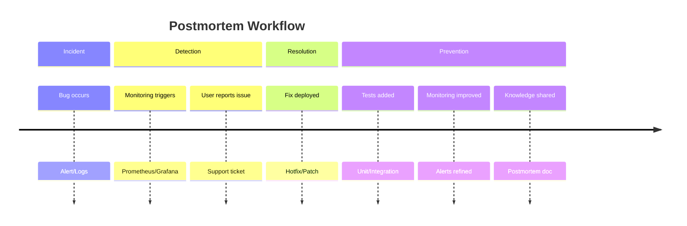

+++
title = "Debugging Go Code: Techniques, Tools, and IDE Support"
date = "2025-04-22T18:00:00+02:00"
draft = false
tags = ["go", "debugging", "delve", "vscode", "intellij", "gotools"]
categories = ["golang", "development-tools"]
summary = "Learn effective debugging techniques for Go code using tools like Delve, and how to leverage modern IDEs such as VSCode and IntelliJ IDEA for faster diagnosis and fixes."
comments = true
ShowToc = true
TocOpen = true
image = "debug-banner.jpg"
weight = 9
+++


**"Code never lies. Comments sometimes do. Logs often scream."**

Debugging is a core skill for any Go developer. Whether you're fixing a crashing service, tracking down performance bottlenecks, or just figuring out what your code is actually doing, knowing how to debug effectively can save hours of pain.

In this article, I'll explore practical debugging techniques in Go, the role of `Delve` (Go's debugger), and how modern IDEs like `VSCode` and `IntelliJ IDEA (GoLand)` can make your life easier.

---

## 🧠 Start With the Basics: Logging and Println

The oldest (and still very effective) debugging technique: adding `fmt.Println()` or `log.Printf()` statements. While not fancy, it can be fast and powerful, especially for quick investigations or local development.

**🔥 Tip: Use structured logging (`log/slog`, `zap`, `zerolog`) for real-world debugging — especially in distributed systems.**

---

## 🛠️ `Delve`: The Go Debugger

[Delve](https://github.com/go-delve/delve) is the official debugger for Go. It allows you to:

- Set breakpoints

- Step through code (step in, over, out)

- Inspect variables and stack frames

- Evaluate expressions at runtime

### 📦 Install Delve

```text
go install github.com/go-delve/delve/cmd/dlv@latest
```

### 🔍 Basic Usage (CLI)

```text
dlv debug
> break main.go:42
> continue
> print someVar
```

**Use dlv test to debug test functions interactively.**

---

## 🖥️ Debugging in Visual Studio Code

VSCode with the Go extension by the Go team supports Delve under the hood.

### ✅ Features:

- Interactive breakpoints

- Variable watches

- Step-by-step execution

- Debug test files directly

### ⚙️ Quick Setup:

1. Install the Go extension.

1. Add a `.vscode/launch.json` file:

    ```json
    {
      "version": "0.2.0",
      "configurations": [
        {
          "name": "Launch Main",
          "type": "go",
          "request": "launch",
          "mode": "debug",
          "program": "${workspaceFolder}/main.go"
         }
      ]
    }
    ```

1. Hit `F5` or click the debug icon.

---

## 🧠 Debugging in IntelliJ IDEA / GoLand

JetBrains’ GoLand or the Go plugin for IntelliJ IDEA Ultimate offers a premium Go debugging experience.

### ✅ Features:

- Visual breakpoints with conditions

- Inline variable values

- Goroutine inspection

- Smart watches and expression evaluation

### 🚀 How to Use:

- Set breakpoints in the left margin

- Right-click your Go file → Debug

- Use the debug tool window to inspect state

**💡 `GoLand` integrates with `dlv` and offers a rich UI on top of it.**

---

## 🧪 Debugging Tests

Both VSCode and GoLand support debugging test cases individually.

- VSCode: Right-click `TestXxx` → Debug Test

- GoLand: Click the green bug icon next to the test function

Add `t.Log()` and use `-v` for more visibility.

---

## 📈 Advanced Techniques

- `pprof`: Profile CPU, memory, goroutines, and more

- `trace`: Detailed execution traces for concurrency issues

- `panic stack traces`: Analyze logs to trace the root of panics

- `race detector`: Run with go run -race or go test -race

---

## 📝 `Postmortems`: Learning From Bugs in Production

Even with the best debugging practices, some bugs will inevitably make it to production. What separates good teams from great ones is **how they learn from failures**. This is where **postmortems** (or retrospectives) come in.

A postmortem is a structured analysis written after an incident, focusing on *what happened*, *why it happened*, and *how to prevent it from happening again*.

### 🔑 Key Elements of a Good Postmortem

- **Timeline** → When was the bug introduced? When was it detected? How long did it take to fix?
- **Root Cause** → What was the actual bug (code, logic, configuration, external dependency)?
- **Impact** → Which users, systems, or services were affected?
- **Detection** → How was the bug discovered (monitoring, logs, customer reports)?
- **Resolution** → How was it fixed?
- **Prevention** → What changes will ensure it doesn’t happen again?



### 📋 Example Postmortem Template

```text
Incident: User login service panic in production
Date: 2025-04-20
Duration: 37 minutes
Impact: 23% of login requests failed
Root Cause: Nil pointer dereference in JWT parsing code
Detection: Alert from Prometheus error rate dashboard
Resolution: Hotfix deployed with nil-check
Prevention: Added unit test for malformed tokens + panic recovery middleware
---
```

🚨 Best Practices

- Keep `postmortems` blameless — focus on systems and processes, not individuals.

- Share them widely inside the organization.

- Turn learnings into action items (tests, monitoring, lint rules).

- Review past postmortems regularly to spot recurring patterns.

👉 Debugging teaches you how to fix today’s bugs. Postmortems teach you how to prevent tomorrow’s.

---

## 🔁 Summary

- Use `fmt.Println()` and logging for quick insights

- Learn Delve — it's your best friend in deep debugging

- Leverage IDEs like VSCode or GoLand for full-featured debugging

- Don't forget Go’s built-in tools like `pprof`, `trace`, and the race detector

---

Happy debugging — may your bugs be shallow and your stack traces meaningful 🐞

---

🚀 Follow me on [norbix.dev](https://norbix.dev) for more insights on Go, Python, AI, system design, and engineering wisdom.
