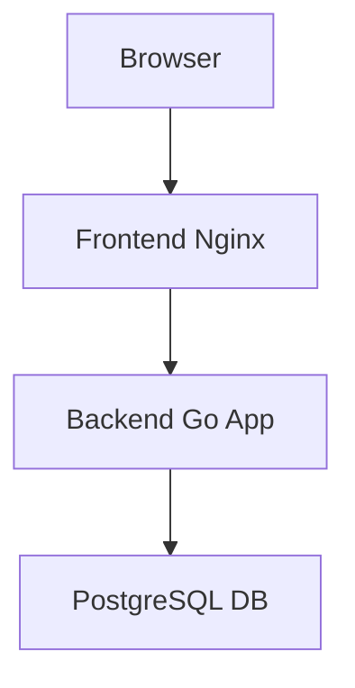
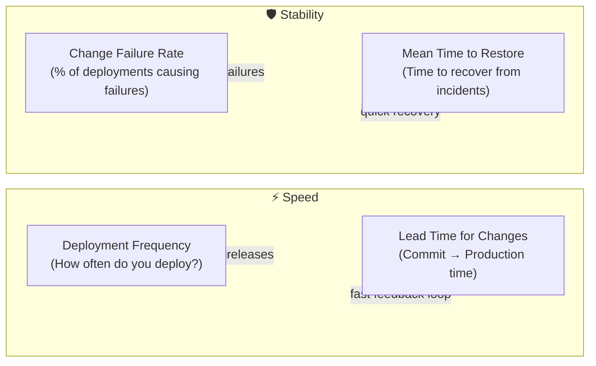

+++
date = '2025-04-19T15:53:01+02:00'
draft = false
title = 'DevOps Deployment'
tags = ["devops", "docker", "kubernetes", "helm"]
categories = ["devops", "docker", "kubernetes"]
summary = "A comprehensive guide to deploying a 3-tier application using Docker, Kubernetes, and Helm."
comments = true
ShowToc = true
TocOpen = true
image = "banner.jpg"
weight = 13
+++


## 🚀 DevOps Deployment: Dockerize and Deploy a 3-Tier App with Helm on Kubernetes

As modern applications evolve, DevOps workflows bridge the gap between development and operations. In this post, we’ll walk through how to Dockerize a 3-tier web application—consisting of a frontend, backend, and PostgreSQL database—and deploy it to a Kubernetes cluster using a custom Helm chart.

You’ll learn:

- How to structure a 3-tier app for containerization
- Dockerfile tips for Go-based services
- Kubernetes deployment best practices
- How to create a reusable Helm chart for real-world deployments

---

## 🧱 3-Tier Architecture Overview

We'll build and deploy the following:

- Frontend – a static site (React, Vue, or Hugo)
- Backend – a Go HTTP API
- Database – PostgreSQL



---

## 📦 Step 1: Dockerize Each Tier

### 🔹 Frontend Dockerfile (e.g., Hugo + Nginx)

```Dockerfile
# Stage 1 – Build Hugo site
FROM klakegg/hugo:0.120.0-ext AS builder
WORKDIR /app
COPY . .
RUN hugo

# Stage 2 – Serve with Nginx
FROM nginx:alpine
COPY --from=builder /app/public /usr/share/nginx/html
```

### 🔹 Backend Dockerfile (Go API)

```Dockerfile
# Stage 1 – Build
FROM golang:1.21 AS builder
WORKDIR /app
COPY . .
RUN go build -o server .

# Stage 2 – Run
FROM alpine
COPY --from=builder /app/server /server
EXPOSE 8080
ENTRYPOINT ["/server"]
```

### 🔹 PostgreSQL (Official Image)

No Dockerfile needed, just reference postgres:15-alpine in your docker-compose.yml or Kubernetes deployment.

---

## 🧪 Step 2: Local Testing with Docker Compose

Use Compose to test locally before pushing to Kubernetes:

```yaml
version: '3.9'
services:
  frontend:
    build: ./frontend
    ports: [ "80:80" ]
    depends_on: [ backend ]
  
  backend:
    build: ./backend
    ports: [ "8080:8080" ]
    environment:
      DB_HOST: postgres
    depends_on: [ postgres ]
  
  postgres:
    image: postgres:15-alpine
    environment:
      POSTGRES_DB: app
      POSTGRES_USER: user
      POSTGRES_PASSWORD: pass
    volumes:
      - dbdata:/var/lib/postgresql/data

volumes:
  dbdata:
```

✅ Once confirmed working, you're ready for the cluster.

---

## ☸️ Step 3: Prepare Kubernetes Manifests

Break deployments into individual resources: `Deployment`, `Service`, `ConfigMap`, and `Secret`. Then, template them using `Helm`.

---

## 📦 Step 4: Create a Custom Helm Chart

```text
helm create myapp
```

This generates:

```text
myapp/
├── charts/
├── templates/
│   ├── frontend-deployment.yaml
│   ├── backend-deployment.yaml
│   ├── postgres-deployment.yaml
│   ├── _helpers.tpl
│   ├── service.yaml
│   └── ingress.yaml
├── values.yaml
```

Example: `frontend-deployment.yaml`

```yaml
apiVersion: apps/v1
kind: Deployment
metadata:
  name: {{ .Release.Name }}-frontend
spec:
  replicas: 1
  selector:
    matchLabels:
      app: {{ .Release.Name }}-frontend
  template:
    metadata:
      labels:
        app: {{ .Release.Name }}-frontend
    spec:
      containers:
        - name: frontend
          image: "{{ .Values.frontend.image.repository }}:{{ .Values.frontend.image.tag }}"
          ports:
            - containerPort: 80
```

Example: `values.yaml`

```yaml
frontend:
  image:
    repository: myregistry/frontend
    tag: "latest"

backend:
  image:
    repository: myregistry/backend
    tag: "latest"

postgres:
  image:
    repository: postgres
    tag: "15-alpine"
  env:
    POSTGRES_DB: app
    POSTGRES_USER: user
    POSTGRES_PASSWORD: pass
```

---

## 🚢 Step 5: Deploy to Kubernetes

```text
helm install myapp ./myapp --namespace my-namespace --create-namespace
```

Need to update?

```text
helm upgrade myapp ./myapp
```

---

## 🧹 Cleanup

```text
helm uninstall myapp --namespace my-namespace
kubectl delete namespace my-namespace
```

---

## `DORA` Metrics for DevOps Success

DORA (DevOps Research and Assessment) metrics help measure software delivery performance. Focus on:




1. Deployment Frequency `DF`

    ➡️ How often code is deployed to production.
    
    - High-performing teams: deploy on-demand, multiple times a day.
    
    - Low-performing teams: deploy monthly or less.
    
    - Goal: Ship value quickly and iteratively.

1. Lead Time for Changes `LT`

    ➡️ Time from code commit → successfully running in production.
    
    - Measures delivery speed.
    
    - Elite performers: <1 day.
    
    - Low performers: >1 month.
    
    - Goal: Shorter lead times = faster feedback loops.

1. Change Failure Rate `CFR`

    ➡️ Percentage of deployments that cause failures (bugs, outages, rollbacks).
    
    - Elite teams: 0–15% failure rate.
    
    - Goal: Keep failure rates low, even with high deployment frequency.

1. Mean Time to Restore `MTTR`

    ➡️ How long it takes to recover from a failure in production.
    
    - Elite teams: <1 hour.
    
    - Goal: Detect issues quickly and restore service fast.

### 📊 Why They Matter

- They provide objective data on DevOps maturity.

- Balance speed vs reliability (no point deploying daily if systems keep breaking).

- Help teams focus on outcomes, not vanity metrics (like “number of commits”).


### ⚙️ How to Track DORA Metrics

- Version Control (GitHub/GitLab): commits & PR timestamps.

- CI/CD pipelines (Jenkins, GitHub Actions, ArgoCD): deployment events.

- Monitoring/Observability (Prometheus, Grafana, Datadog): incidents, MTTR.

- Incident management (PagerDuty, OpsGenie): failure tracking.

### 🏆 Benchmarks (from Google’s 2022 DevOps Report)

| Metric                | Elite Performers        | Low Performers          |
|------------------------|-------------------------|-------------------------|
| Deployment Frequency   | On-demand (daily/more) | Fewer than once/month   |
| Lead Time for Changes  | <1 day                 | >1 month                |
| Change Failure Rate    | 0–15%                  | 46–60%                  |
| MTTR (Time to Restore) | <1 hour                | >6 months               |

👉 In short: DORA metrics are the KPIs of DevOps — they tell you how fast you deliver and how resilient you are.

---

## 🎯 Final Thoughts

By combining Docker, Kubernetes, and Helm, you get:

- A repeatable deployment pipeline
- Configurable environments per stage (via Helm)
- Easy rollbacks and upgrades

Helm lets you treat infrastructure like code—enabling DevOps best practices like versioning, templating, and CI/CD automation.

---

🚀 Follow me on [norbix.dev](https://norbix.dev) for more insights on Go, Python, AI, system design, and engineering wisdom.
