+++
date = '2025-04-19T15:53:01+02:00'
draft = false
title = 'DevOps Deployment'
tags = ["devops", "docker", "kubernetes", "helm", "security", "ca-certificates"]
categories = ["devops", "docker", "kubernetes"]
summary = "A complete DevOps walkthrough — from Docker and Helm deployment to managing CA certificates and end-to-end TLS trust in Kubernetes."
readingTime = true
comments = true
ShowToc = true
TocOpen = true
image = "banner.jpg"
weight = 13
+++


## 🚀 DevOps Deployment: Dockerize and Deploy a 3-Tier App with Helm on Kubernetes

As modern applications evolve, DevOps workflows bridge the gap between development and operations. In this post, we’ll walk through how to Dockerize a 3-tier web application—consisting of a frontend, backend, and PostgreSQL database—and deploy it to a Kubernetes cluster using a custom Helm chart.

You’ll learn:

- How to structure a 3-tier app for containerization
- Dockerfile tips for Go-based services
- Kubernetes deployment best practices
- How to create a reusable Helm chart for real-world deployments
- How to manage trusted CA certificates across Linux, Docker, and JVM-based systems

---

## 🧱 3-Tier Architecture Overview

We'll build and deploy the following:

- Frontend – a static site (React, Vue, or Hugo)
- Backend – a Go HTTP API
- Database – PostgreSQL


---

## 📦 Step 1: Dockerize Each Tier

### 🔹 Frontend Dockerfile (e.g., Hugo + Nginx)

```Dockerfile
# Stage 1 – Build Hugo site
FROM klakegg/hugo:0.120.0-ext AS builder
WORKDIR /app
COPY . .
RUN hugo

# Stage 2 – Serve with Nginx
FROM nginx:alpine
COPY --from=builder /app/public /usr/share/nginx/html
```

### 🔹 Backend Dockerfile (Go API)

```Dockerfile
# Stage 1 – Build
FROM golang:1.21 AS builder
WORKDIR /app
COPY . .
RUN go build -o server .

# Stage 2 – Run
FROM alpine
COPY --from=builder /app/server /server
EXPOSE 8080
ENTRYPOINT ["/server"]
```

### 🔹 PostgreSQL (Official Image)

No Dockerfile needed, just reference postgres:15-alpine in your docker-compose.yml or Kubernetes deployment.

---

## 🧪 Step 2: Local Testing with Docker Compose

Use Compose to test locally before pushing to Kubernetes:

```yaml
version: '3.9'
services:
  frontend:
    build: ./frontend
    ports: [ "80:80" ]
    depends_on: [ backend ]
  
  backend:
    build: ./backend
    ports: [ "8080:8080" ]
    environment:
      DB_HOST: postgres
    depends_on: [ postgres ]
  
  postgres:
    image: postgres:15-alpine
    environment:
      POSTGRES_DB: app
      POSTGRES_USER: user
      POSTGRES_PASSWORD: pass
    volumes:
      - dbdata:/var/lib/postgresql/data

volumes:
  dbdata:
```

✅ Once confirmed working, you're ready for the cluster.

---

## ☸️ Step 3: Prepare Kubernetes Manifests

Break deployments into individual resources: `Deployment`, `Service`, `ConfigMap`, and `Secret`. Then, template them using `Helm`.

---

## 📦 Step 4: Create a Custom Helm Chart

```text
helm create myapp
```

This generates:

```text
myapp/
├── charts/
├── templates/
│   ├── frontend-deployment.yaml
│   ├── backend-deployment.yaml
│   ├── postgres-deployment.yaml
│   ├── _helpers.tpl
│   ├── service.yaml
│   └── ingress.yaml
├── values.yaml
```

Example: `frontend-deployment.yaml`

```yaml
apiVersion: apps/v1
kind: Deployment
metadata:
  name: {{ .Release.Name }}-frontend
spec:
  replicas: 1
  selector:
    matchLabels:
      app: {{ .Release.Name }}-frontend
  template:
    metadata:
      labels:
        app: {{ .Release.Name }}-frontend
    spec:
      containers:
        - name: frontend
          image: "{{ .Values.frontend.image.repository }}:{{ .Values.frontend.image.tag }}"
          ports:
            - containerPort: 80
```

Example: `values.yaml`

```yaml
frontend:
  image:
    repository: myregistry/frontend
    tag: "latest"

backend:
  image:
    repository: myregistry/backend
    tag: "latest"

postgres:
  image:
    repository: postgres
    tag: "15-alpine"
  env:
    POSTGRES_DB: app
    POSTGRES_USER: user
    POSTGRES_PASSWORD: pass
```

---

## 🚢 Step 5: Deploy to Kubernetes

```text
helm install myapp ./myapp --namespace my-namespace --create-namespace
```

Need to update?

```text
helm upgrade myapp ./myapp
```

---

## 🧹 Cleanup

```text
helm uninstall myapp --namespace my-namespace
kubectl delete namespace my-namespace
```

---

## 🔐 Managing CA Certificates in DevOps Environments

When deploying secure applications, especially in containerized or multi-service environments, your workloads need to trust Certificate Authorities (CAs). This ensures that HTTPS, TLS, and mTLS connections work correctly across Docker, Kubernetes, and JVM-based applications.

### 🧩 Why It Matters

If your backend calls external APIs, databases, or internal services over HTTPS, your containers must trust the issuing CA of those certificates — otherwise you’ll see errors like:

```matlab
x509: certificate signed by unknown authority
```

This usually means your CA isn’t installed in the trust store.

### 🪜 Understanding the CA Chain

A Certificate Authority chain (also known as a “trust chain”) establishes trust between the server’s TLS certificate and a root authority your system already trusts. 

It typically looks like this:

```text
Root CA → Intermediate CA(s) → Leaf/Server Certificate
```

#### 🧠 Components of the Chain

1. Root CA – The top-level authority (e.g., DigiCert, Let’s Encrypt, or your internal PKI root).

   - Preinstalled in the OS or Java keystore.

1. Intermediate CA – A delegated authority signed by the root; used for scalability and security.

   - Often multiple intermediates exist between root and server.

1. Server Certificate (Leaf) – The certificate installed on your app, load balancer, or ingress.

   - Signed by an intermediate CA.

When a TLS handshake occurs, the server presents its certificate chain to the client.

The client verifies:

- Each certificate was signed by the next one up,

- The top-most certificate (`Root CA`) exists in its trust store.

If any link in the chain is missing or invalid, you’ll see handshake errors like:

```text
unable to verify the first certificate
certificate signed by unknown authority
```

#### 🧩 Why Intermediate CAs Exist

Intermediate CAs are critical for security and scalability in any modern PKI:

| Level | Who Signs It | Purpose |
|-------|--------------|---------|
| Root CA	| Self-signed	| Acts as the ultimate trust anchor. Kept offline and rarely used. |
| Intermediate CA	| Signed by Root CA	| Issues end-user or server certificates safely. |
| Leaf / Server Cert	| Signed by Intermediate CA	| Used by servers and applications. |

Why it matters:

- 🧱 The Root CA stays offline (cold storage or HSM).

- ⚙️ Intermediates handle day-to-day certificate issuance.

- 🛡️ If an intermediate is compromised, it can be revoked independently of the root.

- 🧩 Enterprises can delegate intermediates per environment (e.g., staging, prod) or per region.


##### 🔐 Example Real-World Chain

Using OpenSSL to inspect the trust path:

```shell
openssl s_client -connect norbix.dev:443 -showcerts
```

Typical output:

```text
0 s:/CN=api.norbix.dev
  i:/CN=Norbix Intermediate CA
1 s:/CN=Norbix Intermediate CA
  i:/CN=Norbix Root CA
2 s:/CN=Norbix Root CA
  i:/CN=Norbix Root CA
```

Here:

- Certificate 0 – your server cert (leaf).

- Certificate 1 – your Intermediate CA (signed by the Root).

- Certificate 2 – your Root CA (self-signed).

#### 🧩 Building a Full Chain File

In some deployments (especially Nginx or Ingress controllers), you must provide a full-chain certificate combining all components:

```shell
cat server.crt intermediate.crt rootCA.crt > fullchain.pem
```

Use this file in configurations such as:

```nginx configuration
ssl_certificate /etc/nginx/certs/fullchain.pem;
ssl_certificate_key /etc/nginx/certs/server.key;
```

The same principle applies to Ingress resources in Kubernetes (using `tls.crt` inside Secrets).

### 🔗 Visualizing a Multi-Level `PKI`


- Root CA signs multiple Intermediates for different environments.

- Each Intermediate signs server certificates for its zone.

- Clients only need to trust the Root CA — the full chain provides cryptographic proof.

### 🔐 How Validation Actually Works

When a client (browser, API consumer, app, etc.) connects to your HTTPS endpoint:

1. Server presents the certificate chain during the TLS handshake:

   ```text
   Leaf (Server Cert)
   + Intermediate CA(s)
   + Optional Root (sometimes omitted)
   ```

1. Client builds the trust path:

   ```text
   Leaf → Intermediate → Root
   ```

1. The client:

   - Verifies each signature:

   - “Was this cert signed by the next one in the chain?”

   - Checks expiration dates.

   - Ensures the Root CA public key exists in its local trust store (e.g., /etc/ssl/certs/ or $JAVA_HOME/lib/security/cacerts).

1. ✅ If the chain is valid and ends at a trusted Root CA → the certificate is accepted.
   
   ❌ If the Root CA is missing or untrusted → x509: certificate signed by unknown authority.

#### 🏛 Why the Root CA Is Offline

- The Root CA’s private key is the “master key” of your PKI.

  If it’s ever compromised, every certificate under it becomes untrustworthy.

- To protect it:

   - The Root CA’s private key lives in an HSM, air-gapped server, or cold storage.

   - It’s only used once in a while to:

     - Sign or renew Intermediate CAs.

     - Issue CRLs (Certificate Revocation Lists) or OCSP signing certs.

So the Root CA only acts as a signer of Intermediate CAs, not as an active participant in client validation.

### 🔍 Client Trust Flow (Step by Step)

Let’s visualize this:


What Happens:

- `A` (Root CA) has its public certificate installed in the OS/browser.

- `B` (Intermediate CA) signs leaf certs and is online.

- `C` (Server cert) is presented by the server.

- `D` (Client) validates the signatures locally, using cached Root CA info.

### 🐧 CA Certificates in Linux

Trusted CAs are managed system-wide and stored in platform-specific locations:

| Distribution | CA Store Location                | Update Command                     |
|--------------|----------------------------------|------------------------------------|
| Debian / Ubuntu	| /usr/local/share/ca-certificates/ (custom) | /etc/ssl/certs/ (system)	sudo update-ca-certificates |
| RedHat / CentOS / Fedora	| /etc/pki/ca-trust/source/anchors/	| sudo update-ca-trust extract |
| Alpine Linux	| /usr/share/ca-certificates/ | update-ca-certificates |

To add a custom CA:

```shell
sudo cp my-root-ca.crt /usr/local/share/ca-certificates/
sudo update-ca-certificates
```

Inside a Dockerfile (Debian/Ubuntu base):

```Dockerfile
COPY my-root-ca.crt /usr/local/share/ca-certificates/
RUN update-ca-certificates
```

### ☕ CA Certificates in the JVM (Java & Spring Boot Apps)

JVM apps don’t use the OS trust store by default. They rely on the Java keystore:

```shell
$JAVA_HOME/lib/security/cacerts
```

- Default password: changeit

- Managed using the keytool utility.

Add your CA to the keystore:

```shell
sudo keytool -importcert \
  -trustcacerts \
  -file my-root-ca.crt \
  -alias myrootca \
  -keystore $JAVA_HOME/lib/security/cacerts
```

Verify:

```shell
keytool -list -keystore $JAVA_HOME/lib/security/cacerts | grep myrootca
```

For containerized Java apps, mount or bake the updated keystore into your image.

### CAs in Kubernetes

You can mount custom CA bundles into pods via ConfigMaps or Secrets.

Example:

```yaml
apiVersion: v1
kind: ConfigMap
metadata:
  name: custom-ca
data:
  my-root-ca.crt: |
    -----BEGIN CERTIFICATE-----
    MIID...
    -----END CERTIFICATE-----
---
apiVersion: apps/v1
kind: Deployment
metadata:
  name: myapp
spec:
  template:
    spec:
      volumes:
        - name: ca-cert
          configMap:
            name: custom-ca
      containers:
        - name: backend
          image: myregistry/backend
          volumeMounts:
            - mountPath: /usr/local/share/ca-certificates/my-root-ca.crt
              subPath: my-root-ca.crt
          env:
            - name: SSL_CERT_DIR
              value: /usr/local/share/ca-certificates
```

This ensures all HTTPS clients inside the container trust your internal CA.

#### ✅ Quick Tips

- Always verify your containers include updated ca-certificates packages.

- Use CI/CD build steps to refresh CAs for long-lived images.

- For internal APIs, prefer short-lived certs from an internal CA (Vault, Smallstep, or cert-manager).

#### 🧭 Visualizing the Trust Chain Across Platforms


Flow:

1. Root and Intermediate CAs are distributed from your PKI.

1. They’re installed into Linux, Docker images, or JVM keystores.

1. Kubernetes workloads mount or inherit these trust stores to enable secure HTTPS connections.


#### 🌐 End-to-End Trust Flow Inside a Kubernetes Cluster

To visualize how certificates propagate and maintain trust between components within a live Kubernetes environment:

```mermaid
flowchart TB
   subgraph Cluster["☸️ Kubernetes Cluster"]
      A["Ingress Controller (Nginx / Traefik)"]
      B["Backend Service (Go API)"]
      C["Pod with Mounted CA Bundle"]
      D["PostgreSQL Service / External API"]
   end

   subgraph PKI["🏛️ Internal / External PKI"]
      E["Root CA"]
      F["Intermediate CA"]
      G["Issued Server Certs"]
   end

   E --> F --> G
   G --> A
   G --> B
   G --> D

   A -->|TLS Handshake| B
   B -->|Mutual TLS / HTTPS| D
   C -->|Uses mounted trust store| F

   A -.->|Validates chain against Root CA| E
   B -.->|Trusts mounted CA certs| E
```




Flow Explanation:

1. 🔐 Root and Intermediate CAs issue server and client certificates (via cert-manager, Vault, or your internal PKI).

1. 🧱 The Ingress Controller presents a full certificate chain (tls.crt with intermediates).

1. ⚙️ The Backend Service validates this chain using system or mounted CAs.

1. ☁️ The Pod includes a ConfigMap or Secret-mounted trust store for external HTTPS calls.

1. 🧩 All communication — ingress to service to external API — relies on the same root of trust.

This ensures end-to-end security across:

- Internal service-to-service communication

- External API calls

- Database or message broker TLS connections

### 🔐 What Is Mutual TLS (mTLS)

So far, we’ve talked about **one-way TLS**, where the client verifies the server’s identity.  
**Mutual TLS (mTLS)** extends this idea — it makes **both sides authenticate each other** using X.509 certificates.

In a standard TLS handshake:
- The **server** presents its certificate chain (so the client knows it’s talking to the right endpoint).
- The **client** simply trusts that certificate based on its CA bundle.

In **mTLS**, an additional step occurs:
- The **client also presents its own certificate** to the server.
- The **server verifies the client certificate** against its trusted CA store.

That means:
- The **client authenticates the server** ✅
- The **server authenticates the client** ✅

This creates *mutual trust* — useful in microservices, APIs, and internal systems where both ends need to verify identity.

#### 🧩 mTLS in Practice

| Component | Uses Certificate From | Verified Against |
|------------|-----------------------|------------------|
| Client | Client certificate (issued by same PKI) | Server’s trust store (Root + Intermediate CA) |
| Server | Server certificate (public endpoint) | Client’s trust store (Root + Intermediate CA) |

Once both sides complete validation, the TLS session is established and encrypted.

#### 🧱 mTLS in Kubernetes

mTLS is commonly used between **microservices**, **sidecars**, or **service meshes** like Istio or Linkerd.

Example setup with cert-manager or Vault:
- Each service gets its own **certificate and key** (often short-lived).
- Services trust a shared **Root or Intermediate CA**.
- The service mesh injects sidecars that handle mTLS transparently.

#### ☸️ Example: Go API with mTLS Validation

If your Go-based backend connects securely to another internal service:

```go
cert, _ := tls.LoadX509KeyPair("client.crt", "client.key")
caCert, _ := os.ReadFile("rootCA.crt")

caPool := x509.NewCertPool()
caPool.AppendCertsFromPEM(caCert)

tlsConfig := &tls.Config{
    Certificates: []tls.Certificate{cert}, // client certificate
    RootCAs:      caPool,                  // trust server CA
    ClientCAs:    caPool,                  // verify client CA (on server)
    ClientAuth:   tls.RequireAndVerifyClientCert,
}
```

This configuration ensures:

- The client proves its identity with its certificate.

- The server verifies the client’s cert against a trusted CA.

- Both endpoints encrypt traffic and authenticate each other.

#### 🔐 Benefits of `mTLS`

- 🧭 Strong identity assurance between services.

- 🧱 Zero-trust networking — authentication is built into every connection.

- 🔒 Defense in depth — even if network boundaries are breached, only valid certs can communicate.

- ⚙️ Automatable with cert-manager, Vault, or SPIRE for rotation and issuance.

- 🧩 Visualizing Mutual TLS


Both sides use certificates issued from the same trust root, and the handshake only succeeds when each validates the other’s chain.

🧠 In short:

- `TLS` guarantees confidentiality and server authenticity,

- `mTLS` guarantees confidentiality, integrity, and mutual identity verification — making it essential for secure microservice communication inside Kubernetes clusters or service meshes.

---

## `DORA` Metrics for DevOps Success

DORA (DevOps Research and Assessment) metrics help measure software delivery performance. Focus on:

```mermaid
flowchart LR
    subgraph Speed["⚡ Speed"]
        DF["Deployment Frequency<br/>(How often do you deploy?)"]
        LT["Lead Time for Changes<br/>(Commit → Production time)"]
    end

    subgraph Stability["🛡️ Stability"]
        CFR["Change Failure Rate<br/>(% of deployments causing failures)"]
        MTTR["Mean Time to Restore<br/>(Time to recover from incidents)"]
    end

    DF -->|frequent releases| Speed
    LT -->|fast feedback loop| Speed
    CFR -->|fewer failures| Stability
    MTTR -->|quick recovery| Stability
```




1. Deployment Frequency `DF`

    ➡️ How often code is deployed to production.
    
    - High-performing teams: deploy on-demand, multiple times a day.
    
    - Low-performing teams: deploy monthly or less.
    
    - Goal: Ship value quickly and iteratively.

1. Lead Time for Changes `LT`

    ➡️ Time from code commit → successfully running in production.
    
    - Measures delivery speed.
    
    - Elite performers: <1 day.
    
    - Low performers: >1 month.
    
    - Goal: Shorter lead times = faster feedback loops.

1. Change Failure Rate `CFR`

    ➡️ Percentage of deployments that cause failures (bugs, outages, rollbacks).
    
    - Elite teams: 0–15% failure rate.
    
    - Goal: Keep failure rates low, even with high deployment frequency.

1. Mean Time to Restore `MTTR`

    ➡️ How long it takes to recover from a failure in production.
    
    - Elite teams: <1 hour.
    
    - Goal: Detect issues quickly and restore service fast.

### 📊 Why They Matter

- They provide objective data on DevOps maturity.

- Balance speed vs reliability (no point deploying daily if systems keep breaking).

- Help teams focus on outcomes, not vanity metrics (like “number of commits”).


### ⚙️ How to Track DORA Metrics

- Version Control (GitHub/GitLab): commits & PR timestamps.

- CI/CD pipelines (Jenkins, GitHub Actions, ArgoCD): deployment events.

- Monitoring/Observability (Prometheus, Grafana, Datadog): incidents, MTTR.

- Incident management (PagerDuty, OpsGenie): failure tracking.

### 🏆 Benchmarks (from Google’s 2022 DevOps Report)

| Metric                | Elite Performers        | Low Performers          |
|------------------------|-------------------------|-------------------------|
| Deployment Frequency   | On-demand (daily/more) | Fewer than once/month   |
| Lead Time for Changes  | <1 day                 | >1 month                |
| Change Failure Rate    | 0–15%                  | 46–60%                  |
| MTTR (Time to Restore) | <1 hour                | >6 months               |

👉 In short: DORA metrics are the KPIs of DevOps — they tell you how fast you deliver and how resilient you are.

---

## 🎯 Final Thoughts

By combining Docker, Kubernetes, and Helm, you get:

- A repeatable deployment pipeline
- Configurable environments per stage (via Helm)
- Easy rollbacks and upgrades

Helm lets you treat infrastructure like code—enabling DevOps best practices like versioning, templating, and CI/CD automation.

---

🚀 Follow me on [norbix.dev](https://norbix.dev) for more insights on Go, Python, AI, system design, and engineering wisdom.
