+++
date = '2025-04-15T16:11:36+02:00'
draft = false
title = 'Diagrams: Mermaid Syntax Highlights'
tags = ["mermaid", "diagrams", "syntax"]
categories = ["software-engineering", "diagrams"]
summary = "A quick reference guide to using Mermaid syntax for creating various types of diagrams, including flowcharts, graphs, and more."
comments = true
ShowToc = true
TocOpen = true
image = "banner.jpg"
weight = 3
+++

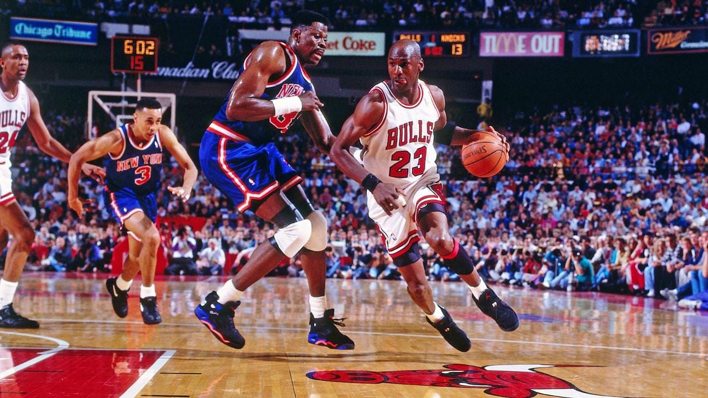

# 🧭 Mermaid Syntax Highlights

## 🔄 Flowcharts

Direction:

- LR: Left to Right
- TB: Top to Bottom
- BT: Bottom to Top

### Code

```text
flowchart LR
    G[(Goals)] <===> P[(Projects)]
    P ---o PD(Deadline)
    PD ---- OV([Overdue]) ---> FOV{4 Days}
    PD ---x MT([Met])
    P ---o PT(Tasks)
    PT ---- C([Complete])
    PT ---x IC([Incomplete])
    C ---> R[[Review]]
    R -..-> G
```

### Rendered Diagram

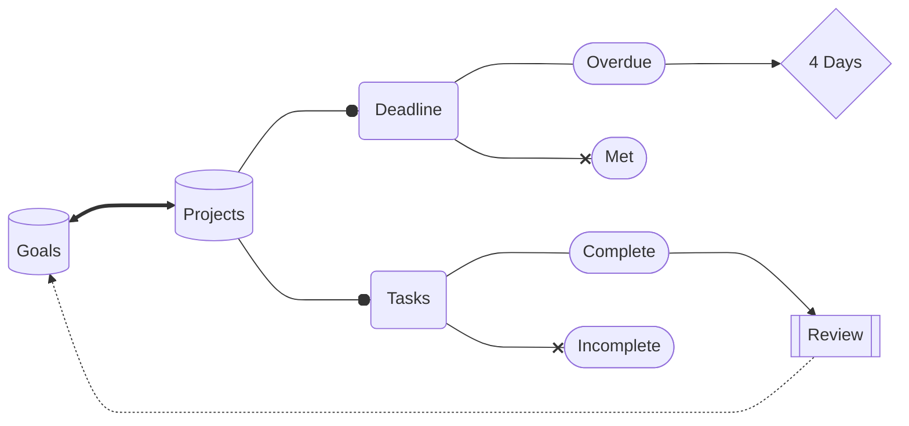

👀 Comments:

- %% – Comment not rendered in the chart
- |Label| – Annotates arrows

🎯 Example with styling, click links, and labels:

### Code

```text
flowchart LR;
    classDef blue fill:#2374f7,stroke:#000,color:#fff
    G[(Goals)]:::blue <===> |Connects To| P[(Projects)]:::blue
    click P "https://github.com/norbix"
```

### Rendered Diagram

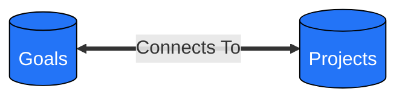

---

## 🧩 Class Diagrams (UML-style)

Great for `OOP` design documentation.

### Code

```text
classDiagram
    class Order {
        +OrderStatus status
    }
    class OrderStatus {
        <<enumeration>>
        FAILED
        PENDING
        PAID
    }
    class PaymentProcessor {
        <<interface>>
        -String apiKey
        +processPayment(Order order) OrderStatus
    }
    class Customer {
        +String name
    }
    Order o-- Customer : aggregation
    Car *-- Engine : composition
    PaymentProcessor <|-- StripePaymentProcessor
```

### Rendered Diagram

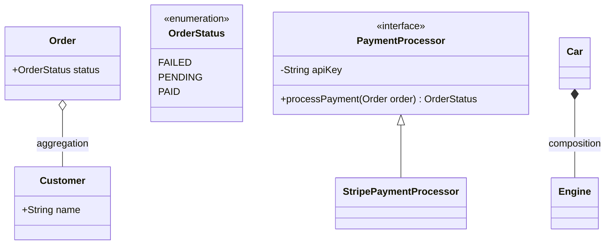

## 🧩 UML Relationships

Mermaid also supports association, aggregation, and composition, which are common in UML.

### Code

```text
classDiagram
    class Teacher {
      +Name string
      +Teach(Student)
    }
    class Student {
      +Name string
    }
    Teacher --> Student : association

    class Department {
      +Name string
      +Professors []Professor
    }
    class Professor {
      +Name string
    }
    Department o-- Professor : aggregation

    class House {
      +Address string
      +Rooms []Room
    }
    class Room {
      +Number int
    }
    House *-- Room : composition
```

### Rendered Diagram

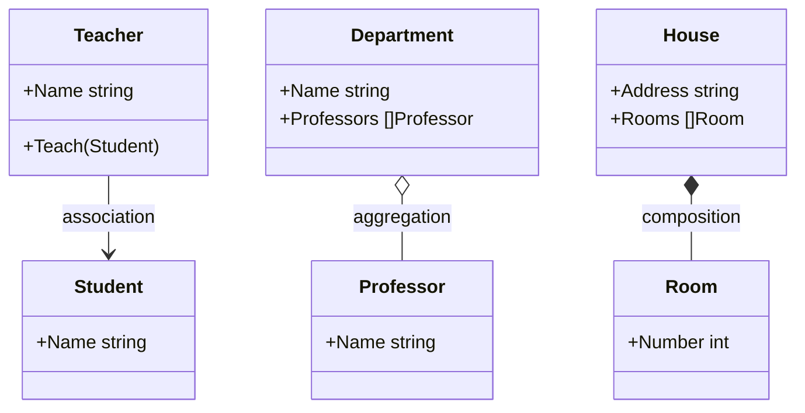

- Association → plain arrow (-->)

- Aggregation → hollow diamond (o--)

- Composition → filled diamond (*--)

This makes it easy to visually document relationships in Go codebases.

---

## 🧱 Graph Diagrams (UML-style)

### Code

```text
graph TD
    a(content) --> b([hello])
    b --> c[(world)]
    b --> d(branch)
    d --> e((circle))
    d ==> f>flag]
    f --- g{diamond}
```

### Rendered Diagram

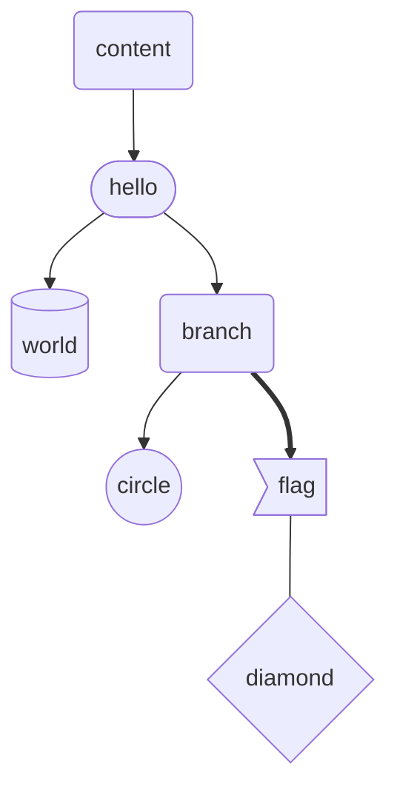

Use subgraph to group elements:

### Code

```text
graph TD
    subgraph Graph One
        A --> B
    end
    subgraph Graph Two
        C --> D
    end
    A --> D
```

### Rendered Diagram

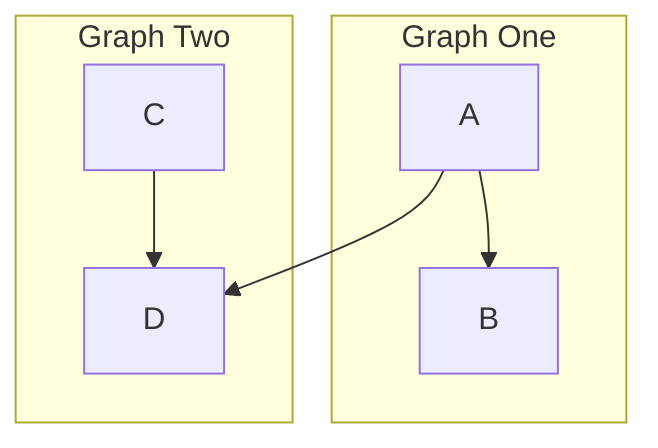

---

## 🥧 Pie Charts

### Code

```text
pie
    title Content Breakdown
    "youtube" : 50
    "twitch" : 20
    "twitter" : 30
```

### Rendered Diagram

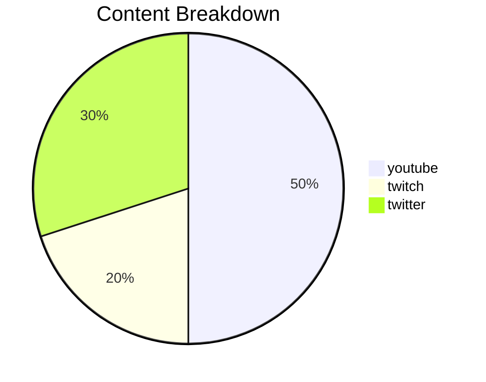

---

## 🧭 Journey Diagrams

Track progress or workflows using narrative sections:

### Code

```text
journey
    title My Working Day
    section Work
        Wrote code: 3: me
        Reviewed PRs: 4: me
    section Twitch
        Streamed: 3: me
```

### Rendered Diagram

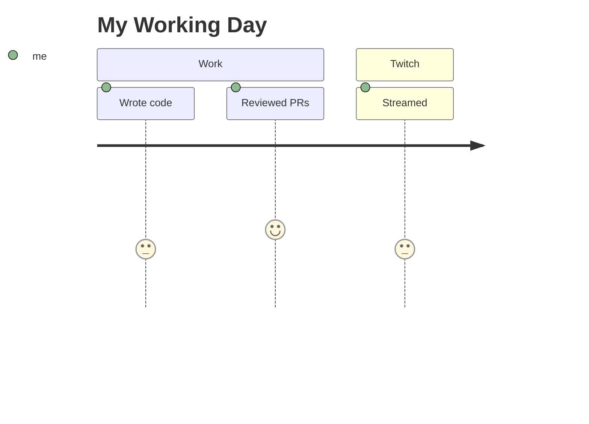

---

## 🧩 Class Diagrams

Great for OOP design documentation.

### Code

```text
classDiagram
    class Order {
        +OrderStatus status
    }
    class OrderStatus {
        <<enumeration>>
        FAILED
        PENDING
        PAID
    }
    class PaymentProcessor {
        <<interface>>
        -String apiKey
        +processPayment(Order order) OrderStatus
    }
    class Customer {
        +String name
    }
    Order o-- Customer
    Car *-- Engine
    PaymentProcessor <|-- StripePaymentProcessor
```

### Rendered Diagram

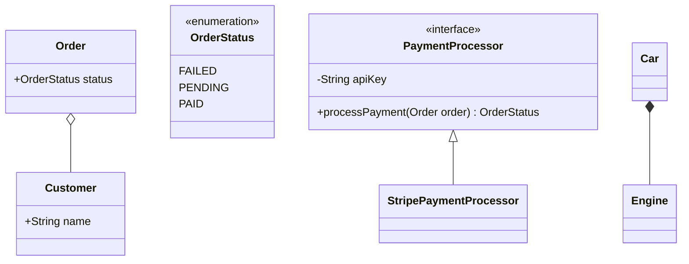

---

## 📜 Sequence Diagrams

### Code

```text
sequenceDiagram
    participant fe as Front-End
    participant be as Back-End
    participant auth as Auth

    fe -->> be: Login
    be -->> auth: Validate
    auth -->> be: Token
    be -->> fe: Success

    alt Invalid credentials
        be -->> fe: Error
    end
```

### Rendered Diagram

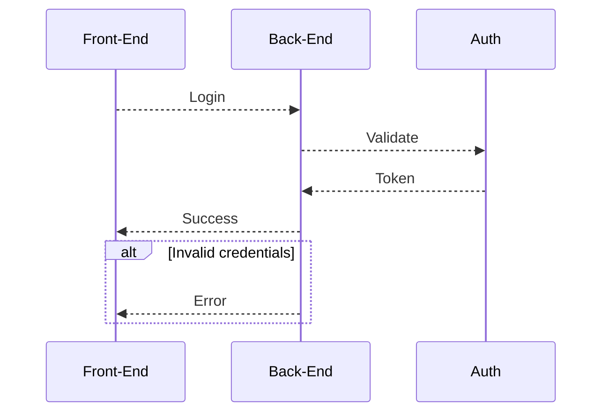

---

## ✅ Why Use Mermaid in Your Codebase?

- 📖 Self-documenting code and architecture
- 👥 Team-wide clarity on workflows and design
- 🔁 Easy to update and version control
- 🧩 Supports component trees, state machines, database schemas, and more

---

## 📦 Resources

- 📚 [Official Repo (mermaid-js/mermaid)](https://github.com/mermaid-js/mermaid)
- 🎓 [YouTube Course](https://www.youtube.com/watch?v=-XV1JBfhgWo&list=PLw5h0DiJ-9PC49ItLKBQlWSMH1zolOCXS)
- ✨ Try live: Mermaid [Live Editor](https://mermaid.live/edit#pako:eNpVjc1ugzAQhF_F2lMrkYg_B_ChUkPaXCK1h5wKOVhhg1GCjYxRmgLvXkNUtZ3Tjuab2R6OqkBgcLqo61Fwbch-k0ti9ZylQletqXl7IIvF07BFQ2ol8TaQ9cNWkVaopqlk-Xjn1xNE0n43YUiMqOR5vEfp3H-TOJBNtuONUc3hb7K_qoG8ZNW7sPP_E6HRtl6zE2cnvjhyTVKuZwQcKHVVADO6Qwdq1DWfLPRTmoMRWGMOzJ4F1-cccjnaTsPlh1L1T02rrhRgty-tdV1TcIObipea_yIoC9Sp6qQB5kXzBLAePoFF7pKu_DBc0ST0g9iPHbgB85NgGbiev0po4Pl0dOBr_ugu44i6Vp5HaeTGcTh-Az03dPc)

---

🚀 Follow me on [norbix.dev](https://norbix.dev) for more insights on Go, Python, AI, system design, and engineering wisdom.
