+++
date = '2025-04-19T15:34:33+02:00'
draft = false
title = 'Graph Theory Algorithms 4 Competitive Programming'
tags = ["go", "golang", "algorithms", "graph-theory"]
categories = ["backend", "golang"]
summary = "A comprehensive guide to graph theory algorithms in Go, covering essential concepts, implementations, and best practices for competitive programming."
comments = true
ShowToc = true
TocOpen = true
image = "banner.jpg"
weight = 7
+++


---

## 🧠 Graph Theory for Competitive Programming

In competitive programming, few topics are as powerful—and sometimes intimidating—as graph theory. Whether it’s shortest paths, connected components, or cycles, graphs appear everywhere from Google Maps to dependency resolution.

In this article, we’ll explore the essential graph concepts, common problems, and Go (Golang) code snippets to help you handle any graph-based challenge on coding platforms like Codeforces, LeetCode, or AtCoder.

---

## 🕸️ What Is a Graph?

A graph is a collection of nodes (vertices) and edges (connections between nodes). It can be:

- Directed or Undirected
- Weighted or Unweighted
- Connected or Disconnected
- Cyclic or Acyclic

A simple undirected graph looks like:

```mermaid

graph TD
A(1) -- 2 ↔ 1 --> B(2)
B -- 3 ↔ 2 --> C(3)
C -- 4 ↔ 3 --> D(4)
D -- 1 ↔ 4 --> A

```




In Go, we typically represent graphs using an adjacency list.

```go
graph := map[int][]int{
	1: {2, 4},
	2: {1, 3},
	3: {2, 4},
	4: {1, 3},
}
```

---

## 🔍 DFS and BFS – Graph Traversal

Use `DFS` for problems involving backtracking, connected components, and cycle detection.

Use `BFS` for shortest paths in unweighted graphs or level-order traversal

**Depth-First Search (DFS)**

```go
func dfs(node int, visited map[int]bool, graph map[int][]int) {
	if visited[node] {
		return
	}
	visited[node] = true
	fmt.Println(node)

	for _, neighbor := range graph[node] {
		dfs(neighbor, visited, graph)
	}
}
```

**Breadth-First Search (BFS)**

```go
func bfs(start int, graph map[int][]int) {
	visited := map[int]bool{}
	queue := []int{start}

	for len(queue) > 0 {
		node := queue[0]
		queue = queue[1:]

		if visited[node] {
			continue
		}
		visited[node] = true
		fmt.Println(node)

		for _, neighbor := range graph[node] {
			if !visited[neighbor] {
				queue = append(queue, neighbor)
			}
		}
	}
}
```

---

## 🔗 Connected Components 

In an undirected graph, you can find connected components by running DFS from each unvisited node.

```go
func countComponents(graph map[int][]int, n int) int {
	visited := make(map[int]bool)
	count := 0

	for i := 1; i <= n; i++ {
		if !visited[i] {
			dfs(i, visited, graph)
			count++
		}
	}
	return count
}
```

---

## ⛓️ Cycle Detection (Undirected Graph)

DFS with parent tracking:

```go
func hasCycle(node, parent int, visited map[int]bool, graph map[int][]int) bool {
	visited[node] = true
	for _, neighbor := range graph[node] {
		if !visited[neighbor] {
			if hasCycle(neighbor, node, visited, graph) {
				return true
			}
		} else if neighbor != parent {
			return true
		}
	}
	return false
}
```

---

## 📐 Topological Sort (Directed Acyclic Graph)

Used in task scheduling or course dependency problems.

```go
func topologicalSort(graph map[int][]int, n int) []int {
	visited := make(map[int]bool)
	stack := []int{}

	var dfs func(int)
	dfs = func(node int) {
		visited[node] = true
		for _, neighbor := range graph[node] {
			if !visited[neighbor] {
				dfs(neighbor)
			}
		}
		stack = append(stack, node)
	}

	for i := 1; i <= n; i++ {
		if !visited[i] {
			dfs(i)
		}
	}

	// Reverse the stack
	for i, j := 0, len(stack)-1; i < j; i, j = i+1, j-1 {
		stack[i], stack[j] = stack[j], stack[i]
	}
	return stack
}
```

---

## 🛣️ Dijkstra’s Algorithm (Shortest Path)

Used in weighted graphs with non-negative edges.

```go
type Item struct {
	node, dist int
}

func dijkstra(graph map[int][]Item, start int, n int) []int {
	const INF = int(1e9)
	dist := make([]int, n+1)
	for i := range dist {
		dist[i] = INF
	}
	dist[start] = 0

	pq := &MinHeap{}
	heap.Init(pq)
	heap.Push(pq, Item{start, 0})

	for pq.Len() > 0 {
		curr := heap.Pop(pq).(Item)
		if curr.dist > dist[curr.node] {
			continue
		}
		for _, neighbor := range graph[curr.node] {
			newDist := dist[curr.node] + neighbor.dist
			if newDist < dist[neighbor.node] {
				dist[neighbor.node] = newDist
				heap.Push(pq, Item{neighbor.node, newDist})
			}
		}
	}
	return dist
}
```

**Hint**

You’ll need a priority queue with container/heap.

---

## 🎯 Key Problem Patterns

| Problem | Technique |
|-------------------------------|---------------------|
| Find if a graph is connected | DFS / BFS |
| Shortest path (unweighted graph) | BFS |
| Shortest path (weighted graph) | Dijkstra’s |
| All-pairs shortest paths | Floyd-Warshall |
| Topological sort | DFS / Kahn's Algo |
| Cycle detection (undirected graph) | DFS + parent |
| Bipartite graph check | BFS + coloring |

---

## 🧠 Final Thoughts

Graph problems may seem tough at first, but they become second nature with practice. 
Whether it’s mapping networks, detecting cycles, or optimizing routes, graph theory is a core skill that unlocks deep algorithmic power.

---

## ✍️ Practice Tip:

Solve 10–15 problems covering `DFS`, `BFS`, `topological sort`, and `shortest path`. Then go deeper into `Union-Find`, `Bridges`, and `Articulation Points`.

---

🚀 Follow me on [norbix.dev](https://norbix.dev) for more insights on Go, system design, and engineering wisdom.
