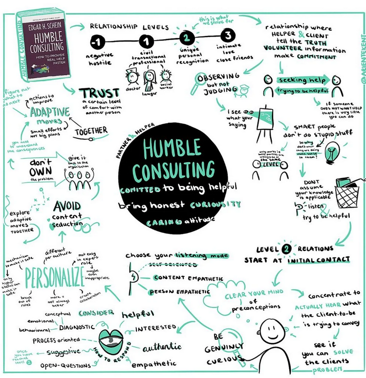

+++
title = "Humble Consulting: How Curiosity Creates Real Business Value"
date = "2025-09-17T10:00:00+02:00"
draft = false
tags = ["consulting", "business", "software-engineering", "b2b"]
categories = ["consulting", "leadership", "software-engineering"]
summary = "Exploring Edgar H. Schein’s idea of Humble Consulting and how curiosity, empathy, and co-creation lead to measurable business value—earning more, saving more, and reaching hidden gatekeepers."
comments = true
ShowToc = true
TocOpen = true
image = "humble_consulting.png"
weight = 24
+++

---

## 🌱 What Is Humble Consulting?

Edgar H. Schein, in his book *Humble Consulting*, challenges the traditional model of the “all-knowing expert.”  
Instead of delivering answers from a pedestal, humble consulting emphasizes:

- **Being genuinely curious** about the client’s context
- **Listening without judgment**
- **Building trust step by step**
- **Exploring adaptive solutions together**

This approach turns the consultant into a **partner**, not just a vendor.

---

## 💡 Why It Matters for Software & B2B Engineering

In software projects, the biggest risks rarely come from *technical complexity*—they come from **misalignment, assumptions, and poor communication**.  
Humble consulting addresses these by:

- 🤝 **Faster trust-building** → clients share the *real* issues early, reducing rework costs.
- 🎯 **Better solutions** → co-created designs mean fewer failed features and less waste.
- 🚀 **Reduced risks & delays** → solving the *right* problem avoids budget overruns.

For B2B engineering and SaaS, this translates directly into **financial value**.

---

## 🔑 Gatekeepers: The Hidden Connectors

In every organization there are **gatekeepers**—people who are not always visible but hold **direct influence** with decision-makers.  
They may be senior engineers, trusted managers, or long-tenured staff who quietly shape what leaders approve.

Here’s the challenge: traditional “hard-selling” approaches often miss them.  
But **humble consulting naturally surfaces gatekeepers** because:

- You **listen deeply** instead of pitching.
- You build trust at multiple levels, not just with the C-suite.
- You co-create solutions, which encourages gatekeepers to reveal what *really matters*.

Once you have a gatekeeper’s trust, your ability to **sell services, ideas, or products skyrockets**. Why?  
Because you’re no longer just “another vendor”—you’ve earned the support of someone who whispers in the decision-maker’s ear.

---

## 📈 The Business Value in Money Terms

At its core, *business value* means one thing: **earning more or saving more**.  
Humble consulting helps companies do both:

💰 **Earn More Revenue**
- By uncovering opportunities through gatekeepers that outsiders would never see.
- By delivering solutions that stakeholders actually adopt and pay for.
- By strengthening relationships that lead to renewals and upsells.

💰 **Save More Money**
- By avoiding months of wasted development on the wrong features.
- By reducing project delays (which directly cut into margins).
- By minimizing risk of failed rollouts or expensive rework.

Every hour spent listening with humility can save weeks of rework.  
Every gatekeeper won over can unlock hidden revenue streams.

## What is `Money Language`?

It is a language of the executives and decision-makers who control budgets.

More can be found under this fantastic podcast with Pini Reznik: [The Rause of Cloud Native](https://www.youtube.com/live/VsEyN7yoSQY?si=hUUVNNShTg89LKYb&t=6109)

---

## 🔍 How to Apply Humble Consulting in Tech Projects

1. **Start with curiosity, not expertise**
    - Ask open questions: *“What’s the business impact behind this request?”*
    - Avoid jumping into “solution mode” too early.

2. **Observe without judgment**
    - Stakeholders and gatekeepers often know the hidden cost drivers.
    - By listening, you surface inefficiencies that can be fixed.

3. **Co-create instead of dictating**
    - Joint workshops, prototypes, and iterations create alignment.
    - Shared ownership ensures solutions stick (and ROI is realized).

4. **Personalize your approach**
    - Each company’s culture and financial drivers are different—tailor accordingly.

---

## 🚀 Closing Thoughts

The most effective consultants and engineers aren’t the ones who talk the most—they’re the ones who listen, adapt, and connect with **decision-makers and their trusted gatekeepers**.

Humble consulting is not just about being nice—it’s about **unlocking influence, protecting budgets, accelerating revenue, and maximizing ROI**.

👉 In other words: humility pays—especially when it helps you reach the gatekeepers who hold the keys to business growth.

---

🚀 Follow me on [norbix.dev](https://norbix.dev) for more insights on Go, Python, AI, system design, and engineering wisdom.
