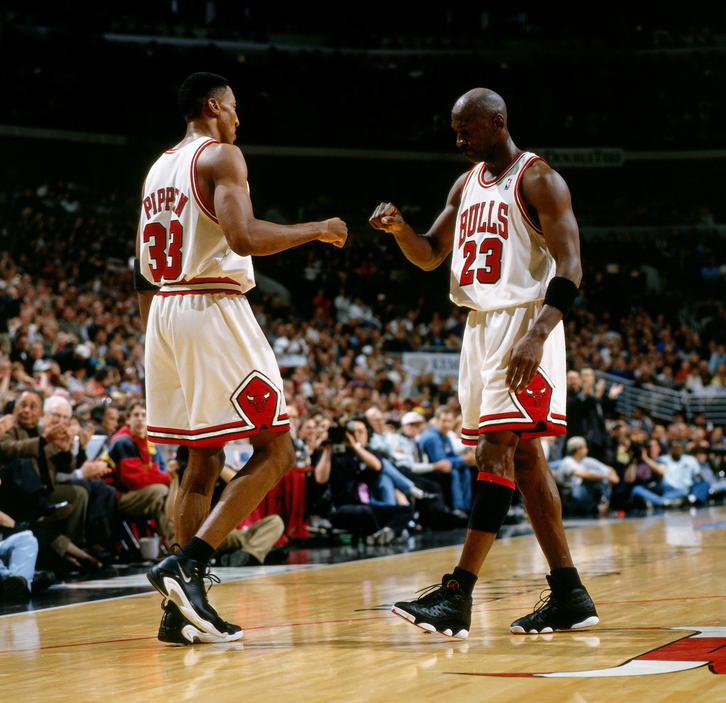
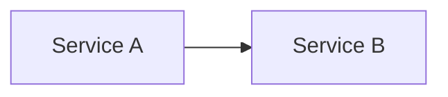
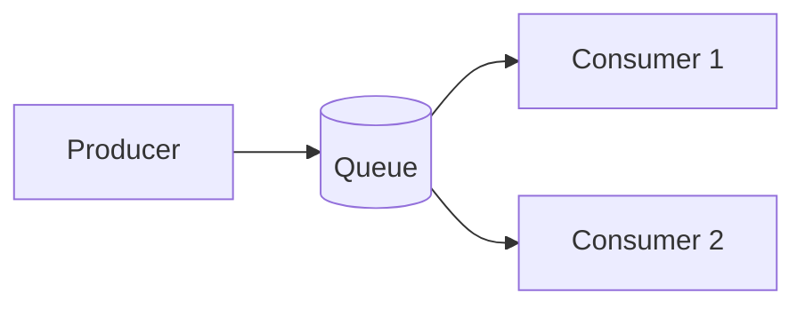
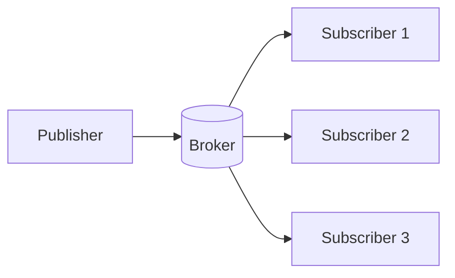
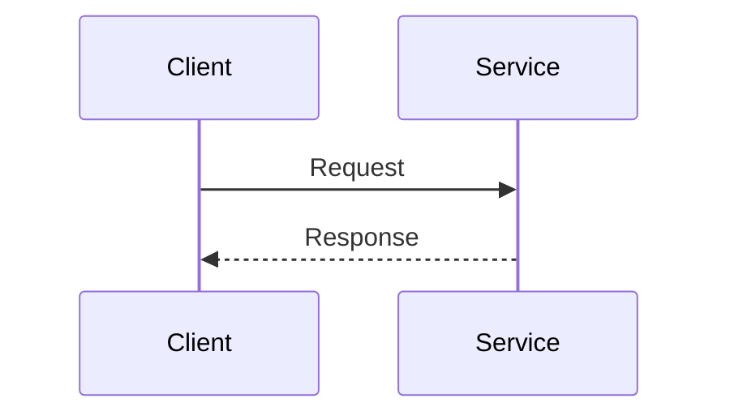
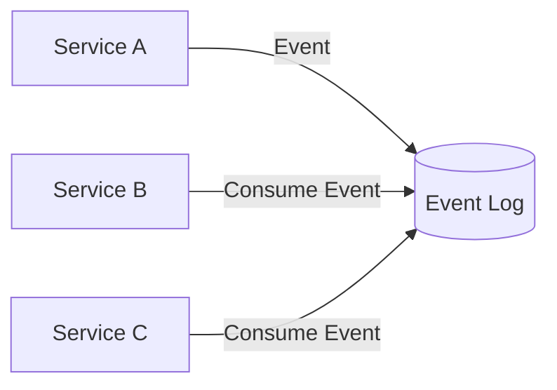
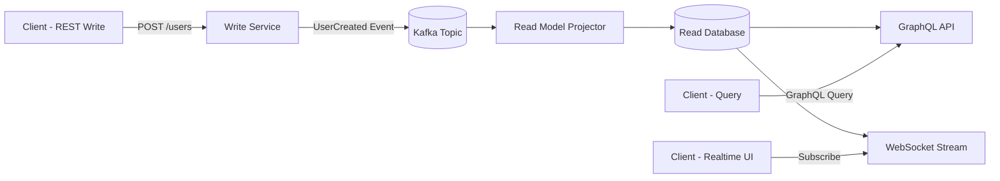
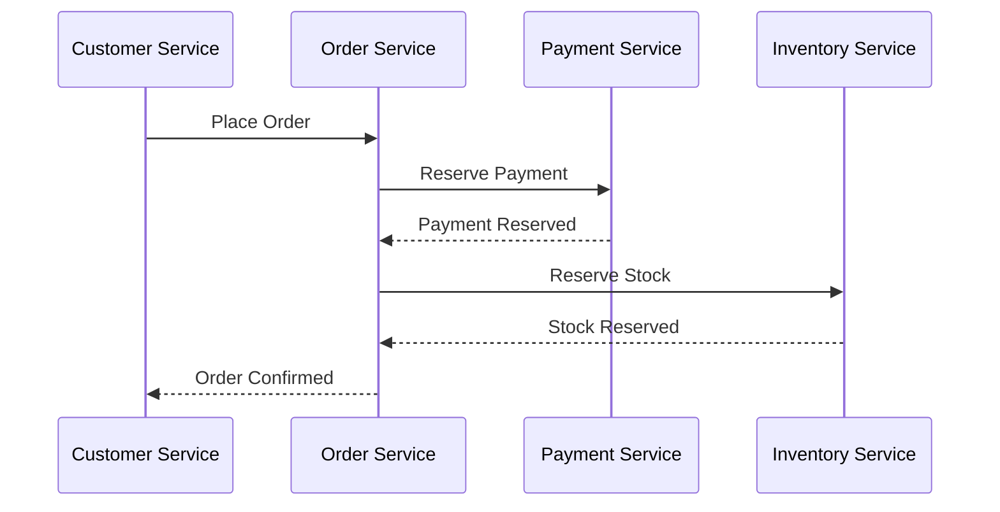
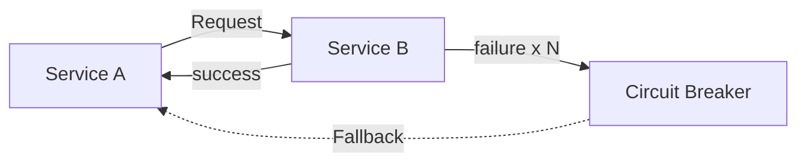
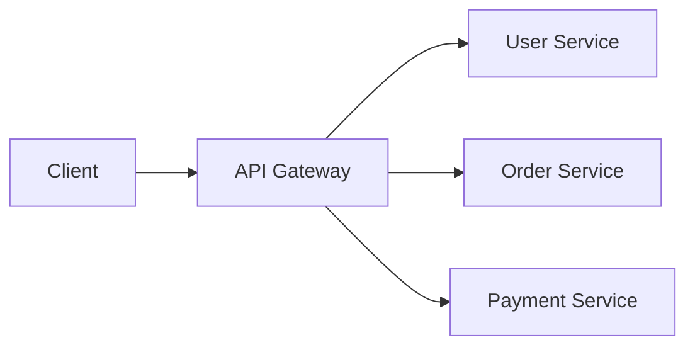

+++
date = '2025-09-22T10:00:00+02:00'
draft = false
title = 'Enterprise Integration Patterns in Go: Practical Examples'
tags = ['go', 'golang', 'integration patterns', 'architecture', 'system design']
categories = ['Programming', 'Go']
summary = 'Explore key Enterprise Integration Patterns (EIP) with practical Go examples, covering point-to-point, pub/sub, queues, and event-driven design for distributed systems.'
comments = true
ShowToc = true
TocOpen = true
image = 'integration-banner.jpg'
weight = 25
+++

Integration patterns provide reusable solutions for connecting distributed systems.

Whether you’re building microservices, SaaS platforms, or cloud-native applications, you’ll often face challenges around **data exchange, reliability, and scalability**. Enterprise Integration Patterns (EIP) give you a toolkit to design robust communication between components.

<div style="display: flex; justify-content: center;">
  
</div>

---

## 🔌 Core Integration Patterns

### 1. Point-to-Point

A **direct connection** between two systems.  
Good for simplicity, but becomes a **spaghetti mess** as integrations grow (n² problem).



🧑‍💻 Example (Go client calling API):

```go
resp, err := http.Get("http://service-b:8080/data")
if err != nil {
    log.Fatal(err)
}
defer resp.Body.Close()
```

- ✅ Simple, fast
- ⚠️ Tight coupling, doesn’t scale

---

### 2. Message Queue

A producer sends messages to a queue, and consumers process them asynchronously.



🧑‍💻 Example with RabbitMQ (using streadway/amqp):

```go
ch, _ := conn.Channel()
q, _ := ch.QueueDeclare("tasks", false, false, false, false, nil)
ch.Publish("", q.Name, false, false,
    amqp.Publishing{ContentType: "text/plain", Body: []byte("task data")})
```

- ✅ Decouples producer & consumer
- ✅ Smooths traffic spikes, supports retry
- ⚠️ Adds latency, requires broker

---

### 3. Publish–Subscribe (Pub/Sub)

A publisher emits events to a broker; multiple subscribers consume independently.



🧑‍💻 Example with NATS:

```go
nc, _ := nats.Connect(nats.DefaultURL)
defer nc.Drain()

nc.Subscribe("orders.created", func(m *nats.Msg) {
    fmt.Printf("Received: %s\n", string(m.Data))
})

nc.Publish("orders.created", []byte("Order#123"))
```

- ✅ Decouples producers/consumers
- ✅ Scales horizontally
- ⚠️ Delivery/order guarantees require tuning

---

### 4. Request–Reply

Classic synchronous API call.
Go’s net/http or grpc are common implementations.




🧑‍💻 Example with gRPC:

```go
conn, _ := grpc.Dial("service-b:50051", grpc.WithInsecure())
client := pb.NewUserServiceClient(conn)

resp, _ := client.GetUser(ctx, &pb.GetUserRequest{Id: "42"})
fmt.Println(resp.Name)
```

- ✅ Familiar, widely supported
- ⚠️ Tight coupling, fragile if callee is down

---

### 5. Event-Driven / Event Sourcing

State changes are represented as immutable events. Consumers react asynchronously.




🧑‍💻 Example: append events to Kafka

```go
writer := kafka.NewWriter(kafka.WriterConfig{
    Brokers: []string{"localhost:9092"},
    Topic:   "user-events",
})

writer.WriteMessages(context.Background(),
    kafka.Message{Key: []byte("user-1"), Value: []byte("UserCreated")},
)
```

- ✅ Full audit log, replay possible
- ✅ Decoupled, scalable
- ⚠️ Requires careful schema/versioning strategy

---

## 🏗️ Advanced Architectural Patterns

### 1. CQRS (Command Query Responsibility Segregation) with Kafka

CQRS separates responsibilities into a **write side (Commands)** and a **read side (Queries)**.  
Instead of a single API serving both reads and writes, CQRS allows you to optimize each:

- **Writes (Commands):** exposed as REST APIs for simple, synchronous commands.
- **Reads (Queries):** exposed as GraphQL for flexible queries, or WebSockets for real-time updates.

In event-driven architectures, CQRS is often combined with **Kafka**:
- the **Write side** publishes events,
- the **Read side** consumes and projects them into optimized **read models**.
- Microservices remain independent, but their state converges via **eventual consistency**.




🧑‍💻 Go Example – Write Side (REST Command API)

```go
// Write handler - create user
func (s *Server) CreateUserHandler(w http.ResponseWriter, r *http.Request) {
    var user User
    json.NewDecoder(r.Body).Decode(&user)

    // Persist to write DB
    s.writeDB.Save(user)

    // Publish event to Kafka
    event := fmt.Sprintf(`{"event":"UserCreated","id":"%s","name":"%s"}`, user.ID, user.Name)
    s.kafkaWriter.WriteMessages(context.Background(),
        kafka.Message{Key: []byte(user.ID), Value: []byte(event)})

    w.WriteHeader(http.StatusCreated)
}
```

🧑‍💻 Go Example – Read Side (GraphQL + WebSocket)

```go
// GraphQL resolver for querying users
func (r *Resolver) User(ctx context.Context, id string) (*User, error) {
    return r.readDB.GetUserByID(id)
}

// WebSocket broadcaster (pseudo-code)
func (s *Server) StreamUserEvents(ws *websocket.Conn) {
    for msg := range s.kafkaReader.C {
        ws.WriteMessage(websocket.TextMessage, msg.Value)
    }
}
```

✅ Benefits

- `REST` commands are simple and predictable for writes.

- `GraphQL` and `WebSockets` make reads flexible and real-time.

- `Microservices` keep independent state but synchronize through events.

- Highly scalable — read and write paths scale separately.

⚠️ Challenges

- Eventual consistency: data in the read model may lag behind the write.

- More moving parts: requires careful schema evolution, retries, and monitoring.

- Debugging distributed state requires strong observability.


🌍 Real-world use case

Imagine a User Service with CQRS:

- Writes (`REST`): POST /users creates a user and emits UserCreated.

- Other `microservices` (Billing, Notifications) consume that event asynchronously and update their state.

- `Reads (GraphQL/WebSocket)`: A dashboard queries aggregated data (user + billing status) or subscribes to real-time updates without hitting the write database.

Over time, the system achieves eventual consistency: all services converge on the same user state, but they don’t have to be strongly consistent at write time.

👉 This now shows a **CQRS microservices architecture** where:
- **Writes = REST**
- **Reads = GraphQL + WebSockets**
- **State is shared asynchronously** via Kafka with **eventual consistency**

---

### 2. Saga Pattern (Distributed Transactions)

In a microservices world, a single business process (e.g., “place order”) may span multiple services.  
A **Saga** coordinates these steps to ensure **eventual consistency** without requiring a global transaction.

- **Choreography (event-based):** each service listens for events and emits compensating events if something fails.
- **Orchestration (central coordinator):** a Saga orchestrator tells each service what to do next and how to roll back if needed.



Note over O,I,P: If any step fails → compensating events (e.g., Cancel Payment)

🧑‍💻 Example in Go (compensating event):

```go
type OrderCancelled struct {
    OrderID string
    Reason  string
}

// If stock reservation fails
cancelEvent := OrderCancelled{OrderID: "123", Reason: "Out of stock"}
publish(cancelEvent)
```

- ✅ Benefits: Handles long-running, multi-service transactions without 2PC.
- ⚠️ Challenges: Requires careful design of compensating actions.

---

### 3. Circuit Breaker (Resilience)

A Circuit Breaker protects your system from cascading failures.
When a dependency fails repeatedly, the breaker “opens” and stops calls until recovery is detected.



🧑‍💻 Example with Go + resilience library (pseudo-code):

```go
cb := gobreaker.NewCircuitBreaker(gobreaker.Settings{
    Name: "PaymentService",
})

result, err := cb.Execute(func() (interface{}, error) {
    return callPaymentService()
})
if err != nil {
    log.Println("Fallback: return cached response or error")
}
```

- ✅ Benefits: Prevents cascading failures, improves stability.
- ⚠️ Challenges: Needs good fallback strategies.

---

### 4. API Gateway / Aggregator

An API Gateway is a single entry point that routes requests to multiple microservices.
Sometimes it also aggregates responses from multiple services to reduce client complexity.



🧑‍💻 Example aggregator in Go (pseudo-code):

```go
func AggregateOrderData(orderID string) OrderView {
    user := userService.GetUser(orderID)
    payment := paymentService.GetPayment(orderID)
    order := orderService.GetOrder(orderID)

    return OrderView{User: user, Order: order, Payment: payment}
}
```

- ✅ Benefits: Simplifies client logic, centralizes auth/routing.
- ⚠️ Challenges: Gateway can become a bottleneck if overloaded.

---

## ✅ Conclusion

Integration patterns are the glue of modern distributed systems.  
Choosing the right one depends on your trade-offs and the maturity of your architecture:

- Need **simplicity** → Point-to-Point / Request–Reply
- Need **resilience** → Queues / Circuit Breaker
- Need **scalability** → Pub/Sub / Event Sourcing
- Need **consistency in distributed workflows** → Saga
- Need **optimized reads and writes** → CQRS with Kafka
- Need **simplified client access** → API Gateway / Aggregator

By applying these patterns in Go — with tools like **gRPC, RabbitMQ, Kafka, NATS, Envoy, and GraphQL** — you can build systems that are:
- **Scalable** → handle traffic growth without bottlenecks
- **Fault-tolerant** → recover gracefully from failures
- **Maintainable** → clear separation of concerns and modular design
- **Future-proof** → adaptable to new requirements as your system evolves

Integration patterns are not silver bullets, but they provide a **toolbox of proven solutions**. The key is knowing **when to use which pattern** — and combining them wisely.

Happy integrating! 🔗🐹

---

🚀 Follow me on [norbix.dev](https://norbix.dev) for more insights on Go, Python, AI, system design, and engineering wisdom.
