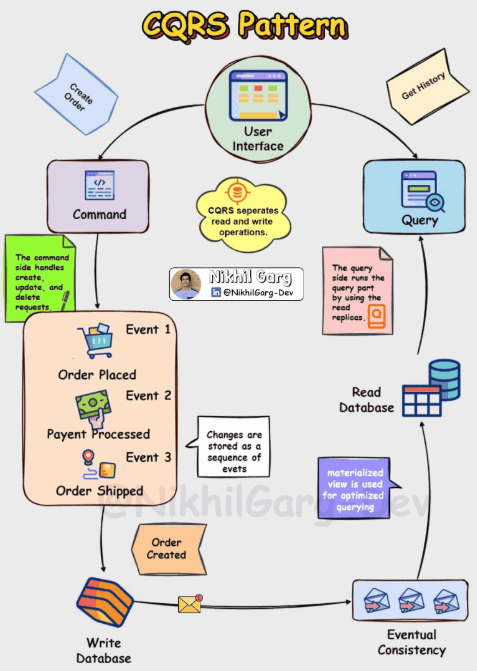

+++
date = '2025-09-22T10:00:00+02:00'
draft = false
title = 'Enterprise Integration Patterns in Go: Practical Examples'
tags = ['go', 'golang', 'integration patterns', 'architecture', 'system design']
categories = ['Programming', 'Go']
summary = 'Explore key Enterprise Integration Patterns (EIP) with practical Go examples, covering point-to-point, pub/sub, queues, and event-driven design for distributed systems.'
comments = true
ShowToc = true
TocOpen = true
image = 'integration-banner.jpg'
weight = 25
+++

Integration patterns provide reusable solutions for connecting distributed systems.

Whether you’re building microservices, SaaS platforms, or cloud-native applications, you’ll often face challenges around **data exchange, reliability, and scalability**. Enterprise Integration Patterns (EIP) give you a toolkit to design robust communication between components.

<div style="display: flex; justify-content: center;">
  
</div>

---

## 🔌 Core Integration Patterns

### 1. Point-to-Point

A **direct connection** between two systems.  
Good for simplicity, but becomes a **spaghetti mess** as integrations grow (n² problem).

- Just one-way delivery from A to B.
    - Think of it as “I send you data, and I don’t care if you reply.”

    - Often implemented with messaging systems (e.g., a producer sends to a queue consumed by exactly one consumer).

    - Example: Service A sends “new invoice” to Service B — no response expected.


🧑‍💻 Example (Go client calling API):

```go
resp, err := http.Get("http://service-b:8080/data")
if err != nil {
    log.Fatal(err)
}
defer resp.Body.Close()
```

- ✅ Simple, fast
- ⚠️ Tight coupling, doesn’t scale

---

### 2. Message Queue

A producer sends messages to a queue, and consumers process them asynchronously.

- Model: 1 producer → 1 consumer (though you can scale multiple consumers in a competing consumers pattern).

- Order: Typically guarantees FIFO order per queue (but once you add multiple consumers, strict order across all messages isn’t guaranteed).

- Delivery: Each message is consumed by exactly one consumer.

- Use case: Background jobs, task processing.

- Examples: RabbitMQ (classic queue), AWS SQS, ActiveMQ.


🧑‍💻 Example with RabbitMQ (using streadway/amqp):

```go
ch, _ := conn.Channel()
q, _ := ch.QueueDeclare("tasks", false, false, false, false, nil)
ch.Publish("", q.Name, false, false,
    amqp.Publishing{ContentType: "text/plain", Body: []byte("task data")})
```

- ✅ Decouples producer & consumer
- ✅ Smooths traffic spikes, supports retry
- ⚠️ Adds latency, requires broker

---

#### 2.1 Durable Queues & Backpressure

When systems communicate asynchronously, it’s critical to handle:

- Durability → ensuring messages aren’t lost if a consumer is down.

- Backpressure → preventing fast producers from overwhelming slower consumers.

##### Durable Queues

A durable queue persists messages until they’re successfully processed.

- SQS (AWS) → messages survive consumer crashes; FIFO queues add ordering + exactly-once processing.

- RabbitMQ → queues and messages can be declared durable so they survive broker restarts.

- Kafka → events are stored in a log on disk, retained for a configurable time, replayable.

- ✅ Guarantees reliability, at the cost of storage and throughput.

##### ⚖️ Backpressure

Backpressure protects your system when consumers can’t keep up with producers.

Strategies:

- Buffering (temporarily store extra messages)

- Dropping (discard excess messages when full — useful for metrics/logging)

- Throttling (slow down producers when consumers lag)

- Scaling consumers (auto-scaling workers to drain the queue)

- Example with Go channels (bounded buffer):

```go
queue := make(chan string, 10) // max capacity 10

// Producer
go func() {
    for i := 0; i < 100; i++ {
        queue <- fmt.Sprintf("msg-%d", i) // blocks if channel is full
    }
}()

// Consumer
for msg := range queue {
    fmt.Println("Processing:", msg)
    time.Sleep(100 * time.Millisecond) // simulate slow consumer
}
```

Here, if the consumer is slow, the producer blocks once the channel is full — a built-in form of backpressure.

##### ✅ Takeaways:

Durable queues ensure no data loss.

Backpressure ensures system stability under load.

Together, they make distributed systems resilient and predictable.

---

### 3. Publish–Subscribe (Pub/Sub)

A publisher emits events to a broker; multiple subscribers consume independently.

- Model: 1 publisher → many subscribers.

- Order: Delivery order depends on the broker. Some systems (like Kafka) guarantee ordering within a partition, others (like NATS) focus more on speed/availability than global ordering.

- Delivery: Each message is delivered to all interested subscribers.

- Use case: Broadcasting events (e.g., “user signed up” → notify billing, analytics, emails).

- Queue vs Pub/Sub explanation [video](https://www.youtube.com/watch?v=ac2zC2YsXnI)

- Examples: Kafka, NATS, AWS SNS, Google Pub/Sub.


🧑‍💻 Example with NATS:

```go
nc, _ := nats.Connect(nats.DefaultURL)
defer nc.Drain()

nc.Subscribe("orders.created", func(m *nats.Msg) {
    fmt.Printf("Received: %s\n", string(m.Data))
})

nc.Publish("orders.created", []byte("Order#123"))
```

- ✅ Decouples producers/consumers
- ✅ Scales horizontally
- ⚠️ Delivery/order guarantees require tuning

---

### 4. Request–Reply

Classic synchronous API call.
Go’s net/http or grpc are common implementations.

- Classic `REST` / `gRPC` / `HTTP` style.

    - Client sends a request, waits for a response.

    - Synchronous, one-to-one.

    - Example: GET /users/42 → {"id":42,"name":"Norbert"}.


🧑‍💻 Example with gRPC:

```go
conn, _ := grpc.Dial("service-b:50051", grpc.WithInsecure())
client := pb.NewUserServiceClient(conn)

resp, _ := client.GetUser(ctx, &pb.GetUserRequest{Id: "42"})
fmt.Println(resp.Name)
```

- ✅ Familiar, widely supported
- ⚠️ Tight coupling, fragile if callee is down

---

### 5. Event-Driven / Event Sourcing

State changes are represented as immutable events. Consumers react asynchronously.

- Examples

  - Pub/Sub:

    - AWS SNS → SQS queues (fan-out notifications)

    - Google Pub/Sub → notify multiple microservices of an event

    - NATS → lightweight, high-speed broadcasts (e.g., IoT sensors → multiple consumers)

  - Event-Driven / Event Sourcing:

    - Kafka + Kafka Streams → keep an immutable log of user actions, replay to rebuild projections

    - EventStoreDB → store business events like OrderPlaced, PaymentProcessed, OrderShipped

    - CQRS system → commands change state by emitting events; queries rebuild state from those events


🧑‍💻 Example: append events to Kafka

```go
writer := kafka.NewWriter(kafka.WriterConfig{
    Brokers: []string{"localhost:9092"},
    Topic:   "user-events",
})

writer.WriteMessages(context.Background(),
    kafka.Message{Key: []byte("user-1"), Value: []byte("UserCreated")},
)
```

- ✅ Full audit log, replay possible
- ✅ Decoupled, scalable
- ⚠️ Requires careful schema/versioning strategy

#### 🔄 Event-Driven vs. Pub/Sub

While they often overlap, there are important distinctions:

| Aspect       | Pub/Sub                                                | Event-Driven / Event Sourcing                          |
|--------------|--------------------------------------------------------|-------------------------------------------------------|
| What it is   | A messaging pattern — publishers broadcast messages, subscribers consume | An architecture + storage model — all state changes are recorded as a stream of events |
| Focus        | Routing and delivering messages to many consumers | Persisting immutable events as the source of truth      |
| Ordering    | Delivery order may or may not be guaranteed (depends on broker: Kafka partitions vs. SNS best-effort) | Events are always stored in append-only order, enabling replay |
| Persistence | Messages are often transient (delivered then gone, unless persisted separately) | Event log itself is durable and replayable          |
| Use cases   | Broadcasting notifications (e.g., SNS → SQS + Lambda) | Systems needing audit trails, state reconstruction, or CQRS (Command Query Responsibility) |


- ✅ In short:

  - Pub/Sub is about who gets the message (fan-out delivery).

  - Event-driven/event sourcing is about how events define state (system of record + replay).

---

## 🏗️ Advanced Architectural Patterns

### 1. `CQRS` (Command Query Responsibility Segregation) with `Kafka`

CQRS separates responsibilities into a **write side (Commands)** and a **read side (Queries)**.  
Instead of a single API serving both reads and writes, CQRS allows you to optimize each:

- **Writes (Commands):** exposed as REST APIs for simple, synchronous commands.
- **Reads (Queries):** exposed as GraphQL for flexible queries, or `WebSockets` for real-time updates.

- `WebSocket` is a different beast: it creates a persistent, bidirectional channel.

    - Can carry request–reply messages inside it, or stream events point-to-point.

    - So WebSockets are more like a transport that can implement either pattern.

In event-driven architectures, CQRS is often combined with **Kafka**:
- the **Write side** publishes events,
- the **Read side** consumes and projects them into optimized **read models**.
- Microservices remain independent, but their state converges via **eventual consistency**.




🧑‍💻 Go Example – Write Side (REST Command API)

```go
// Write handler - create user
func (s *Server) CreateUserHandler(w http.ResponseWriter, r *http.Request) {
    var user User
    json.NewDecoder(r.Body).Decode(&user)

    // Persist to write DB
    s.writeDB.Save(user)

    // Publish event to Kafka
    event := fmt.Sprintf(`{"event":"UserCreated","id":"%s","name":"%s"}`, user.ID, user.Name)
    s.kafkaWriter.WriteMessages(context.Background(),
        kafka.Message{Key: []byte(user.ID), Value: []byte(event)})

    w.WriteHeader(http.StatusCreated)
}
```

🧑‍💻 Go Example – Read Side (GraphQL + WebSocket)

```go
// GraphQL resolver for querying users
func (r *Resolver) User(ctx context.Context, id string) (*User, error) {
    return r.readDB.GetUserByID(id)
}

// WebSocket broadcaster (pseudo-code)
func (s *Server) StreamUserEvents(ws *websocket.Conn) {
    for msg := range s.kafkaReader.C {
        ws.WriteMessage(websocket.TextMessage, msg.Value)
    }
}
```

✅ Benefits

- `REST` commands are simple and predictable for writes.

- `GraphQL` and `WebSockets` make reads flexible and real-time.

- `Microservices` keep independent state but synchronize through events.

- Highly scalable — read and write paths scale separately.

⚠️ Challenges

- Eventual consistency: data in the read model may lag behind the write.

- More moving parts: requires careful schema evolution, retries, and monitoring.

- Debugging distributed state requires strong observability.


🌍 Real-world use case

Imagine a User Service with CQRS:

- Writes (`REST`): POST /users creates a user and emits UserCreated.

- Other `microservices` (Billing, Notifications) consume that event asynchronously and update their state.

- `Reads (GraphQL/WebSocket)`: A dashboard queries aggregated data (user + billing status) or subscribes to real-time updates without hitting the write database.

Over time, the system achieves eventual consistency: all services converge on the same user state, but they don’t have to be strongly consistent at write time.

👉 This now shows a **CQRS microservices architecture** where:
- **Writes = REST**
- **Reads = GraphQL + WebSockets**
- **State is shared asynchronously** via Kafka with **eventual consistency**


---

### 2. Saga Pattern (Distributed Transactions)

In a microservices world, a single business process (e.g., “place order”) may span multiple services.  
A **Saga** coordinates these steps to ensure **eventual consistency** without requiring a global transaction.

- **Choreography (event-based):** each service listens for events and emits compensating events if something fails.
- **Orchestration (central coordinator):** a Saga orchestrator tells each service what to do next and how to roll back if needed.


Note over O,I,P: If any step fails → compensating events (e.g., Cancel Payment)

🧑‍💻 Example in Go (compensating event):

```go
type OrderCancelled struct {
    OrderID string
    Reason  string
}

// If stock reservation fails
cancelEvent := OrderCancelled{OrderID: "123", Reason: "Out of stock"}
publish(cancelEvent)
```

- ✅ Benefits: Handles long-running, multi-service transactions without 2PC.
- ⚠️ Challenges: Requires careful design of compensating actions.

---

### 3. Circuit Breaker (Resilience)

A Circuit Breaker protects your system from cascading failures.
When a dependency fails repeatedly, the breaker “opens” and short-circuits calls, giving the failing service time to recover and protecting your system from resource exhaustion.


⚡ How it works

The circuit breaker has three states:

  1. Closed ✅

      - Normal operation.

      - Requests flow through, failures are counted.

      - If failures exceed a threshold → breaker opens.

  1. Open ❌

      - Requests fail immediately (or trigger fallback).

      - Prevents hammering a dependency that’s already down.

      - After a timeout, breaker moves to half-open.

  1. Half-Open 🔄

      - A limited number of requests are allowed through.

      - If they succeed → breaker closes (normal operation resumes).

      - If they fail → breaker reopens.

🧑‍💻 Example with Go + resilience library (pseudo-code):

```go
package main

import (
    "fmt"
    "log"
    "time"

    "github.com/sony/gobreaker"
)

func callPaymentService() (string, error) {
  // Simulate external dependency
  return "", fmt.Errorf("timeout") // always failing
}

func main() {
    cb := gobreaker.NewCircuitBreaker(gobreaker.Settings{
    Name:        "PaymentService",
    MaxRequests: 3,               // allowed in half-open state
    Interval:    60 * time.Second, // reset failure counter window
    Timeout:     5 * time.Second,  // wait before trying half-open
  })

for i := 0; i < 5; i++ {
  _, err := cb.Execute(func() (interface{}, error) {
        return callPaymentService()
    })

    if err != nil {
        log.Println("Fallback: returning cached response")
    }
    time.Sleep(1 * time.Second)
  }
}
```

🔄 Fallback Strategies

- Return cached data (last known good response).

- Use a degraded mode (serve partial functionality).

- Queue requests for later retry (if acceptable).

- Fail fast with a clear error to the client.


🌍 Real-world use cases

- Payment APIs: prevent an outage in a payment gateway from blocking the whole checkout flow.

- Third-party APIs: stop retry storms when an external service is down.

- Microservices: isolate failures in one service from taking down the whole system.


✅ Benefits

- Prevents cascading failures.

- Improves stability under load.

- Gives failing services time to recover.

⚠️ Challenges

- Requires careful tuning of thresholds (failure count, timeout).

- Fallback logic can be tricky — wrong defaults may cause bad UX.

- Risk of false positives (breaker opening too aggressively).

---

### 4. API Gateway / Aggregator

An API Gateway is a single entry point that routes requests to multiple microservices.
Sometimes it also aggregates responses from multiple services to reduce client complexity.


🧑‍💻 Example aggregator in Go (pseudo-code):

```go
func AggregateOrderData(orderID string) OrderView {
    user := userService.GetUser(orderID)
    payment := paymentService.GetPayment(orderID)
    order := orderService.GetOrder(orderID)

    return OrderView{User: user, Order: order, Payment: payment}
}
```

- ✅ Benefits: Simplifies client logic, centralizes auth/routing.
- ⚠️ Challenges: Gateway can become a bottleneck if overloaded.

---

## ✅ Conclusion

Integration patterns are the glue of modern distributed systems.  
Choosing the right one depends on your trade-offs and the maturity of your architecture:

- Need **simplicity** → Point-to-Point / Request–Reply
- Need **resilience** → Queues / Circuit Breaker
- Need **scalability** → Pub/Sub / Event Sourcing
- Need **consistency in distributed workflows** → Saga
- Need **optimized reads and writes** → CQRS with Kafka
- Need **simplified client access** → API Gateway / Aggregator

By applying these patterns in Go — with tools like **gRPC, RabbitMQ, Kafka, NATS, Envoy, and GraphQL** — you can build systems that are:
- **Scalable** → handle traffic growth without bottlenecks
- **Fault-tolerant** → recover gracefully from failures
- **Maintainable** → clear separation of concerns and modular design
- **Future-proof** → adaptable to new requirements as your system evolves

Integration patterns are not silver bullets, but they provide a **toolbox of proven solutions**. The key is knowing **when to use which pattern** — and combining them wisely.

Happy integrating! 🔗🐹

---

🚀 Follow me on [norbix.dev](https://norbix.dev) for more insights on Go, Python, AI, system design, and engineering wisdom.
