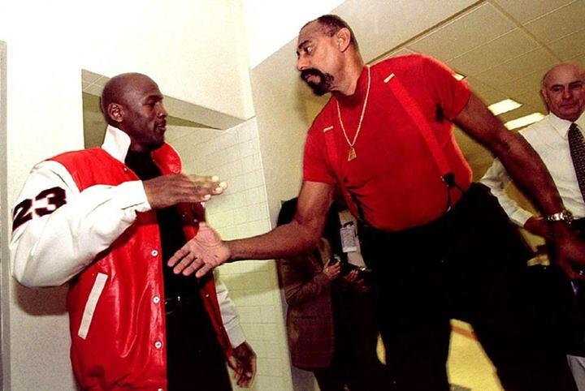
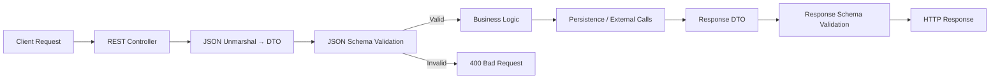
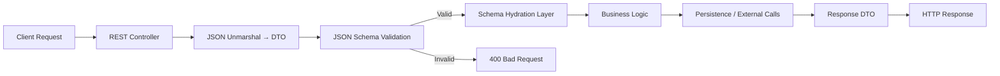

+++
date = '2026-02-25T10:00:00+02:00'
draft = false
title = 'JSON Schema in Modern Microservices: Contract-First Validation Strategy'
tags = ["json-schema", "go", "api-design", "microservices", "validation", "openapi", "contracts"]
categories = ["architecture", "backend"]
summary = "A practical guide to JSON Schema in modern microservices — API-first design, OpenAPI contracts, DTO generation, and runtime validation in Go systems."
readingTime = true
comments = true
ShowToc = true
TocOpen = true
image = "banner.png"
weight = 32
+++



# JSON Schema in Modern Microservices

In modern microservices, contracts are more important than code.

When services communicate over REST, messaging systems, or event streams, the real boundary is not the controller — it is the **data contract**.

JSON Schema provides a formal way to describe, validate, and enforce that contract.

In this article, we’ll explore:

- what `JSON` `Schema` is,
- how it fits into `API-first` design,
- how validation works in Go microservices,
- how `OpenAPI` relates to it,
- and how tools like `QuickType` and `jsonschema` validators support contract-driven systems.

---

## 🧭 Why Data Validation Is Critical

In distributed systems:

- services evolve independently,
- deployments are asynchronous,
- consumers and producers are versioned separately.

Without strict validation:

- malformed payloads leak into business logic,
- backward compatibility silently breaks,
- security vulnerabilities appear,
- debugging becomes expensive.

Validation must happen:

- at REST controller boundaries,
- at message consumer entrypoints,
- before business logic executes.

The rule is simple:

**Never trust incoming data. Always validate against the contract.**

---

## 🌐 What Is JSON Schema?

JSON Schema (https://json-schema.org) is a specification for describing the structure of JSON documents.

It allows you to define:

- required fields,
- data types,
- nested objects,
- arrays,
- enums,
- string patterns,
- numeric constraints,
- custom rules.

Example:

```json
{
  "$schema": "https://json-schema.org/draft/2020-12/schema",
  "type": "object",
  "required": ["email", "age"],
  "properties": {
    "email": {
      "type": "string",
      "format": "email"
    },
    "age": {
      "type": "integer",
      "minimum": 18
    }
  }
}
```

---

## 📜 JSON Schema Draft Versions Explained

JSON Schema evolves through formal specification drafts.
Each draft introduces new features, clarifications, and sometimes behavioral changes.

Modern validators (including `santhosh-tekuri/jsonschema`) support multiple drafts:

- Draft 4

- Draft 6

- Draft 7

- 2019-09

- 2020-12

Understanding differences matters when:

- validating across microservices,

- upgrading legacy APIs,

- ensuring backward compatibility,

- integrating third-party schemas.

---

### 🏛 Draft 4 (2013)

Draft 4 is one of the earliest widely adopted versions.

Characteristics:

- basic validation keywords

- type, properties, required

- allOf, anyOf, oneOf

- limited format validation

- no support for newer conditional constructs

Why it still matters:

- many legacy enterprise systems still use Draft 4

- older OpenAPI tools defaulted to it

- migration must be handled carefully

Limitation:

- lacks modern conditional validation features

- weaker composition semantics

---

### 🏗 Draft 6 (2017)

Draft 6 introduced important refinements:

- better numeric validation

- const keyword

- improved format handling

- clarified boolean schema behavior

This draft made schemas more expressive and stricter.

---

### 🚀 Draft 7 (2018)

Draft 7 became the de facto standard for years.

New features:

- if / then / else conditional validation

- enhanced format

- improved error reporting expectations

- clarified $id behavior

Why Draft 7 became popular:

- stable

- widely supported

- supported by most tooling ecosystems

Many production systems still standardize on Draft 7 for compatibility.

---

### 🧠 Draft 2019-09

This draft introduced structural changes and advanced features.

Major additions:

- `$defs` replacing definitions

- unevaluatedProperties

- unevaluatedItems

- improved recursive schema handling

- vocabulary system for extensibility

This version made schemas:

- more modular

- more reusable

- more precise in large systems

It also improved support for complex microservice ecosystems where schemas reference each other.

---

### 🧬 Draft 2020-12 (Current Modern Standard)

Draft 2020-12 refined the architecture further.

Key improvements:

- dynamic references ($dynamicRef)

- improved recursive definitions

- clearer meta-schema separation

- better annotation vs validation separation

- stronger composition semantics

This draft is ideal for:

- large distributed systems

- versioned contract ecosystems

- schema registries

- contract-driven microservice platforms

If you're starting a new system today, 2020-12 is the recommended choice.

---

### 🔄 Why Draft Version Consistency Matters

If Service A uses Draft 4 and Service B uses 2020-12

You may face:

- unexpected validation behavior,

- incompatible keyword usage,

- tooling mismatches,

- broken CI validation.

In enterprise systems, teams often:

- standardize on a specific draft,

- enforce it in CI,

- validate $schema field strictly.

Example:

```json
"$schema": "https://json-schema.org/draft/2020-12/schema"
```

The $schema field defines:

- which rules apply,

- how validators interpret keywords,

- what meta-schema governs validation.

---

### 🧪 Draft Selection Strategy

For legacy systems:

- Keep existing draft

- Introduce migration plan

- Validate compatibility

For new systems:

- Use Draft 2020-12

- Enforce schema linting in CI

- Document draft version in API guidelines

Consistency across microservices is more important than novelty.

---

### 🎯 Architectural Insight

Draft evolution reflects the maturity of JSON Schema:

- Draft 4 → structural validation

- Draft 7 → conditional logic

- 2019-09 → modular systems

- 2020-12 → scalable distributed ecosystems

As microservices become more autonomous, schema capabilities must evolve accordingly.

---

## 🧱 API-First (Contract-First) Design

There are two common approaches:

Code-First

- Write controller

- Define DTO

- Generate docs later

Risk: documentation diverges from implementation.

---

## API-First (Recommended)

- Define schema / OpenAPI contract first

- Review with stakeholders

- Generate DTO models

- Implement logic

Benefits:

- shared understanding between teams,

- backward compatibility management,

- early validation of design,

- easier versioning.

In enterprise environments, API-first dramatically reduces integration issues.

---

## 📘 What Is OpenAPI?

OpenAPI is a specification that describes REST APIs.

It includes:

- endpoints,

- HTTP methods,

- request/response schemas,

- status codes,

- authentication models.

OpenAPI often embeds JSON Schema for request/response validation.

Think of it like this:

OpenAPI = API structure
JSON Schema = data structure

They complement each other.

---

## 🧬 DTOs and Schema Alignment

`DTO` (Data Transfer Object) is the in-code representation of a contract.

Example in Go:

```go
type CreateUserRequest struct {
    Email string `json:"email"`
    Age   int    `json:"age"`
}
```

The risk:

If the `DTO` changes but the contract does not — you break consumers.

This is why many teams:

- generate DTOs from OpenAPI/JSON Schema,

- or validate DTO instances against schema at runtime.

Contract must be the single source of truth.

---

## ⚙ Runtime Validation in Go Microservices

In modern Go services, validation usually happens:

1. JSON → DTO unmarshalling

1. DTO → JSON Schema validation

1. Only then → business logic

A powerful validator library: [https://github.com/santhosh-tekuri/jsonschema](https://github.com/santhosh-tekuri/jsonschema)

It supports:

- Draft 4 / 6 / 7 / 2019-09 / 2020-12

- fast compiled schemas

- strict validation

- reusable schema caching

Example usage:

```go
compiler := jsonschema.NewCompiler()
compiler.AddResource("schema.json", schemaReader)

schema := compiler.MustCompile("schema.json")

if err := schema.Validate(instance); err != nil {
    return fmt.Errorf("invalid payload: %w", err)
}
```

This ensures:

- strict contract enforcement,

- safe service boundaries,

- predictable failures.

Validation belongs at the edge — not inside business logic.

---

## 🔄 QuickType – Model Generation from Contracts

`QuickType` is a tool that generates typed models from:

- JSON Schema

- OpenAPI

- example JSON documents

It supports:

- Go

- TypeScript

- Python

- Java

- C#

Why it’s powerful:

- single source contract,

- consistent model generation across frontend & backend,

- reduces manual DTO drift.

Example flow:

Schema → QuickType → Go DTO
Schema → QuickType → TypeScript interfaces

This keeps microservices and frontend aligned.

---

## Go-Only Alternative: atombender/go-jsonschema

If your architecture is Go-only and you do not require cross-language model generation,
github.com/atombender/go-jsonschema provides a native Go alternative.

It generates Go structs directly from a JSON Schema file.

Installation:

```text
go install github.com/atombender/go-jsonschema@latest
```

Example usage:

```text
go-jsonschema ./schema.json \
-p contractv1 \
-o model.go \
--minimal-names \
--tags json
```

This produces:

- Strongly-typed Go DTOs

- Proper json struct tags

- Optional validation helpers

- Draft-aware model alignment

Best suited for:

- Go-only microservices

- Internal backend platforms

- Minimal tooling environments

- Teams without frontend SDK generation requirements

Unlike `QuickType`, it does not support multi-language model generation.
However, for pure `Go` ecosystems, it integrates naturally and keeps the toolchain simple.

---

## ⚖ QuickType vs go-jsonschema

These tools solve different problems.

They answer different architectural questions.

| Concern	| QuickType	| go-jsonschema / jsonschema validators |
|-------------------|------------|---------------------------------------|
| Generate DTO models	| ✅	| ❌ |
| Runtime validation	| ❌	| ✅ |
| Cross-language support	| ✅	| ❌ |
| Enforce contract at boundary	| ❌	| ✅ |
| CI/CD contract validation	| ❌	| ✅ |
| Reduce manual DTO drift	| ✅ | ❌ |
| Schema draft compliance	| ❌	| ✅ |

### QuickType

Purpose:

- Generate models from schema

Strength:

- Type-safe DTOs

- Cross-language support

- Frontend/backend alignment

Limitation:

- Does not enforce validation at runtime

---

### go-jsonschema (validators)

Purpose:

- Validate JSON against schema at runtime

Strength:

- Strong boundary enforcement

- Contract validation in production

- Draft compliance

Limitation:

- Does not generate models

---

## In Modern Architecture You Use Both

- Design contract →

- Generate DTOs →

- Validate at runtime →

- Execute business logic

Generation + validation = safety.

---

## 🏗 Designing a Strong API Contract

Good contracts:

- are explicit,

- define required fields,

- use enums for finite states,

- avoid nullable chaos,

- version breaking changes,

- document error responses.

Avoid:

- loosely typed "any" objects,

- undocumented optional fields,

- implicit assumptions,

- breaking field renames.

Schema clarity reduces operational risk.

---

## 🔐 Security & Stability Benefits

Strict validation prevents:

- injection payloads,

- unexpected nested structures,

- oversized payload attacks,

- broken consumer requests.

It also:

- simplifies observability,

- improves error reporting,

- reduces undefined behavior.

Validation is not overhead.

It is production safety.

---

## 🔁 Contract Validation Flow in a Microservice

Below is a practical view of how contract validation should happen inside a production-grade microservice.

Diagram



What This Diagram Shows

1. Controller Layer
    
    Handles HTTP transport concerns only.

1. DTO Mapping

    Raw JSON is converted into strongly-typed structures.

1. Schema Validation (Critical Boundary)

    Payload is validated against the JSON Schema contract.

1. Business Logic Execution

    Only validated, trusted data reaches domain logic.

1. Optional Response Validation

    Response payload is validated against response schema before sending.

---

## 🧪 JSON Schema in CI/CD

Contracts should be validated in pipeline:

- schema linting,

- backward compatibility checks,

- contract tests between services,

- OpenAPI diff validation.

Failing schema compatibility should block release.

---

## 💧 Schema Hydration in Microservices

Validation answers the question:

- “Is this payload structurally correct?”

Hydration answers a different question:

- “Is this payload semantically complete and ready for domain execution?”

Schema hydration is the process of:

- enriching validated input with derived data,

- applying default values,

- resolving references,

- transforming external formats into internal canonical models.

Validation ensures correctness.
Hydration ensures usability.

---

### 🧱 Validation vs Hydration

| Concern                           | Validation | Hydration |
|-----------------------------------|------------|-----------|
| Checks structure	                 | ✅	| ❌ |
| Applies defaults	                 | ❌	| ✅ |
| Enriches with computed fields	| ❌	| ✅ | 
| Resolves external IDs	| ❌	| ✅ | 
| Ensures business readiness	| ❌	| ✅ |

**Validation protects boundaries.
Hydration prepares data for domain logic.**

---

### 🏛 Architecture Insight

In mature microservice systems:

```text
Contract Layer
↓
Validation Layer
↓
Hydration Layer
↓
Domain Layer
↓
Persistence Layer
```

Each layer has a single responsibility.

This separation is what enables:

- safe evolution,

- independent deployment,

- strict contracts,

- clean domain models.

---

### 🧪 Hydration in CI/CD

Hydration logic should be:

- unit-tested independently,

- contract-tested with multiple schema versions,

- validated for backward compatibility.

Schema validation prevents malformed input.
Hydration prevents malformed domain state.

Both are required for production safety.

---

## 🔄 Where Hydration Happens

Extend the previous flow:

Diagram



Hydration is a separate layer, not part of business logic and not part of validation.

This separation:

- keeps validation pure,

- keeps business logic clean,

- keeps transformations centralized.

### 🎯 Architectural Principle

Validation protects the system from invalid data.
Hydration prepares valid data for meaningful execution.

Both are part of a mature contract-first microservice design.

---

🎯 Final Thoughts

In distributed systems:

**Data contracts are architecture.**

JSON Schema:

- formalizes communication,

- prevents integration drift,

- improves safety,

- enables API-first workflows.

Modern microservices should:

- design contracts first,

- generate models automatically,

- validate strictly at boundaries,

- treat schema as production infrastructure.

Confidence starts at the contract.

---

🚀 Follow me on [norbix.dev](https://norbix.dev) for more insights on Go, Python, AI, system design, and engineering wisdom.
