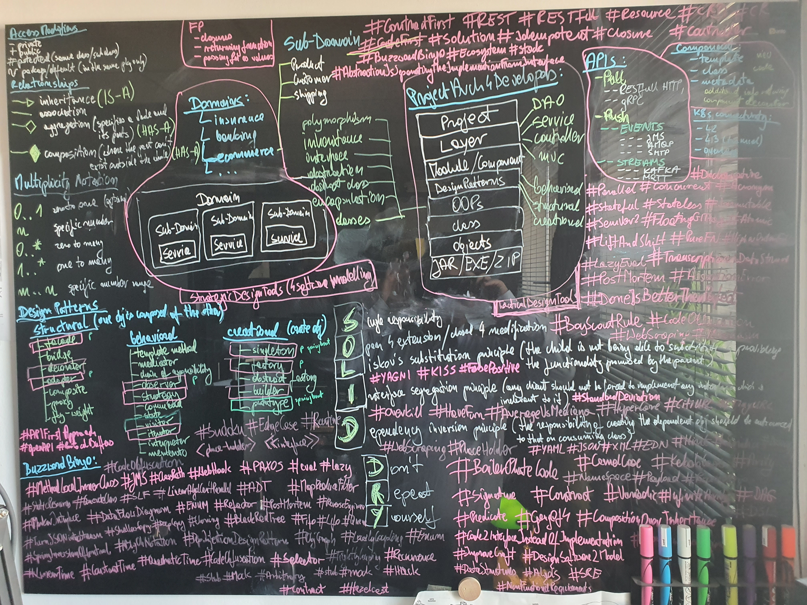

+++
date = '2025-04-13T14:44:44+02:00'
draft = false
title = 'Keywords in Software Architecture'
tags = ["architecture", "software-engineering", "keywords"]
categories = ["architecture", "software-engineering"]
summary = "A visual exploration of the core keywords and concepts in modern software architecture." 
comments = true
ShowToc = true
TocOpen = true
image = "keywords_board.jpg"
weight = 2
+++

The whiteboard behind this article is more than just colorful notes — it's a map of the mental models that drive clean, scalable, and maintainable software systems. Let’s break down the core ideas and keywords captured in this visual brainstorm.

---

## 🧠 Sub-Domains & Bounded Contexts

- **Domain**, **Sub-Domain**, **Service**
- **Line of business**, like _Insurance_, _Banking_, _E-Commerce_
- Visualized as logical boundaries for teams and services
- Inspired by **Domain-Driven Design (DDD)**

> _“Design your system around business capabilities, not technical constraints.”_

---

## 🧱 Architectural Patterns

- **Layered Architecture**: `DAO → Service → Controller`
- **Module / Component** view
- Common design layers:
    - **Project**
    - **Layer**
    - **Objects / Classes**
    - **Executable packaging**: `.JAR / .EXE / .ZIP`

---

## ✍️ Design Patterns (GoF)

Grouped by intent:

### Structural:
- `Facade`
- `Decorator`
- `Adapter`

### Behavioral:
- `Strategy`
- `Observer`
- `Command`

### Creational:
- `Singleton`
- `Factory`
- `Builder`

Each of these has a purpose in object lifecycle, behavior injection, or structural abstraction.

---

## 📐 SOLID Principles

Each letter is a compass for clean design:

- **S** – Single Responsibility
- **O** – Open/Closed
- **L** – Liskov Substitution
- **I** – Interface Segregation
- **D** – Dependency Inversion

And don’t forget the twin brother: **DRY** (Don’t Repeat Yourself).

---

## 🛰️ Communication Styles

- **REST**, **gRPC**, **GraphQL**, **WebSocket**
- **Pub/Sub**, **Push**, **Poll**
- Emphasizes **event-driven**, asynchronous models in distributed systems

---

## ⚙️ Buzzwords & Practices

From delivery to deployment:

- **#ShiftLeft**
- **#TestFirst**, **#ContractFirst**, **#DesignFirst**
- **#PlatformEngineering**
- **#ZeroTrust**, **#Resilience**, **#Observability**

---

## 🎯 Hashtags as Architecture Drivers

A few standout philosophies and principles:

- `#CompositionOverInheritance`
- `#LiftAndShift`
- `#KISS` (Keep It Simple, Stupid)
- `#DeferDecisions`
- `#AutomationIsProductivity`
- `#AnticorruptionLayer`
- `#BoundedContext`
- `#HexagonalArchitecture`

These tags aren’t just trending on dev Twitter — they’re real-world practices for making software _less fragile_ and _more adaptive_.

---

## 📌 TL;DR

The whiteboard outlines an entire **mental toolkit for system design**:

- Think **in domains**, not just code
- Choose patterns and principles that **solve business pain points**
- Architect with **change in mind** — using **SOLID**, **DDD**, and **event-driven paradigms**
- Let **#buzzwords** like `#DRY`, `#ShiftLeft`, and `#Resilience` guide practical decisions, not dogma

---

> _"Architecture is not about boxes and arrows. It's about decisions and trade-offs."_  
> – Norbert Jakubczak

---

💬 Got questions about any of the keywords? Want a breakdown on one of the patterns or practices? Drop a comment below — let's talk architecture.

🚀 Follow me on [norbix.dev](https://norbix.dev) for more insights on Go, Python, AI, system design, and engineering wisdom.
