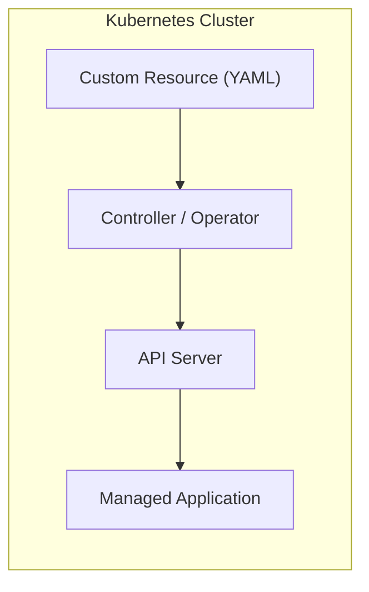

+++
date = '2025-10-07T10:00:00+02:00'
draft = false
title = "Kubernetes Operators in Go"
tags = ["kubernetes", "go", "operator-sdk", "controller-runtime", "cloud-native"]
categories = ["platform-engineering", "golang", "kubernetes"]
summary = "Learn how to build and understand Kubernetes Operators in Go — from controllers and reconciliation loops to the Operator SDK."
readingTime = true
comments = true
ShowToc = true
TocOpen = true
image = "banner.jpg"
weight = 27
+++


## 🐹 Developing `Kubernetes (K8s) Operators` in `Go`

“Automation is powerful. But automation that understands Kubernetes state? That’s what Operators deliver.”

Kubernetes Operators let you extend the platform’s capabilities beyond deployments and services — into managing complex applications, lifecycle events, and custom resources.
And Go is the native language of Kubernetes — which makes it the perfect choice for building them.

## ⚙️ What Is a `Kubernetes (K8s) Operator`?

A Kubernetes Operator is a special kind of controller that manages the lifecycle of Custom Resources (CRDs) — your own Kubernetes-native objects.

Operators embody operational logic in code.
Instead of running manual scripts to install, configure, and update complex apps, an Operator does it automatically — continuously reconciling desired and actual state.



---

## 🧱 The Core Concepts

|Concept | Description |
| ------ | ----------- |
| Custom Resource (CRD)	| Defines a new Kubernetes API type, e.g., `KafkaCluster`, `PostgresDB`.|
| Controller | Watches the cluster for changes and acts on them. |
| Reconcile Loop | Logic that brings actual state in line with desired state. |
| Manager | Runs one or more controllers within a single binary (operator process).|

---

## 🧰 Tooling: Operator SDK and Controller Runtime

Most operators are built using either:

- `kubebuilder` - the foundation used by the Kubernetes project itself.
- `Operator SDK` - built on top of `Kubebuilder`, adds `scaffolding`, `Helm/Ansible` support, and packaging tools.

Both use the same controller-runtime library under the hood.

---

## 🧑‍💻 Minimal Operator in Go

Let’s start small — a custom resource that defines a simple app replica count, like a toy version of a Deployment.

1. Define the `CRD` type
    
    ```go
    type AppSpec struct {
        Replicas int `json:"replicas"`
    }
    
    type App struct {
        metav1.TypeMeta   `json:",inline"`
        metav1.ObjectMeta `json:"metadata,omitempty"`
        Spec              AppSpec `json:"spec,omitempty"`
    }
    ```

1. Write the Reconciler

    ```go
    type AppReconciler struct {
        client.Client
        Scheme *runtime.Scheme
    }
    
    func (r *AppReconciler) Reconcile(ctx context.Context, req ctrl.Request) (ctrl.Result, error) {
        var app v1alpha1.App
        if err := r.Get(ctx, req.NamespacedName, &app); err != nil {
            return ctrl.Result{}, client.IgnoreNotFound(err)
        }
    
        fmt.Printf("Reconciling App: %s with %d replicas\n", app.Name, app.Spec.Replicas)
    
        // logic to create/update pods, deployments, etc.
    
        return ctrl.Result{RequeueAfter: time.Minute}, nil
    }
    ```

1. Register with the Manager

    ```go
    func (r *AppReconciler) SetupWithManager(mgr ctrl.Manager) error {
        return ctrl.NewControllerManagedBy(mgr).
            For(&v1alpha1.App{}).
            Complete(r)
    }
    ```

---

## 🧰 Try It Yourself — Demo Repository

You can explore a working version of this basic Operator (which watches and copies ConfigMaps between namespaces) here:

👉 [**norbix/demo2_k8soperator_golang**](https://github.com/norbix/demo2_k8soperator_golang)

It’s a minimal controller built with `kubebuilder`, showcasing:
- A real reconciliation loop in Go,
- RBAC permissions via `controller-gen`,
- and namespace-aware ConfigMap copying.

Feel free to clone it, run `make run`, and explore how reconciliation behaves locally before deploying it into a cluster.

---

## 🔄 How Reconciliation Works

1. The controller watches for changes in your custom resource (App).

1. Each time the `CR` changes, the Reconcile function runs.

1. You query current cluster state.

1. Compare it to desired state.

1. Apply Kubernetes API calls to fix drift.

This “watch → compare → act” loop is the heartbeat of every Kubernetes Operator.

---

## 🧩 Example Use Cases

- Database lifecycle (PostgreSQL, Cassandra)

- Message brokers (Kafka, RabbitMQ)

- In-house platform abstractions (custom CRDs for deployments or internal apps)

- Certificates, secrets, or DNS automation

- SaaS product provisioning (multi-tenant control planes)

---

## 🧠 Why Build Operators in Go?

| Reason | Benefit |
| -------- | --------- |
| Native to Kubernetes | All core components are Go; you use the same APIs. |
| Strong typing	| Prevents config and schema errors early. |
| Performance | Lightweight, fast binaries for controllers. |
| Ecosystem	| Access to client-go, controller-runtime, and api-machinery. |


---

## ⚙️ Common Pitfalls

- Forgetting to requeue (return ctrl.Result{RequeueAfter: ...})

- Not handling NotFound errors (causes noisy logs)

- Too much logic in Reconcile() — move helpers to separate packages

- Forgetting RBAC permissions (config/rbac/role.yaml)

---

## 🚀 What if you want to build a real-world Operator?

- Try `kubebuilder init --domain=example.com --repo=github.com/norbix/app-operator`

- Generate your API: `kubebuilder create api --group apps --version v1alpha1 --kind App`

- Build and run locally: `make run`

- Deploy to a kind/minikube cluster and apply your CRD.

---

## 🧩 Summary

Kubernetes Operators let you embed operational knowledge directly into the cluster.
They turn scripts into controllers, and manual operations into self-healing automation.

“In the end, Operators are just Go programs — but they make Kubernetes feel alive.”

---

## 🔗 Further Reading

- [`Kubebuilder` Book](https://book.kubebuilder.io/)

- [Operator `SDK` Docs](https://sdk.operatorframework.io/docs/)

- [`client-go` API reference](https://pkg.go.dev/k8s.io/client-go)

---

🚀 Follow me on [norbix.dev](https://norbix.dev) for more insights on Go, Python, AI, system design, and engineering wisdom.
