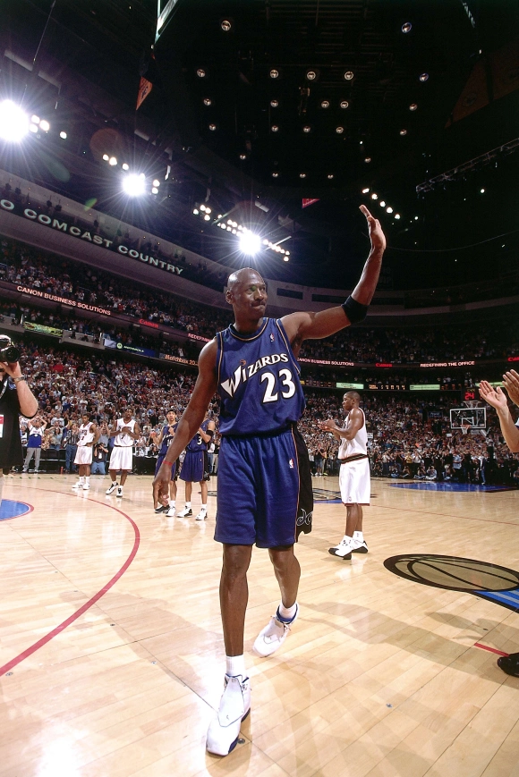
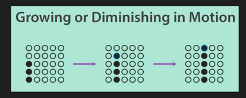
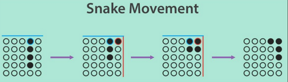
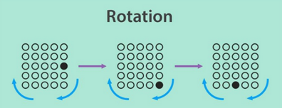
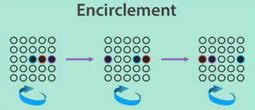
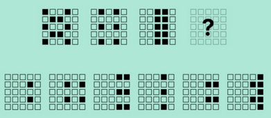

+++
title = "Movement Patterns & Logical Thinking in Software Engineering"
date = "2025-04-25T10:00:00+02:00"
draft = false
tags = ["software-engineering", "algorithms", "patterns"]
categories = ["software-engineering", "algorithms"]
summary = "Exploring the intersection of movement patterns and logical thinking in software engineering, with a focus on algorithms and design."
comments = true
ShowToc = true
TocOpen = true
image = "banner.jpg"
weight = 18
+++



Software engineering is more than code — it's a game of patterns, abstraction, and logical motion. Just like visual puzzles rely on detecting transformations in space, good software design often hinges on recognizing and applying conceptual movement patterns.

In this post, we’ll explore 5 movement metaphors and how they map to software design, refactoring, and architecture decisions. Use these mental models to improve your code reasoning, modularity, and problem-solving clarity.

---

## ✅ 1. Growing or Diminishing in Motion

🔍 Pattern: A group of elements expands or contracts as it shifts.



🛠 In Code:

- Growing: Adding new responsibilities during a data pipeline pass.

- Diminishing: Filtering or trimming data as it flows through functions.

```go
// Growing: Aggregating log metrics
for _, log := range logs {
	if log.Level == "ERROR" {
		metrics.Errors = append(metrics.Errors, log)
	}
}

// Diminishing: Dropping stale entries
activeUsers := []User{}
for _, u := range users {
	if !u.IsStale() {
		activeUsers = append(activeUsers, u)
	}
}
```

---

## 🐍 2. Snake Movement

🔍 Pattern: An entity slithers forward while retaining continuity — position shifts, but shape remains.




🛠 In Code:

- Queues or buffers where the oldest element is dequeued and the new one appended.

- Sliding window algorithms in streaming or monitoring.

```go
window := []int{1, 2, 3}
window = append(window[1:], 4) // Slides the window forward
```

---

## 🔁 3. Rotation

🔍 Pattern: The configuration stays constant, but its orientation changes — like rotating a matrix.



🛠 In Code:

- Round-robin task distribution

- Load balancing strategies

- Rotating logs or secrets

```go
servers := []string{"a", "b", "c"}
i := 0
for req := range requests {
	handleRequest(req, servers[i])
	i = (i + 1) % len(servers)
}
```

---

## 🔒 4. Encirclement

🔍 Pattern: Elements surround a core and transition around it.



🛠 In Code:

- Retry loops around critical operations

- Security checks encircling a core feature (like middleware)

```go
// Encircled by retries
for attempts := 0; attempts < 3; attempts++ {
	err := doCriticalOp()
	if err == nil {
		break
	}
	time.Sleep(1 * time.Second)
}
```

---

## 🧩 5. Merging and Dividing

🔍 Pattern: Entities split into parts or combine into a whole — a reconfiguration in structure.



🛠 In Code:

- Microservice decomposition vs. monoliths

- Merging streams, splitting workloads

```go
// Splitting
chunks := strings.Split(fileContent, "\n\n")

// Merging
joined := strings.Join(chunks, "\n")
```

---

## 🧠 Why It Matters

These abstract movement patterns train your brain to:

- Recognize hidden logic transformations

- Improve refactoring instincts

- Communicate architectural intent with visual clarity

When debugging or designing, ask:

    What motion is this code making? Growing, rotating, merging… or slithering forward like a snake?

---

## 🔚 Closing Thoughts

Whether solving a visual logic puzzle or building a fault-tolerant API, pattern recognition is the foundation of engineering intuition. The more you exercise it, the better your decisions become — both visually and in code.

🌀 Keep moving. Keep thinking. Keep coding.

---

🚀 Follow me on [norbix.dev](https://norbix.dev) for more insights on Go, Python, AI, system design, and engineering wisdom.
