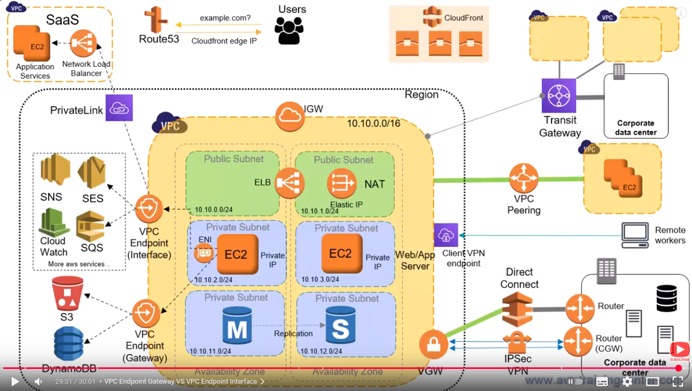
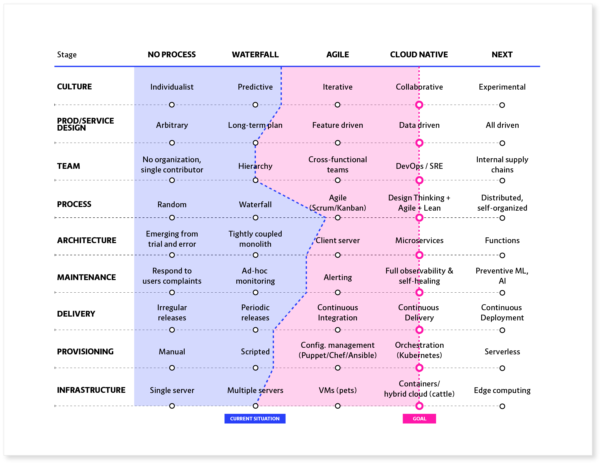
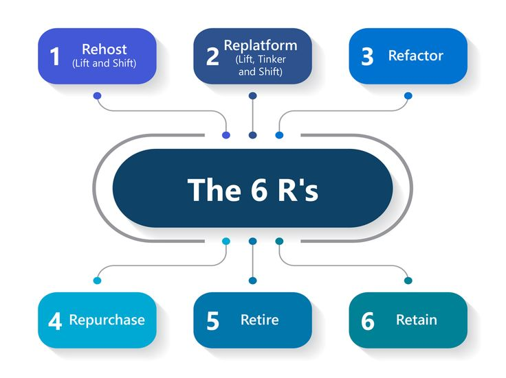

+++
title = "Platform Engineering: The DevOps You Productize"
date = "2025-04-22T16:00:00+02:00"
draft = false
tags = ["platform-engineering", "devops", "sre", "cloud", "developer-experience"]
categories = ["platform-engineering", "cloud-infrastructure"]
summary = "What is Platform Engineering? How is it different from DevOps or SRE? This article unpacks the role of platform teams, why they're critical in modern software delivery, and how they bring together cloud, automation, and developer experience."
comments = true
ShowToc = true
TocOpen = true
image = "platform-banner.jpg"
weight = 15
+++

**"Great platforms don’t abstract power. They enable it."**

You’ve probably heard the term `Platform Engineering` thrown around. But is it just rebranded `DevOps`? Is it `SRE` with a cooler name? Or `cloud automation` with some swagger?

Let’s set the record straight — and show why platform engineering is becoming the backbone of modern engineering organizations.

---

## 🚀 What Is Platform Engineering?

`Platform Engineering` is the discipline of designing, building, and maintaining internal platforms that streamline and scale software delivery. It brings together principles from DevOps, SRE, and cloud engineering into a cohesive, developer-friendly toolkit.

Think of it as building "paved roads" that teams can confidently deploy on — without needing to reinvent infrastructure, pipelines, or observability every time.

**The end goal? Enable dev teams to ship faster and safer — without needing to be `Kubernetes`, `Terraform`, or `AWS` experts.**

---

## 🧱 What Goes Into a Platform?

Platform engineers often build and maintain:

- 🏗️ Internal Developer Platforms (IDPs): Self-service interfaces and APIs for provisioning, deploying, and managing services e.g. [container8.io](https://container8.io).

- 🔁 CI/CD Pipelines: Standardized, reusable workflows for testing and deploying code.

- ☁️ Infrastructure as Code (IaC): Terraform, Pulumi, Crossplane, etc.

- 🔍 Observability Tools: Centralized logging, metrics, and tracing integrations.

- 🔒 Security and Compliance Controls: Guardrails, not roadblocks.

---

## 🧩 How It Relates to DevOps, SRE, and Cloud

### DevOps ✅

- DevOps is a culture of collaboration and automation.

- Platform engineering productizes DevOps by building internal tools and workflows that developers can actually use.

### SRE ✅

- SRE focuses on reliability, automation, and incident response.

- Platform teams embed SRE principles into the platform: error budgets, golden signals, runbooks.

### Cloud Engineering ✅

- Cloud engineering provides the infrastructure foundation.

- Platform engineers abstract that complexity into reusable modules and templates.

#### AWS Networking

**Platform Engineering = DevOps + SRE + Cloud + DX (Developer Experience)**

---

## 🧠 Why Platform Engineering Matters

In complex environments — multiple teams, microservices, polyglot stacks — platform engineering provides:

- 🔄 Consistency: Standardized pipelines and infra reduce cognitive load.

- 🧪 Safety: Guardrails prevent footguns and accelerate onboarding.

- 🛠️ Developer Enablement: Engineers focus on features, not YAML.

- ⚖️ Scalability: Platforms scale better than hero engineers.

**Great platform teams act like product teams: listen to users, iterate fast, and deliver value continuously.**

---

## 🧭 From DevOps to Platform Engineering

As organizations mature, their engineering practices evolve across several stages — from ad-hoc processes to fully autonomous, AI-driven ecosystems.

This chart illustrates the evolutionary path of software delivery maturity, showing how teams move through stages of:

- Culture — from individualistic to collaborative to experimental

- Architecture — from monoliths to microservices to functions

- Infrastructure — from manual servers to orchestrated containers to edge computing

- Process & Delivery — from random releases to continuous delivery to continuous deployment

Platform engineering typically thrives at the Cloud Native stage — where DevOps, SRE, and developer experience converge.

At this point, teams have:

- Automated provisioning (Kubernetes, Terraform, GitOps)

- Continuous delivery pipelines

- Full observability and self-healing systems

- Data-driven decision-making across infrastructure and product layers

The next frontier (`NEXT`) is where platforms become intelligent: predictive maintenance, AI-driven ops, and self-organizing teams.
Platform engineers will lead this transition by combining automation with machine learning and proactive governance.

---

## 🌍 The 6 R’s of Cloud Migration

Platform engineering often intersects with **cloud migration strategies**. When modernizing workloads, organizations typically choose from the **6 R’s** framework:

1. **Rehost (Lift and Shift)** → Move applications “as-is” into the cloud. Fast but not cloud-optimized.
2. **Replatform (Lift, Tinker, and Shift)** → Minor tweaks for optimization (e.g., managed DBs, autoscaling).
3. **Refactor** → Fully re-architect to leverage cloud-native design (microservices, serverless).
4. **Repurchase** → Replace with SaaS solutions (e.g., Salesforce, Workday).
5. **Retire** → Decommission redundant applications.
6. **Retain** → Keep some workloads on-prem due to compliance or cost.

👉 Platform teams help organizations **navigate the 6 R’s** by providing reusable infrastructure, migration tooling, and golden paths. Instead of one-off migrations, they turn cloud adoption into a repeatable, scalable process.

---

## 🛤️ Golden Paths: The Secret Sauce

Platform engineering isn’t just about tools — it’s about opinionated defaults. The best platforms offer "golden paths":

- Recommended ways to build, test, and deploy apps

- Templates for services, jobs, infrastructure

- Standardized observability and alerting

**Give devs superpowers — not blank canvases.**

---

## 📦 Tools of the Trade

Some common tools and patterns used by platform teams:

- `IaC`: Terraform, Pulumi, CDK

- `CI/CD`: GitHub Actions, ArgoCD, Tekton, Spinnaker

- `Containers & K8s`: Helm, Crossplane, Kubernetes Operators

- `Developer Portals`: Backstage, Port, Humanitec

- `Observability`: Prometheus, Grafana, OpenTelemetry

---

## 💬 Final Thoughts

`Platform Engineering` is not a fad. It’s a response to real-world complexity at scale. As orgs grow, they need paved roads, not paved-over tickets.

The future of software delivery is internal platforms that combine speed, reliability, and safety — all with a developer-first mindset.

---

🚀 Follow me on [norbix.dev](https://norbix.dev) for more insights on Go, Python, AI, system design, and engineering wisdom.
