+++
date = '2026-07-11T10:00:00+02:00'
draft = false
title = "Proxy Demystified: API Gateways, Reverse Proxies, SSH Tunnels & Design Patterns"
tags = [
    "proxy",
    "reverse-proxy",
    "forward-proxy",
    "api-gateway",
    "ssh",
    "networking",
    "system-design",
    "architecture",
    "backend",
    "golang"
]
categories = ["software-engineering", "architecture"]
summary = "Learn how routing, forward proxies, reverse proxies, API Gateways, SSH tunneling, Kubernetes ingress, service meshes, and the Proxy design pattern all fit together. A complete guide for backend and platform engineers."
comments = true
ShowToc = true
TocOpen = true
image = "banner.png"
weight = 36
+++


# 🌍 Why Every Software Engineer Should Understand Proxies

Ask ten engineers what a **proxy** is and you'll likely receive ten different answers.

Some will say:

> "Nginx."

Others will answer:

> "An API Gateway."

Network engineers may think about corporate proxy servers.

Security engineers may mention SOCKS proxies.

Platform engineers will talk about Envoy sidecars.

Software developers might immediately think of the Proxy Design Pattern.

Surprisingly...

**They're all correct.**

They simply describe different implementations of the same architectural idea.

---

# 🧠 One Concept, Many Implementations

A proxy is an intermediary.

Instead of communicating directly with the destination, one side communicates with another component that decides how the request should be handled.

Instead of

```
Client ─────────► Server
```

we introduce an intermediary.

```
Client ─────► Proxy ─────► Server
```

Everything else in this article is a specialization of this simple concept.

---

# 🌍 Where You Already Use Proxies

Even if you've never configured one yourself, you already rely on proxies every day.

Examples include:

- Corporate internet proxies
- Cloudflare
- Nginx
- HAProxy
- Traefik
- AWS API Gateway
- Kong
- Envoy
- Kubernetes Ingress Controllers
- Istio sidecars
- SSH port forwarding
- SOCKS tunnels
- CDN edge servers

Modern cloud-native systems often process a single request through several different proxies before it reaches the application.

---

# 🏗 Modern Request Journey

A typical request may look like this:

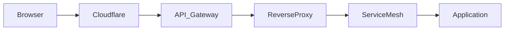

Each component performs a different responsibility.

Some terminate TLS.

Some authenticate users.

Some balance traffic.

Some simply forward packets.

Understanding these responsibilities is one of the most valuable skills in modern system design.

---

# 🚦 Routing vs Proxy

One of the biggest misconceptions is confusing **routing** with **proxying**.

Although both determine where traffic goes, they operate very differently.

## Routing

Routers work at the network layer.

Their responsibility is to determine **where packets should travel**.

A router typically doesn't inspect HTTP headers, cookies or API tokens.

Its job is simply:

> "Which network should receive this packet?"

```text
Packet
   │
   ▼
Router
   │
   ▼
Destination Network
```

Examples include:

- Home routers
- ISP routers
- Cloud VPC routers
- Kubernetes networking

Routing is primarily concerned with IP connectivity.

---

## Proxying

A proxy receives a request as its own endpoint.

Only after inspecting the request does it decide what happens next.

```text
HTTP Request
      │
      ▼
   Proxy Server
      │
      ├── Backend A
      ├── Backend B
      └── Backend C
```

Unlike routers, proxies understand application protocols.

For example they may inspect:

- HTTP methods
- URLs
- Cookies
- JWT tokens
- Request headers
- Payload size
- Client identity

This additional context enables much more sophisticated behaviour.

---

# 🔑 Routing vs Proxy

| Routing | Proxy |
|----------|-------|
| Works at the network layer | Usually works at the application layer |
| Moves packets | Processes requests |
| Doesn't terminate HTTP | Usually terminates HTTP |
| Doesn't inspect application data | Can inspect every request |
| Fast packet forwarding | Rich request processing |
| Examples: routers, switches | Examples: Nginx, Envoy, API Gateway |

Routing answers:

> **"Where should this packet go?"**

Proxying answers:

> **"How should this request be handled before it reaches its destination?"**

This distinction becomes increasingly important as we move into cloud-native architectures.

---

# 🌐 Forward Proxy

The first type of proxy most engineers encounter is the **forward proxy**.

Unlike a reverse proxy, which protects servers, a forward proxy represents the client.

The client intentionally sends all outbound traffic to the proxy.

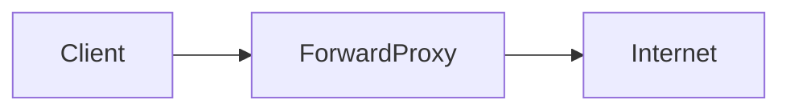

To the destination website, every request appears to originate from the proxy rather than the original client.

This simple architectural change enables a surprising number of capabilities.

## Common Uses

Forward proxies are commonly used for:

- Internet access control
- Corporate security policies
- Web filtering
- Malware inspection
- Logging outbound traffic
- Hiding client IP addresses
- Geographic routing
- Privacy

Large enterprises often require every employee's browser to use a corporate forward proxy before accessing the public Internet.

The proxy becomes the organization's controlled gateway to external services.

---

# 🌍 What the Internet Sees

Without a forward proxy:

```text
Laptop ─────────► example.com
```

The server sees:

```
Client IP = Your Laptop
```

With a forward proxy:

```text
Laptop ───► Proxy ───► example.com
```

The server now sees:

```
Client IP = Proxy Server
```

From the server's perspective, the proxy **is** the client.

This distinction explains why forward proxies are commonly used for privacy, security, and centralized access control.

---

# 🔄 The Evolution of the Proxy

As software systems evolved, so did proxies.

Each new type of proxy solved limitations of the previous generation.

The progression looks roughly like this:

```text
Forward Proxy
        │
        ▼
Reverse Proxy
        │
        ▼
Load Balancer
        │
        ▼
API Gateway
        │
        ▼
Service Mesh
        │
        ▼
Sidecar Proxy
```

Although each technology serves a different purpose, they all share the same fundamental principle:

> **Receive a request first, then decide what should happen next.**

Let's explore each step.

---

# 🔁 Reverse Proxy

While a **forward proxy** represents the client, a **reverse proxy** represents the server.

Instead of clients deciding to use the proxy, the proxy becomes the public entry point for one or more backend applications.

Clients usually don't even know it exists.

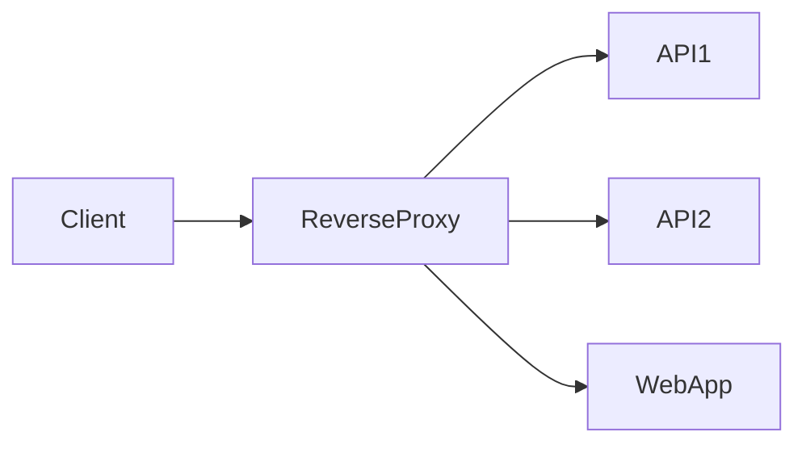

Every incoming request first reaches the reverse proxy.

Only then is it forwarded to the appropriate backend service.

---

# 🏗 Why Reverse Proxies Exist

Imagine exposing every backend service directly to the Internet.

```text
Internet
    │
    ├── App 1
    ├── App 2
    ├── App 3
    └── Database Admin
```

Every application would need to implement:

- TLS termination
- Authentication
- Compression
- Logging
- Rate limiting
- Request routing
- Access control
- DDoS protection

This quickly becomes difficult to maintain.

Instead, we introduce a single reverse proxy.

```text
Internet
     │
     ▼
Reverse Proxy
     │
     ├── App 1
     ├── App 2
     └── App 3
```

The proxy centralizes cross-cutting concerns, allowing backend applications to focus on business logic.

---

# ⚙️ Common Reverse Proxy Responsibilities

Modern reverse proxies commonly handle:

- TLS/SSL termination
- Virtual hosting
- URL-based routing
- HTTP compression
- Static file serving
- Header manipulation
- Authentication integration
- Caching
- Request logging
- Rate limiting

Instead of duplicating this functionality across every application, it can be implemented once at the edge.

---

# 🌍 Popular Reverse Proxy Solutions

Some of the most widely used reverse proxies include:

| Software | Common Use Cases |
|----------|------------------|
| Nginx | Web servers, reverse proxy, static content |
| HAProxy | High-performance load balancing |
| Traefik | Cloud-native and Kubernetes environments |
| Envoy | Service mesh, API gateways, cloud platforms |
| Caddy | Automatic HTTPS and simple deployments |

Each emphasizes different strengths, but all perform the same fundamental role:

Receive requests, inspect them, and forward them to the appropriate destination.

---

# 🚦 Reverse Proxy Routing

One of the biggest advantages of a reverse proxy is intelligent request routing.

Instead of exposing separate ports for every application, a single endpoint can dispatch traffic based on request metadata.

For example:

```text
GET /users
```

may be forwarded to:

```
User Service
```

while

```text
GET /orders
```

is sent to:

```
Order Service
```

Hostnames can also determine routing.

```
api.company.com
```

may reach one backend, while

```
admin.company.com
```

is routed to another.

Clients remain unaware of the underlying infrastructure.

---

# ⚖️ Reverse Proxy vs Load Balancer

Many engineers use these terms interchangeably.

Although they often overlap, they are not identical.

A reverse proxy decides **which application** should handle a request.

A load balancer decides **which instance** of that application should receive it.

Imagine three identical application instances.

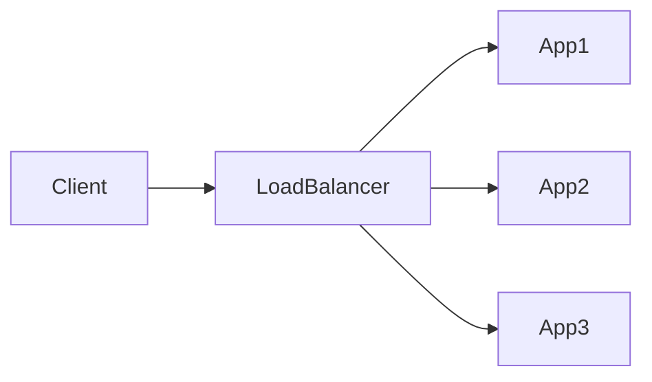

All three applications expose the same API.

The load balancer distributes traffic between them.

This improves:

- Scalability
- High availability
- Fault tolerance
- Rolling deployments

Most modern reverse proxies also include load balancing capabilities, which is why the distinction often becomes blurred.

---

# ⚙️ Load Balancing Strategies

Different workloads benefit from different balancing algorithms.

Common strategies include:

| Algorithm | Description |
|-----------|-------------|
| Round Robin | Requests are distributed evenly |
| Least Connections | Send traffic to the least busy instance |
| Weighted Round Robin | Larger servers receive more requests |
| IP Hash | Same client reaches the same backend |
| Random | Random backend selection |
| Least Response Time | Chooses the fastest responding instance |

Cloud providers implement these algorithms behind managed load balancers such as:

- AWS Application Load Balancer (ALB)
- AWS Network Load Balancer (NLB)
- Google Cloud Load Balancer
- Azure Application Gateway

---

# 🚀 When a Reverse Proxy Isn't Enough

As organizations adopted microservices, reverse proxies started accumulating more and more responsibilities.

Developers wanted features such as:

- OAuth authentication
- JWT validation
- API keys
- Rate limiting
- Request transformation
- Response transformation
- Quotas
- Analytics
- API versioning
- Developer portals

At some point, a simple reverse proxy evolved into something much larger.

This is where the **API Gateway** enters the picture.

---

# 🌐 API Gateway

An API Gateway is a specialized reverse proxy designed specifically for APIs.

Like a reverse proxy, it sits between clients and backend services.

However, it understands much more than simple request forwarding.

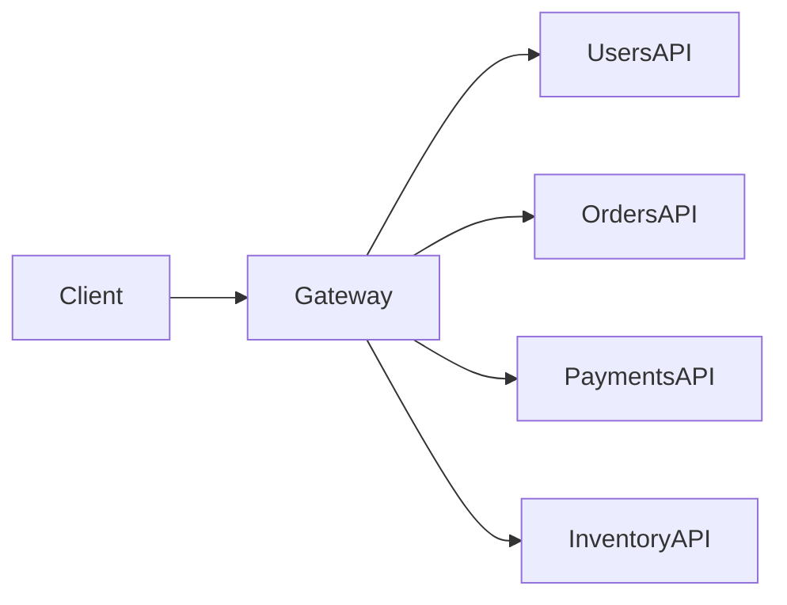

Instead of simply forwarding requests, an API Gateway actively participates in request processing.

---

# 🔑 Typical API Gateway Responsibilities

Modern API Gateways commonly provide:

- Authentication
- Authorization
- JWT validation
- OAuth integration
- API keys
- Rate limiting
- Request validation
- Request transformation
- Response transformation
- Header manipulation
- API versioning
- Metrics
- Logging
- Tracing
- Caching
- Traffic shaping

Because these capabilities are centralized, backend services remain focused on implementing business logic rather than infrastructure concerns.

---

# ☁️ Popular API Gateways

Today's cloud ecosystem offers many API Gateway implementations.

Some of the most popular include:

| Product | Typical Environment |
|---------|----------------------|
| AWS API Gateway | AWS |
| Kong | Cloud-native |
| Apigee | Google Cloud |
| Azure API Management | Microsoft Azure |
| Ambassador | Kubernetes |
| Envoy Gateway | CNCF |

Although they differ in implementation, they all follow the same architectural principle:

> **Every API request passes through the gateway before reaching backend services.**

---

# 🧠 Reverse Proxy vs API Gateway

A useful mental model is:

| Reverse Proxy | API Gateway |
|---------------|-------------|
| Focuses on traffic forwarding | Focuses on API management |
| Routes requests | Applies API policies |
| Handles TLS | Handles authentication |
| May load balance | Applies quotas and rate limits |
| Infrastructure component | API platform component |

You can think of an API Gateway as a reverse proxy that has evolved to understand APIs, identity, security, and developer experience.

---

# 🔐 SSH Tunnels and SOCKS Proxies

So far we've looked at proxies that sit inside server infrastructure.

But proxies can also exist **between networks**.

One of the most powerful examples is SSH port forwarding.

Although many developers use SSH every day to log into remote machines, fewer realize that SSH can also create encrypted network tunnels capable of forwarding virtually any TCP traffic.

This makes SSH far more than a remote terminal.

It can become a secure transport layer between two networks.

---

# 🌍 Why SSH Tunneling Exists

Imagine a database running inside a private network.

```
Database
10.0.0.15:5432
```

The database is intentionally inaccessible from the Internet.

Instead of exposing it publicly, an SSH tunnel allows authorized users to reach it securely through an encrypted connection.

From the application's perspective, nothing changes.

The traffic simply travels through an encrypted tunnel.

---

# 🏠 Local Port Forwarding (`ssh -L`)

Local port forwarding is the most commonly used SSH forwarding mode.

It exposes a **remote service** as if it were running on your local machine.

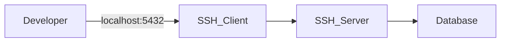

For example:

```bash
ssh -L 5432:database.internal:5432 user@bastion.company.com
```

This command creates the following flow:

```
localhost:5432
        │
        ▼
SSH Tunnel
        │
        ▼
database.internal:5432
```

Applications connect to:

```
localhost:5432
```

while the actual database remains inside the private network.

No firewall rules need to expose the database directly to the Internet.

---

# 🚀 Common Uses of Local Forwarding

Local forwarding is frequently used for:

- Private PostgreSQL databases
- MySQL servers
- Redis instances
- Kubernetes API servers
- Internal dashboards
- Development environments
- Secure administration

Because traffic is encrypted by SSH, no additional VPN is required for many development scenarios.

---

# 🌍 Remote Port Forwarding (`ssh -R`)

Remote forwarding works in the opposite direction.

Instead of exposing a remote service locally, it exposes a **local service** to a remote machine.

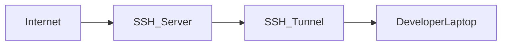

For example:

```bash
ssh -R 8080:localhost:3000 user@server.com
```

Now the remote server can access:

```
localhost:8080
```

even though the application actually runs on your laptop.

---

# 🔧 Common Uses of Remote Forwarding

Remote forwarding is useful when:

- Demonstrating local applications
- Receiving webhooks
- Temporary remote access
- CI/CD testing
- IoT devices behind NAT
- Customer support

Instead of deploying software, developers simply expose their local application through an SSH tunnel.

---

# 🌐 Dynamic Port Forwarding (`ssh -D`)

Dynamic forwarding is where SSH becomes especially interesting.

Instead of forwarding one predefined port, SSH creates an entire **SOCKS proxy**.

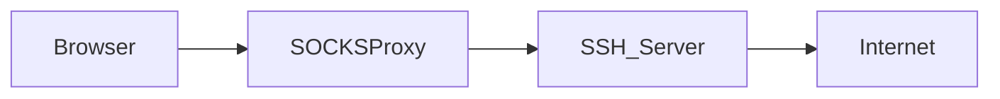

Example:

```bash
ssh -D 1080 user@server.com
```

SSH now creates:

```
localhost:1080
```

as a SOCKS5 proxy.

Applications configured to use this proxy automatically send their traffic through the encrypted SSH connection.

Unlike local forwarding, no destination is predefined.

The client decides where each connection should go.

---

# 🧠 What Makes SOCKS Different?

HTTP proxies understand HTTP.

SOCKS proxies operate at a lower level.

They simply forward TCP connections without interpreting the application protocol.

Because of this, SOCKS works with almost anything:

- HTTP
- HTTPS
- SSH
- SMTP
- FTP
- Git
- Database connections
- Custom TCP protocols

The SOCKS server doesn't need to understand the application's data.

It only forwards network connections.

---

# 🌍 HTTP Proxy vs SOCKS Proxy

Although both are proxies, they serve different purposes.

| HTTP Proxy | SOCKS Proxy |
|------------|-------------|
| Understands HTTP | Protocol agnostic |
| Can inspect URLs | Doesn't inspect application data |
| Can modify HTTP headers | Simply forwards TCP traffic |
| Web traffic only | Any TCP protocol |
| Often used for web filtering | Often used for secure tunneling |

This distinction explains why browsers commonly support both HTTP and SOCKS proxy configurations.

---

# 🔒 Why SSH Tunnels Are So Popular

SSH forwarding offers several advantages:

- End-to-end encryption
- No additional VPN required
- Works through firewalls
- Temporary and easy to create
- Uses existing SSH infrastructure
- Minimal server configuration

For many development teams, SSH tunneling becomes the simplest secure networking solution.

---

# ⚠️ Limitations

Despite its flexibility, SSH tunneling isn't intended to replace production networking infrastructure.

Large organizations typically prefer:

- VPNs
- Zero Trust Networking
- Service Meshes
- Private Links
- Dedicated Bastion Hosts

SSH tunnels are excellent operational tools, but they are usually temporary by nature.

---

# 🧩 A Common Misconception

Many engineers think of SSH port forwarding as a completely different technology from reverse proxies or API Gateways.

Conceptually, it isn't.

An SSH tunnel is simply another proxy.

The difference lies in **what it proxies**.

- Reverse proxies forward HTTP requests.
- API Gateways proxy API calls.
- SOCKS proxies forward TCP connections.
- SSH tunnels securely transport those connections through encrypted channels.

The underlying architectural principle remains exactly the same:

> **Accept traffic first, then decide where it should go.**

---

# ☸️ Kubernetes, Service Meshes and Sidecar Proxies

As applications grew from a handful of servers into hundreds of microservices, a new challenge emerged.

Communication was no longer limited to requests entering the system.

Now, thousands of requests also traveled **between services**.

```
Frontend
    │
    ▼
Users API
    │
    ▼
Orders API
    │
    ▼
Payments API
    │
    ▼
Inventory API
```

Every service suddenly needed to solve problems such as:

- Mutual TLS (mTLS)
- Service discovery
- Authentication
- Authorization
- Retries
- Timeouts
- Circuit breakers
- Traffic shifting
- Distributed tracing
- Metrics
- Logging

Implementing all of these concerns inside every application quickly became unsustainable.

The industry needed another evolution of the proxy.

---

# 🌐 Kubernetes Ingress

Before requests can reach applications running inside Kubernetes, they must first enter the cluster.

This responsibility is typically handled by an **Ingress Controller**.

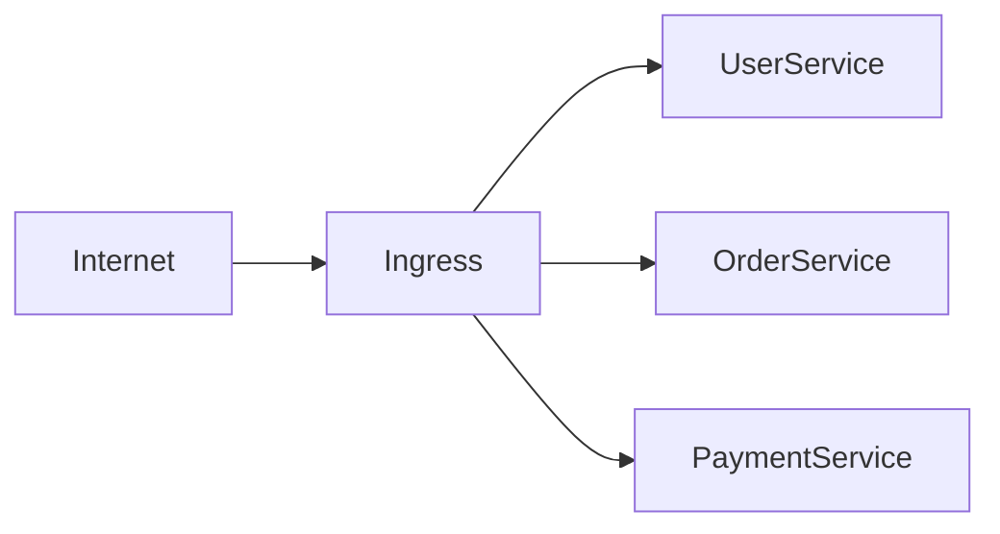

An Ingress behaves much like a reverse proxy.

It accepts incoming HTTP requests and routes them to Kubernetes Services based on rules such as:

- Hostname
- URL path
- TLS configuration

For example:

```
api.company.com/users
```

may route to:

```
users-service
```

while

```
api.company.com/orders
```

is forwarded to:

```
orders-service
```

To clients outside the cluster, the Ingress becomes the public face of the platform.

---

# 🚀 Ingress Controllers

Kubernetes itself doesn't process HTTP traffic.

Instead, it delegates this responsibility to an Ingress Controller.

Popular implementations include:

| Controller | Based On |
|------------|----------|
| NGINX Ingress | NGINX |
| Traefik | Traefik Proxy |
| HAProxy Ingress | HAProxy |
| Kong Ingress | Kong Gateway |
| Ambassador | Envoy |
| Istio Ingress Gateway | Envoy |

Although their features differ, they all share one goal:

Receive incoming requests and route them to the correct workload.

---

# 🌍 The Gateway API

As Kubernetes adoption grew, engineers discovered that the original Ingress API had limitations.

It primarily focused on HTTP routing.

Modern platforms required much richer networking capabilities.

The Kubernetes community introduced the **Gateway API** to provide a more expressive and extensible model.

Instead of a single Ingress resource, networking responsibilities are divided into specialized components.

For example:

- Gateway
- HTTPRoute
- TCPRoute
- TLSRoute
- GRPCRoute

This separation makes networking policies more flexible and easier to manage across large platforms.

Many modern Kubernetes environments are gradually moving from traditional Ingress resources toward the Gateway API.

---

# 🧠 Ingress vs Gateway API

A useful way to think about them is:

| Ingress | Gateway API |
|----------|-------------|
| Simpler | More expressive |
| HTTP-focused | Multiple protocols |
| Limited routing features | Advanced traffic management |
| Single resource | Multiple specialized resources |
| Good for smaller clusters | Designed for large platforms |

The Gateway API isn't intended to replace reverse proxies.

Instead, it provides a standardized way to configure them within Kubernetes.

---

# 🕸 Service Mesh

Until now we've focused on requests entering the cluster.

But what about requests traveling **between** services?

Imagine a request flowing through a typical microservice architecture.

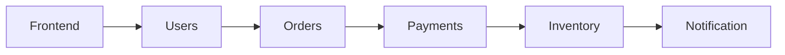

Each connection may require:

- Encryption
- Authentication
- Retries
- Timeouts
- Observability
- Traffic policies

Embedding this logic into every service would create massive duplication.

Instead, the networking responsibilities are moved into dedicated proxies.

This architecture is known as a **Service Mesh**.

---

# 🚀 Sidecar Proxies

Rather than allowing services to communicate directly, a proxy is deployed alongside every application instance.

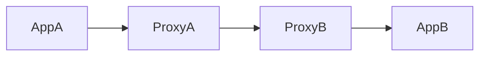

The application believes it is talking directly to another service.

In reality, every request passes through one or more sidecar proxies.

These proxies apply networking policies automatically.

The application itself remains completely unaware.

---

# 🌍 Why Sidecars?

Sidecar proxies provide capabilities such as:

- Mutual TLS
- Automatic retries
- Circuit breakers
- Load balancing
- Traffic shaping
- Canary deployments
- Blue-green deployments
- Fault injection
- Metrics
- Distributed tracing

Instead of every development team implementing these features independently, the platform provides them consistently across all services.

---

# ⚙️ Envoy

The most widely adopted sidecar proxy today is **Envoy**.

Originally developed by Lyft, Envoy has become one of the foundational components of the cloud-native ecosystem.

It powers technologies such as:

- Istio
- Envoy Gateway
- Ambassador
- Google Traffic Director
- AWS App Mesh (historically)
- Consul Connect

Envoy isn't simply a reverse proxy.

It is a programmable Layer 7 proxy capable of handling both edge traffic and internal service-to-service communication.

---

# ☁️ Istio

Istio builds an entire service mesh around Envoy.

Instead of developers configuring every proxy manually, Istio centrally manages networking policies across the cluster.

For example, operators can define:

- Which services may communicate
- Encryption requirements
- Retry policies
- Traffic splitting
- Canary releases
- Request tracing

Applications don't need to implement any of these concerns themselves.

The mesh handles them transparently.

---

# 🔄 A Request Inside a Service Mesh

A request inside a service mesh often follows a path like this:

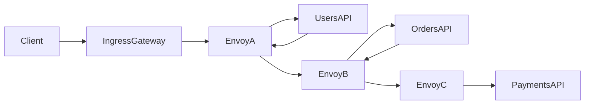

Although the application appears to make direct HTTP or gRPC calls, every hop is mediated by proxies.

This enables centralized networking policies without modifying application code.

---

# 🧩 The Big Picture

At this point, we've encountered several different proxy technologies:

| Technology | Primary Responsibility |
|------------|------------------------|
| Forward Proxy | Represents the client |
| Reverse Proxy | Represents backend servers |
| Load Balancer | Distributes requests |
| API Gateway | Applies API policies |
| Ingress | Routes external traffic into Kubernetes |
| Gateway API | Configures advanced Kubernetes networking |
| Sidecar Proxy | Manages service-to-service traffic |
| Service Mesh | Coordinates all sidecar proxies |

Although they appear to be different technologies, they all implement the same architectural principle:

> **Intercept communication, inspect it, and decide what should happen next.**

The difference lies only in **where** the proxy sits and **what** decisions it makes.

---

# 💻 The Proxy Design Pattern

By now you've seen proxies used throughout networking:

- Forward proxies
- Reverse proxies
- API Gateways
- SSH tunnels
- Sidecar proxies
- Service meshes

But the concept of a proxy isn't limited to networks.

Long before cloud computing became mainstream, software engineers were already using proxies inside application code.

The **Proxy Design Pattern**, introduced by the Gang of Four (GoF), applies exactly the same architectural idea:

> **Instead of talking directly to an object, clients communicate with another object that controls access to it.**

The pattern hasn't changed.

Only the implementation has.

---

# 🧠 The Core Idea

Without a proxy:

```text
Client
   │
   ▼
Real Object
```

With a proxy:

```text
Client
   │
   ▼
Proxy
   │
   ▼
Real Object
```

The proxy implements the same interface as the real object.

To the client, nothing changes.

The proxy simply decides what should happen before forwarding the request.

Sound familiar?

It's exactly what we've been doing throughout this article.

---

# 🔧 A Simple Go Example

Suppose we have a service responsible for retrieving user information.

```go
type UserService interface {
	GetUser(id string) (*User, error)
}
```

A straightforward implementation might look like this:

```go
type UserAPI struct{}

func (u *UserAPI) GetUser(id string) (*User, error) {
	// Call database or remote API
}
```

Clients interact directly with the implementation.

```
Client
    │
    ▼
UserAPI
```

Now imagine we'd like to add logging.

One option is to modify `UserAPI`.

Another is to introduce a proxy.

---

# 📝 Logging Proxy

```go
type LoggingProxy struct {
	service UserService
}

func (p *LoggingProxy) GetUser(id string) (*User, error) {
	log.Printf("Fetching user %s", id)

	user, err := p.service.GetUser(id)

	log.Printf("Finished request")

	return user, err
}
```

The client still depends only on the interface.

```
Client
    │
    ▼
Logging Proxy
    │
    ▼
UserAPI
```

The original service remains completely unchanged.

---

# 🔒 Protection Proxy

A proxy can also enforce authorization.

```go
func (p *AuthorizationProxy) GetUser(id string) (*User, error) {

	if !currentUser.IsAdmin() {
		return nil, ErrUnauthorized
	}

	return p.service.GetUser(id)
}
```

Notice the similarity to an API Gateway.

Both intercept requests before forwarding them.

Both decide whether the request is allowed.

The only difference is the layer at which they operate.

---

# ⚡ Caching Proxy

Another common example is caching.

```go
func (p *CacheProxy) GetUser(id string) (*User, error) {

	if user, ok := p.cache[id]; ok {
		return user, nil
	}

	user, err := p.service.GetUser(id)

	if err == nil {
		p.cache[id] = user
	}

	return user, err
}
```

The caller doesn't know whether the response came from:

- memory
- Redis
- a database
- a remote API

The proxy hides these implementation details.

---

# 🌍 Remote Proxy

One of the original motivations for the Proxy pattern was remote communication.

Instead of calling another object directly, the proxy performs a network request.

```text
Client
    │
    ▼
Remote Proxy
    │
 HTTP/gRPC
    │
    ▼
Remote Service
```

Modern SDKs work this way.

For example, a generated gRPC client behaves like a local object.

Internally, it serializes requests, sends them across the network, waits for a response, and deserializes the result.

The network becomes invisible to the caller.

---

# 💤 Virtual Proxy

Sometimes an object is expensive to create.

Perhaps it loads:

- a large image
- a machine learning model
- a PDF document
- a video
- thousands of database records

Instead of creating the object immediately, the proxy delays initialization until it's actually needed.

```go
func (p *ImageProxy) Display() {

	if p.image == nil {
		p.image = LoadImage()
	}

	p.image.Display()
}
```

This technique is known as **lazy initialization**.

---

# 🧠 Smart Proxy

A Smart Proxy performs additional work before or after forwarding requests.

Examples include:

- Metrics
- Tracing
- Logging
- Retry logic
- Rate limiting
- Connection pooling
- Resource cleanup

Sound familiar?

These are exactly the same responsibilities we've already seen in:

- Reverse proxies
- API Gateways
- Envoy
- Service meshes

The implementation changes.

The architectural idea does not.

---

# 🌍 Infrastructure vs Code

The similarities become surprisingly obvious.

| Infrastructure | Software |
|---------------|----------|
| Reverse Proxy | Proxy Object |
| API Gateway | Authorization Proxy |
| Envoy | Logging Proxy |
| Load Balancer | Smart Proxy |
| SSH Tunnel | Remote Proxy |

Every one of these components stands between two parties and decides how communication should proceed.

Only the level of abstraction changes.

---

# 🧩 One Architectural Pattern Everywhere

Let's revisit the journey we've taken.

We started with a simple idea:

```text
Client ─────────► Server
```

Then introduced an intermediary.

```text
Client ─────► Proxy ─────► Server
```

From that single concept, we explored:

- Forward proxies
- Reverse proxies
- Load balancers
- API Gateways
- SSH tunnels
- SOCKS proxies
- Kubernetes Ingress
- Gateway API
- Service meshes
- Sidecar proxies
- The GoF Proxy pattern

At first glance, these technologies appear unrelated.

In reality, they're all solving variations of the same problem:

> **How can we intercept communication before it reaches its destination?**

Once you recognize this pattern, you'll begin seeing proxies everywhere.

And that's exactly the point.

---

# 🚀 Final Thoughts

One of the biggest misconceptions in software engineering is treating proxies as individual technologies.

They're not.

A reverse proxy isn't "just NGINX."

An API Gateway isn't "just authentication."

A service mesh isn't "just Envoy."

The Gang of Four Proxy pattern isn't "just object-oriented programming."

They're all specialized implementations of one architectural principle:

> **Introduce an intermediary that controls communication between two parties.**

The responsibilities change.

The abstraction changes.

The layer changes.

But the underlying idea remains remarkably consistent.

Understanding that idea makes it much easier to reason about modern distributed systems, cloud-native platforms, networking, and software architecture.

Once you start recognizing proxies as a design concept rather than a specific technology, you'll see them everywhere.

---

# 📚 Key Takeaways

- A proxy is an intermediary between two communicating parties.
- Routing and proxying solve different problems.
- Forward proxies represent clients.
- Reverse proxies represent servers.
- Load balancers distribute requests across multiple instances.
- API Gateways extend reverse proxies with API-specific capabilities.
- SSH port forwarding and SOCKS proxies create secure communication tunnels.
- Kubernetes uses proxies extensively through Ingress Controllers, Gateway API implementations, and Service Meshes.
- Sidecar proxies move networking concerns out of application code.
- The Gang of Four Proxy pattern applies the exact same architectural principle inside software.
- The most valuable lesson isn't learning individual proxy technologies—it's recognizing the common architectural pattern behind them.

---

🚀 Follow me on **norbix.dev** for more deep dives into backend engineering, distributed systems, cloud architecture, Go, Kubernetes, networking, and software design.
