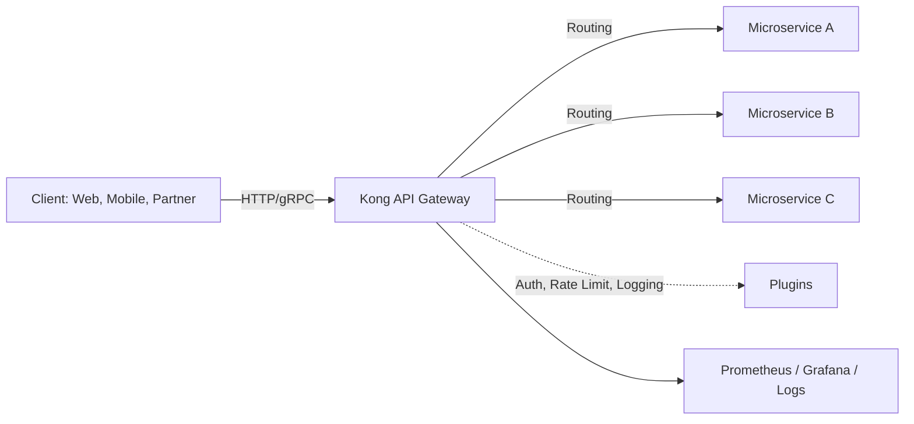
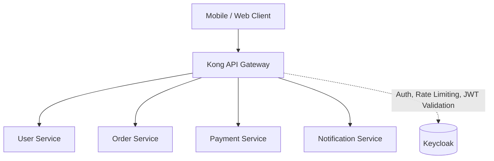
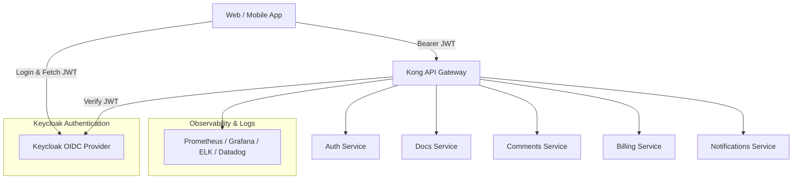
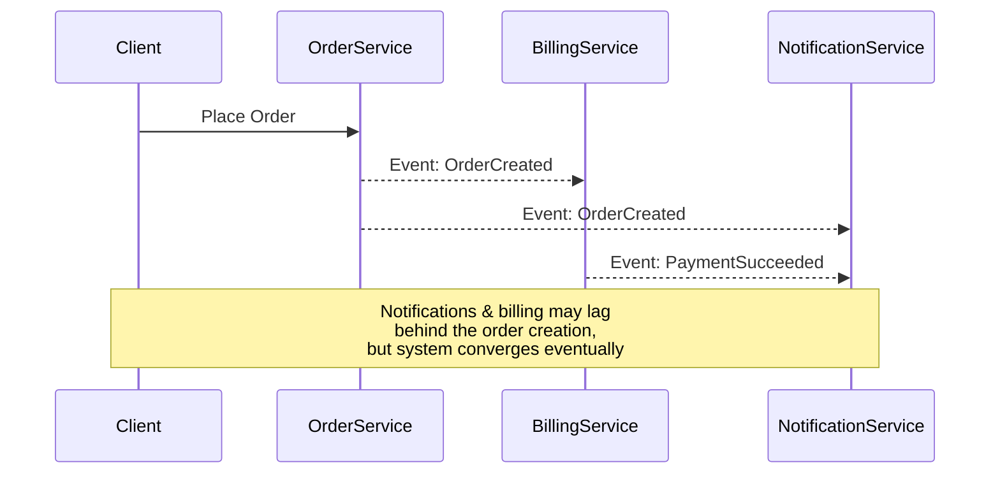

+++
title = "Building SaaS Microservices in Go: REST, gRPC, GraphQL, and WebSocket APIs"
date = "2025-04-22T21:00:00+02:00"
draft = false
tags = ["go", "saas", "microservices", "grpc", "rest", "graphql", "websockets"]
categories = ["golang", "architecture"]
summary = "Explore how to build SaaS-ready microservices in Go using REST, gRPC, GraphQL, and WebSockets. Learn the trade-offs, use cases, and tooling for each API style."
comments = true
ShowToc = true
TocOpen = true
image = "saas-go-banner.jpg"
weight = 16
+++


**"SaaS products scale with services that talk — efficiently, flexibly, and reliably."**

`Go (Golang)` has become a top-tier language for building scalable, cloud-native microservices — especially in the SaaS world. Its speed, simplicity, and rich concurrency model make it ideal for high-performance backends and multi-tenant systems.

In this article, we’ll explore how to build `SaaS` microservices in Go, focusing on different API approaches — `REST`, `gRPC`, `GraphQL`, and `WebSockets` — and when to use each.

---

## 🏗️ Why Use Go for SaaS Microservices?

- ⚡ Performance: Native compilation, low memory usage, fast startup.

- 🧵 Concurrency: Goroutines + channels = lightweight multitasking.

- 🔧 Tooling: Rich stdlib, simple testing, static binaries, fast CI/CD.

- ☁️ Cloud Native: Ideal for containerization and Kubernetes deployments.

**Go hits the sweet spot between systems-level control and developer productivity.**

---

## 🧱 SaaS Architecture Essentials

- Service isolation (multi-tenant or multi-instance)

- Stateless compute (for scalability)

- Secure authentication and authorization

- Observability (metrics, logs, traces)

- Inter-service communication (APIs!)

---

## 🌐 `REST API`: The Classic Workhorse

### ✅ Use When:

- You need browser and mobile-friendly APIs

- Your consumers prefer HTTP+JSON

- You prioritize simplicity and developer ergonomics

### 🛠️ Go Libraries:

- net/http (stdlib)

- `gin`, `chi`, `echo`, `fiber` (routers)

- `openapi`, `swagger`, `goa` (spec + docs)

**`REST API` is battle-tested, easy to cache, and easy to debug — ideal for public APIs or integrations.**

---

## ⚡ `gRPC API`: High-Performance Internal Comms

### ✅ Use When:

- You need fast, efficient, binary communication

- You control both client and server

- You're building service-to-service comms in a large SaaS platform

### 🛠️ Go Libraries:

- google.golang.org/grpc

- Protocol Buffers (protoc, protoc-gen-go)

- Envoy / gRPC-Gateway for REST interop

**`gRPC API` shines in `polyglot`, high-throughput microservice environments.**

---

## 🔍 GraphQL: Flexible Queries for Frontend Teams

### ✅ Use When:

- Frontend teams need control over data shape

- You want to reduce overfetching/underfetching

- You serve multiple frontends with different needs

### 🛠️ Go Libraries:

- 99designs/gqlgen

- graphql-go/graphql

**`GraphQL API` is great for B2B SaaS dashboards, admin panels, or multi-platform apps.**

---

## 🔄 WebSockets: Real-Time, Bi-Directional APIs

### ✅ Use When:

- You need real-time updates (chat, collaboration, notifications)

- Clients push and receive events

### 🛠️ Go Libraries:

- gorilla/websocket

- nhooyr/websocket

**`WebSockets APIs` are ideal for modern SaaS apps with live user interactions.**

---

## 📐 CQRS: Separating Read and Write Paths

The Command Query Responsibility Segregation (CQRS) pattern is often a great fit for SaaS microservices — especially when paired with event-driven architectures.

### ✅ Use When:

- You have complex domain logic or heavy reads vs light writes (or vice versa)

- You want to decouple write models from read-optimized projections

- You're building event-sourced systems

### ⚙️ Tools & Patterns in Go:

- Use separate structs/services for CommandHandlers and QueryHandlers

- Event buses (e.g. go-nats, kafka-go, watermill)

- Projection stores (Postgres, Redis, Elasticsearch, etc.)

**CQRS enables scalability, flexibility, and clear separation of concerns — perfect for SaaS systems with evolving business logic and reporting needs.**

---

##  🧩 Putting It All Together

In a real SaaS platform, you’ll likely mix protocols:

- REST for public APIs and onboarding

- gRPC for internal service mesh

- GraphQL for flexible frontend backends

- WebSocket for interactive features

**Use each where it fits best — Go makes switching easy.**

---

## 🛠️ Dev Stack for SaaS Microservices in Go

- `API Gateways`: Kong, Envoy, Traefik

- `Auth`: OAuth2, OIDC, JWT (with golang-jwt/jwt)

- `Service Discovery`: Consul, etcd, Kubernetes

- `Observability`: Prometheus, OpenTelemetry, Grafana

- `CI/CD`: GitHub Actions, Drone, ArgoCD

API GW Kong Example:



---

## ☁️ SaaS Microservices Examples

### 🛒 E-commerce Platform

- User Service – manages users, profiles, authentication data.

- Catalog Service – product listings, categories, search.

- Order Service – order placement, status tracking.

- Payment Service – handles credit cards, PayPal, Stripe.

- Shipping Service – shipping labels, delivery tracking.

- Notification Service – emails, SMS, push notifications.

### 🏦 FinTech / Banking

- Customer Service – KYC, customer info.

- Account Service – bank accounts, balances.

- Transaction Service – transfers, deposits, withdrawals.

- Fraud Detection Service – anomaly detection.

- Reporting Service – statements, analytics.

### 📱 SaaS / Productivity App

- Auth Service – login, OAuth2, JWT issuance (could be Keycloak).

- Docs Service – document storage and editing.

- Comments Service – threaded discussions.

- Billing Service – subscriptions, invoices.

- Search Service – full-text search across documents.

### 🚗 Mobility / Ride Sharing

- Driver Service – driver registration, availability.

- Rider Service – customer profiles.

- Ride Matching Service – matches drivers ↔ riders.

- Payment Service – fare calculation + payment.

- Location Service – maps, GPS tracking.

### 🔧 How Kong fits in

Kong sits at the edge and routes requests:



---

## 🦍 Kong’s Role

Kong sits as the API Gateway at the edge of your system.
It acts as the single entry point for all clients (web apps, mobile apps, partner APIs).

Instead of each client needing to know where every service lives, they all talk to Kong — and Kong handles:

Routing – decides which microservice should get the request.

Authentication & Authorization – validates JWT tokens (from Keycloak, for example).

Rate Limiting – prevents abuse (e.g., 100 requests/sec max).

Observability – logs, metrics, traces.

Transformations – rewrites headers, payloads, or even protocols.

### 🔄 Flow Example (Keycloak → Kong → Microservices)

1. Client authenticates with Keycloak

    - Redirects user to Keycloak login page.
    
    - Receives a JWT access token (and optionally a refresh token).
    
    - Stores token locally (browser storage, app memory).

1. Client sends request with JWT

    ```text
    GET https://api.saas.com/docs/123
    Authorization: Bearer <JWT from Keycloak>
    ```
1. Kong receives the request

    - Validates JWT using OIDC plugin against Keycloak’s public keys.
    
    - Applies rate limiting plugin (e.g., 10 req/s per user).
    
    - Logs the request (Prometheus/Grafana integration).

1. Kong routes the request

    - /docs/* → goes to Docs Service
    
    - /billing/* → goes to Billing Service
    
    - /auth/* → goes to Auth Service
    
    - Kong uses an internal service registry (DB or declarative YAML).

1. Microservice processes request

    - Docs Service fetches document #123 from storage.
    
    - If it needs to notify the user, it may call Notification Service internally.

1. Response back to client

    - Kong passes the response through.
    
    - Optionally adds headers, strips sensitive data, or transforms payloads.

### 📌 Visual Recap



- Clients must fetch JWT from Keycloak in advance.

- Kong validates JWT and enforces policies.

- Microservices stay focused on business logic.

- Routes traffic to the correct service.

- Adds cross-cutting features (logging, rate limiting, security).

✅ In short: Kong is the traffic cop + security guard + auditor in front of your microservices.

## North–South vs East–West Traffic

The north–south traffic refers to requests coming into the system from external clients (like web or mobile apps) and going out to them. This is typically handled by the API Gateway (Kong in our case).

The east–west traffic refers to communication between internal services within the system. This is where microservices talk to each other to fulfill requests, share data, or trigger actions.

```mermaid
flowchart TB
    subgraph External["🌍 External Clients"]
        Client["👩‍💻 Web / 📱 Mobile App"]
    end

    subgraph DataCenter["🏢 Data Center / Cloud"]
        Kong["🦍 API Gateway (Kong)"]

        subgraph Services["Microservices"]
            AuthService["🔐 Auth Service"]
            DocsService["📄 Docs Service"]
            BillingService["💳 Billing Service"]
            NotificationService["📢 Notification Service"]
        end
    end

    %% North-South traffic
    Client -->|"North–South Traffic"| Kong

    %% Routing from Kong to services
    Kong --> AuthService
    Kong --> DocsService
    Kong --> BillingService
    Kong --> NotificationService

    %% East-West traffic inside services
    DocsService -->|"East–West Traffic"| BillingService
    BillingService --> NotificationService
```



---

## ⏳ Eventual Consistency Challenge in SaaS Microservices

When you split a SaaS platform into many independent services, you also split the data. That means synchronous strong consistency (like in a single SQL database) becomes hard — or impossible — to guarantee.

Instead, many SaaS systems rely on eventual consistency:

A user action triggers an event in one service.

That event propagates asynchronously to other services.

Different services may see different states for a short time.

Eventually, all services converge to the same consistent state.

⚠️ Why This Matters

Billing vs Orders: a customer’s order might be visible immediately, but billing might update a few seconds later.

Search vs Writes: you save a new document, but it doesn’t show up in search until the indexer processes the event.

Notifications: a user adds a comment, but notifications are sent asynchronously.

🛠️ How to Handle It

Idempotency – design APIs so that replaying messages doesn’t create duplicates.

Retries with backoff – transient failures are normal in async flows.

Compensating actions – e.g., if payment fails, cancel the order (Saga pattern).

User experience cues – show “processing…” states to set expectations.



✅ Takeaway: In SaaS microservices, consistency is a spectrum. Accepting temporary inconsistency — and designing for it — is key to resilience and scalability.

## 🗄️ Microservices + Databases: What Happens?

1. Data Ownership

   - Each microservice is responsible for its own schema.
   
   - No other service can directly query or update its DB.
   
   - Example:
   
      - Order Service has orders table.
   
      - Billing Service has invoices table.
   
      - User Service has users table.
   
   This ensures loose coupling and independent evolution.

1. The Consistency Problem

   - A single business transaction (e.g. “Place Order and Charge Payment”) now touches multiple DBs.
   
   - Distributed transactions (2PC, XA) are rarely practical in cloud SaaS (complex, slow, brittle).
   
   - Instead, we use eventual consistency.

1. How It Works

   - Order Service writes new order into its DB.
   
   - It publishes an OrderCreated event (via Kafka, NATS, RabbitMQ, etc.).
   
   - Billing Service consumes the event and writes into its DB.
   
   - Notification Service consumes the same event to send a message.
   
   - All services eventually agree, though not instantly.

1. Patterns to Solve It

   - Event Sourcing – source of truth is the event log, DBs are projections.
   
   - CQRS – separate command (writes) and query (reads) models.
   
   - Saga Pattern – long-running transactions split into steps with compensations if something fails.
   
   - Outbox Pattern – ensure DB writes and event publishes happen atomically (avoids lost events).

1. Example Flow (Saga for Order + Billing)

   ```mermaid
   sequenceDiagram
    participant Client
    participant OrderService
    participant BillingService
    participant NotificationService

    Client->>OrderService: Place Order
    OrderService->>OrderDB: Insert Order(status=pending)
    OrderService-->>BillingService: Event(OrderCreated)

    BillingService->>BillingDB: Create Invoice
    BillingService-->>OrderService: Event(PaymentSucceeded)

    OrderService->>OrderDB: Update Order(status=confirmed)
    OrderService-->>NotificationService: Event(OrderConfirmed)
    NotificationService->>NotificationDB: Send Confirmation
   ```

✅ Key takeaway:

When each microservice has its own DB:

- You trade immediate consistency for autonomy + scalability.

- You must embrace eventual consistency and implement resilience patterns (Sagas, Outbox, CQRS).

---

## 🗄️ Database Role in Microservices

1. Microservice Owns the DB

   - Each microservice has its own private database.
   
   - No other service can directly read/write it.
   
   - Database is part of the service’s implementation detail, not a shared integration layer.

1. Stored Procedures?

   - In modern SaaS microservices:

     - ❌ Avoid heavy stored procedures, triggers, business logic in DB.
   
     - ✅ Keep business logic in the service code (Go, Python, etc.).

   - Why?

     - Stored procedures reintroduce tight coupling to the DB vendor.
   
     - Harder to test, version, and evolve in CI/CD pipelines.
   
     - Breaks polyglot persistence (you can’t easily switch DB type if all logic lives in the DB).

1. What the DB Provides

The DB’s main job is to guarantee ACID (within the boundary of a single microservice):

   `Atomicity` – either a transaction fully succeeds or fails.
   
   `Consistency` – constraints (foreign keys, uniqueness) remain valid.
   
   `Isolation` – concurrent transactions don’t corrupt each other.
   
   `Durability` – once committed, data persists even after crashes.

So, the DB ensures local consistency for the service’s own state.
Global consistency across microservices is achieved via eventual consistency and patterns like Saga / Outbox / CQRS.

1. Polyglot Persistence

   - Each service can choose the best DB type for its domain:

      - Billing → PostgreSQL (ACID, strong transactions).
      
      - Analytics → ClickHouse or BigQuery (fast aggregation).
      
      - Notifications → Redis (fast queues, ephemeral state).

   - This is possible only if business logic lives in services, not in DB stored procs.

1. In Practice

   - ✅ Use DB for data storage, integrity, ACID.
   
   - ✅ Service owns domain logic (validation, rules, workflows).
   
   - ❌ Don’t push domain logic into stored procedures.
   
   - ❌ Don’t let DB become the integration hub between services.

✅ Takeaway:

In microservices, the database is just a persistence layer.
It gives you ACID for local service transactions, while business logic and cross-service coordination stay in the microservice code, not in the DB.

---

## 📌 Final Thoughts

Go makes it easy to build fast, scalable, and maintainable SaaS microservices — no matter which API protocol you're working with. Understanding the strengths and trade-offs of REST, gRPC, GraphQL, WebSockets, and architectural patterns like CQRS helps you design the right interface for each part of your product.

---

🚀 Follow me on [norbix.dev](https://norbix.dev) for more insights on Go, Python, AI, system design, and engineering wisdom.
