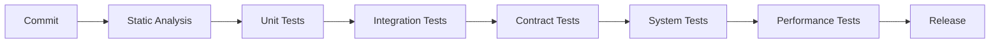

+++
date = '2025-04-20T18:30:00+02:00'
draft = false
title = 'Testing Strategy in Modern DevOps'
tags = ["testing", "devops", "go", "ci-cd", "quality", "automation"]
categories = ["testing", "devops"]
summary = "A practical testing overview for modern DevOps teams — from static analysis and unit tests to E2E, performance, and operational readiness."
readingTime = true
comments = true
ShowToc = true
TocOpen = true
image = "banner-testing.jpg"
weight = 31
+++


# Testing Strategy in Modern DevOps

In modern DevOps, testing is not a phase — it’s a continuous discipline embedded into every stage of the delivery pipeline.

A healthy testing strategy balances:

- speed vs confidence,

- automation vs human judgment,

- local feedback vs production readiness.

In this article, we’ll walk through a real-world testing pyramid, explain what to test, where, and why, and show how this fits naturally into CI/CD pipelines — especially for Go-based systems and cloud-native platforms.

---

🧭 Test Environments

A solid testing strategy starts with clear environment separation:

- Development
- Test
- SIT (System Integration Testing)
- Pre-Prod
- Prod

Each environment answers a different question:

| Environment | Purpose | 
|-------------|---------|
|Development | Fast feedback for developers |
|Test	| Automated functional validation |
| SIT	| Cross-system integration checks |
| Pre-Prod	| Production-like validation |
| Prod	| Real users, real traffic |

Testing intensity increases as you move closer to production — but test scope narrows.

## 🧱 The Testing Pyramid (Practical View)

Below is a real testing pyramid used in enterprise-grade systems — not a theoretical one.

Let’s break it down layer by layer 👇

### 1️⃣ Static Code Analysis (Go)

Goal: Catch problems before code runs.

Static analysis runs:

- instantly,

- deterministically,

- on every commit.

Typical tools:

- `golangci-lint`

- `govet`

- `staticcheck`

- `gosec`

What it finds:

- race conditions,

- nil dereferences,

- security smells,

- dead code,

- style violations.

💡 This layer is your cheapest bug detector — never skip it.

---

### 2️⃣ Unit & Persistence Tests (Go)

Goal: Prove correctness of isolated logic.

These tests validate:

- business rules,

- pure functions,

- repository logic,

- data transformations.

Characteristics:

- no network,

- no real dependencies,

- milliseconds execution time.

Example:

```go
func TestCalculateDiscount(t *testing.T) {
    got := CalculateDiscount(100)
    assert.Equal(t, 10, got)
}
```

Persistence tests may include:

- in-memory DBs,

- containers via Testcontainers,

- controlled fixtures.

---

### 3️⃣ Contract Tests (API – Postman)

Goal: Lock API behavior between teams.

Contract tests verify:

- request/response schemas,

- HTTP status codes,

- required headers,

- backward compatibility.

Why they matter:

- frontend and backend evolve independently,

- breaking changes are caught early,

- documentation stays honest.

Tools:

- Postman / Newman

- OpenAPI schema validation

- Pact (consumer-driven contracts)

---

### 4️⃣ Integration Tests (Go)

Goal: Verify collaboration between components.

These tests check:

- service-to-service calls,

- DB + API interactions,

- message queues,

- external dependencies (mocked or sandboxed).

Unlike unit tests:

- they allow I/O,

- they validate wiring,

- they expose configuration issues.

---

### 5️⃣ System Tests (Go – E2E)

Goal: Validate full system behavior.

End-to-End tests answer:

**“Does the system work as a whole?”**

They run against:

- deployed environments,

- real infrastructure,

- real configurations.

Examples:

- user registration flow,

- payment lifecycle,

- order → invoice → notification.

They are:

- slower,

- more expensive,

- fewer in number.

---

### 6️⃣ Frontend Tests (Cypress)

Goal: Validate user experience.

Frontend tests simulate:

- real user actions,

- browser rendering,

- UI workflows.

Cypress is commonly used for:

- critical user paths,

- regression detection,

- smoke testing before release.

Rule of thumb:

- Test behavior, not pixels.

---

### 7️⃣ Performance Tests (Go)

Goal: Ensure scalability and stability.

Performance tests answer:

- How many users can we handle?

- Where is the bottleneck?

- What happens under peak load?

Typical scenarios:

- load tests,

- stress tests,

- soak tests.

Tools:

- custom Go load generators,

- k6,

- Locust.

---

### 8️⃣ System Integration Tests

Goal: Validate external system cooperation.

These tests verify:

- third-party APIs,

- legacy systems,

- enterprise integrations.

Often executed in:

- SIT,

- Pre-Prod.

Failures here are integration risks, not code bugs.

---

### 9️⃣ Business Acceptance Tests (BAT)

Goal: Verify business expectations.

BATs validate:

- business rules,

- regulatory requirements,

- acceptance criteria.

They are often:

- semi-automated,

- executed by QA or product owners,

- written in business language.

---

### 🔟 Operational Readiness Tests (ORT)

Goal: Answer the question:

**“Are we ready to operate this in production?”**

ORT covers:

- monitoring & alerting,

- logging,

- backup & restore,

- disaster recovery,

- runbooks.

This is where DevOps truly meets operations.

---

## 🧬 Test Data Strategy

Two common approaches:

🔹 GEN – Generated Data

- Fully automated

- Deterministic

- Ideal for CI

🔹 JSON – Prepared Test Data

- Realistic scenarios

- Business-aligned

- Used in integration & E2E tests

Both approaches should coexist.

## 🧰 Test Management & Tooling

In enterprise environments, tools like Zephyr are used to:

- manage test cases,

- link tests to requirements,

- track execution history,

- support audits and compliance.

Automation runs the tests.
Test management explains why they exist.

---

## 🔄 Testing Inside CI/CD Pipelines

A typical pipeline flow:



Key principle:

**Fail fast, fail cheap, fail early.**

---

🎯 Final Thoughts

A mature testing strategy:

- minimizes production risk,

- accelerates delivery,

- builds trust between teams,

- enables continuous deployment.

**Testing is not about finding bugs — it’s about building confidence.**

---

🚀 Follow me on [norbix.dev](https://norbix.dev) for more insights on Go, Python, AI, system design, and engineering wisdom.
